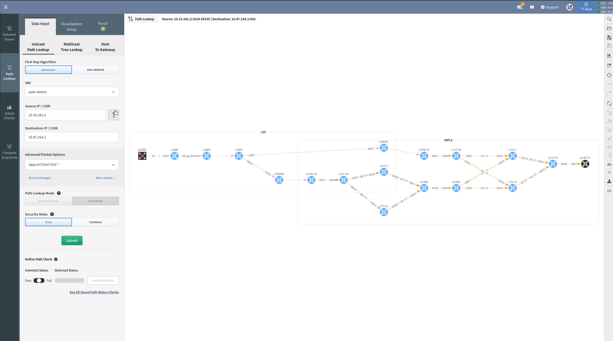

# Compare Snapshot

It can be very useful to have a quick look at the topology and observe what has changed from one snapshot to another. To compare, you just need to click **Compare Snapshots** and select the snapshot you want to compare your active snapshot with, and you will see the result.

In the example above, we notice that 3 devices have been removed in the Demo day 4 Snapshot, and they were there in the Demo day 3 Snapshot.
