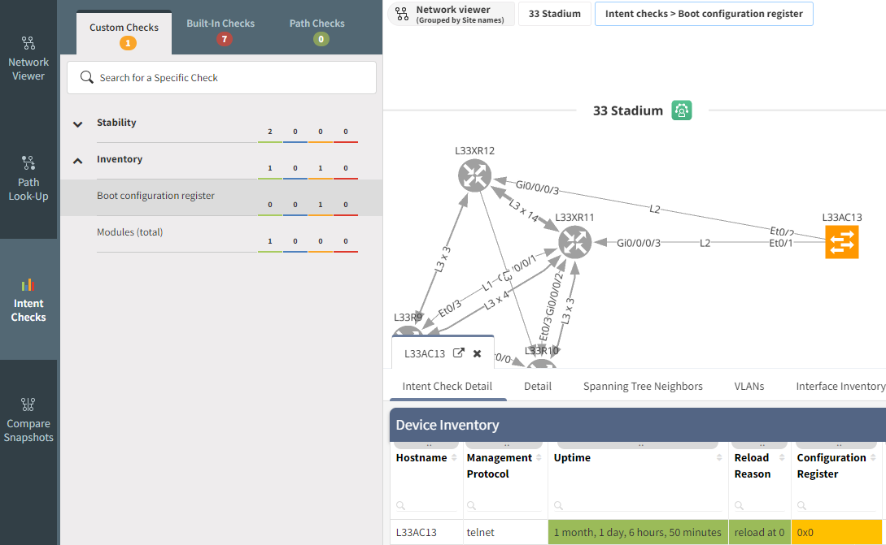

# Intent Checks

You can overlay the Intent Verification Rules on top of any diagrams.

**Intent Check** includes the Built-In checks (Single Points of Failure,
Non-Redundant Links) and the Custom Checks. The Custom Checks are all
the Verification Rules in IP Fabric: the default checks and the ones you
have created.

## Path Checks

Patch checks serve for checking of source and destination ports. Simply
add source and destination and a diagram will be displayed.

