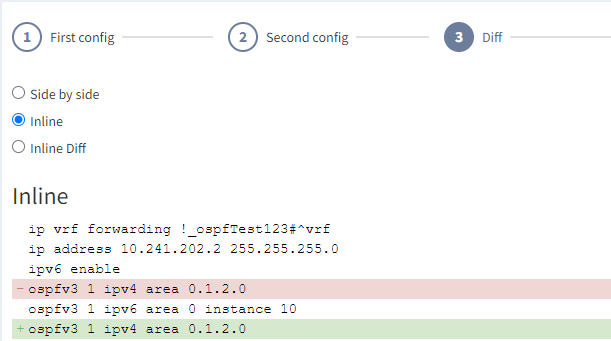
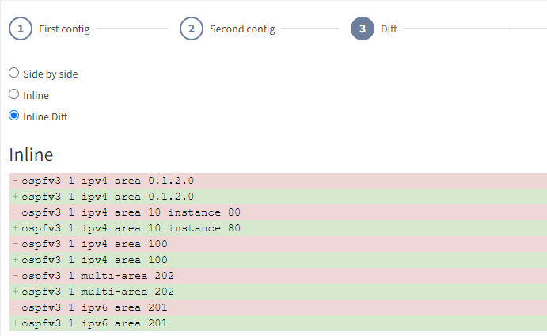

# Configuration

## Overview

Configuration management can be found at **Management --> Configuration** and **backs up the running configuration** of managed network devices based on the defined trigger. Downloaded configuration is then available for viewing in full or sanitized formats, or for comparison. **Only changed configurations** are stored, and these report both the time of the last change and the time of the last configuration check for a change.

Configuration can be retrieved in `full` or `sanitized` forms. Sanitization removes all passwords and network identification information from the configuration to prevent sharing of sensitive information.

## Credential Requirements

Network access credentials allowing the `show run` command (or equivalent)
are necessary for configuration storage and configuration management to work properly. Please review [Device Credentials](../../settings/Discovery_and_Snapshots/Discovery_Settings/device_credentials.md).

These elevated credentials need **Use for configuration management** box checked.

## Trigger

Trigger archiving can be [configured in settings](../../settings/configuration_management.md) and can be based on a _syslog message_ or a _timed event_.

## How to read configuration management data

There are the following properties in the Management configuration table:

- `Serial Number` -- Serial number of the device
- `Hostname` -- Device hostname
- `Last Change At` -- The last time before the very next config change
- `Last Check At` -- The last config file check before the very next configuration change
- `Status` -- Config state indicator that tells us whether:
  - `changed` -- the config changed within the last check (initial value)
  - `no change` -- the config did not change within the last check
- `Hash` -- Unique ID of the configuration file

We need to realize that every table row, once we filter output for a specific hostname, represents a modified configuration file. When new configuration is found (either brand new, or different from previous) for given device, it is committed to git and new record is entered to DB, with status set to `changed`. Next time the device's configuration is checked, there are two options:

1. the configuration file remains the same, in which case status field of the DB record is set to `no change`, and `Last Check At` is set to the current time;
2. the configuration file is changed again, in which case the new configuration is committed to git and new DB record is inserted into DB with status `changed` and `Last Change At` and `Last Check At` being set to current time, as described above.

Let's consider following example:

Let's go from the bottom of the output:

- `Last change At` is `2022-06-11 01:02:11+02` and `Last Check At` is `2022-06-14 01:01:17+02` with status `no change`
  - it means there were no configuration file changes between these two timestamps
  - configuration file was checked multiple times and status transitioned from `changed` to `no change`
- `Last Change At` is `2022-06-15 01:02:08+02` and `Last Check At` is `2022-06-15 01:02:08+02` with status `changed`
  - it means that configuration file changed
  - the status is set to `changed`

## Comparing Configurations

Stored configurations are displayed in a table that shows information such as the serial number of the device, the device host name, the time when configuration change was detected (`Last Change At` column), and the last time a particular configuration was saved in the `Last Check At` column.

The table can be used to compare between two different configurations directly from the user interface. This is done by selecting the `Before` and `After` states to compare, and the resulting differences can be displayed side-by-side, inline with all rows, or inline with only rows where the changes have occurred.

<figure markdown>
  
  <figcaption>Side by Side Diff</figcaption>
</figure>

<figure markdown>
  
  <figcaption>Inline</figcaption>
</figure>

<figure markdown>
  
  <figcaption>Inline Diff</figcaption>
</figure>
