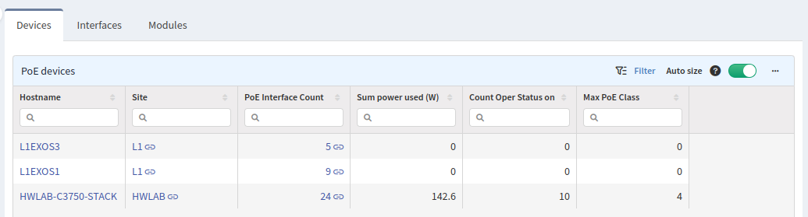
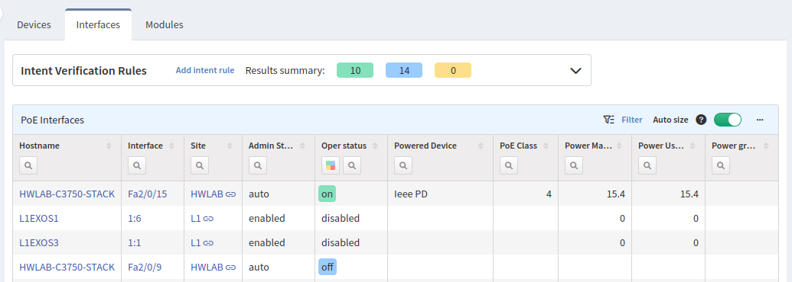
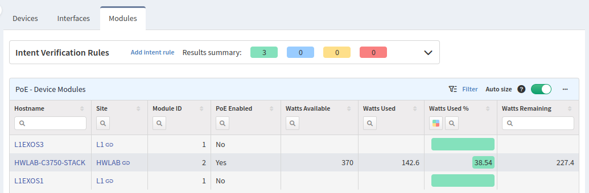

# PoE

Useful information about power consumption over the PoE protocol can be found in
this section.

## Devices

The first tab displays all devices that support PoE protocol, number of PoE
interfaces, current power usage, number of ports that uses PoE and highest PoE
class available on the device

## Interfaces

The PoE interface tab lists all interfaces that support PoE protocol. Filters
can be used to check PoE interface status on a particular device. The `Admin
status` column shows the administrative status of an interface. It can be
enabled/auto or admin-down, shutdown or disabled. Operation status lists status
of every enabled PoE port. Type/PID of powered devices are available in the
`Powered Device` column if available. The last four columns describe PoE class
and power usage.

## Modules

The last tab shows the PoE module statistics. This table is especially
significant because it shows used power consumption in watts, percentage and how
many watts are left.

