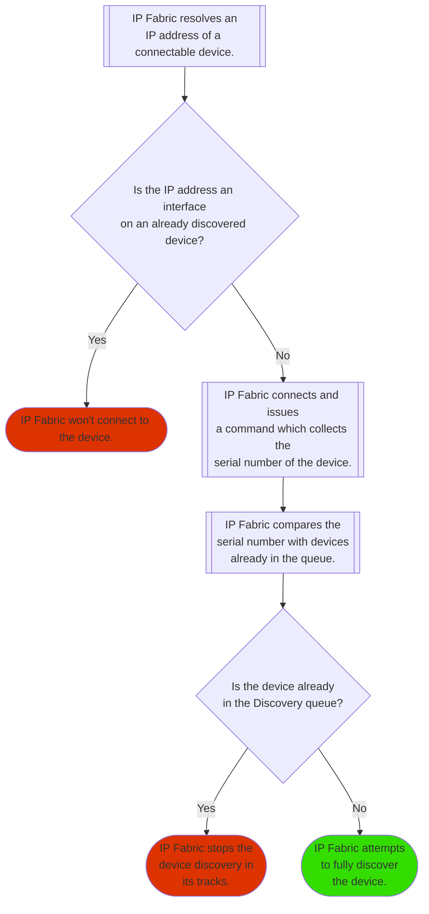
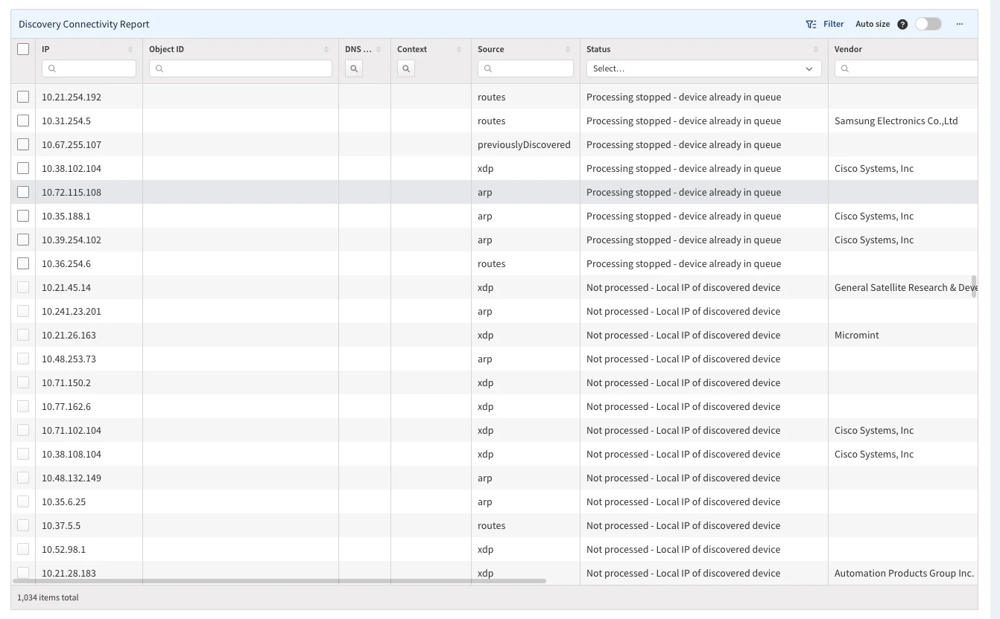

# How CLI Discovery Works

## Overview

Discovery creates a snapshot of the network, finding all active network infrastructure devices and collecting the current state of network protocols and technologies.

The process is controlled with the **Start discovery** and **Stop** buttons in the **Discovery Snapshot** section of the IP Fabric web UI.

 

You may configure **Settings --> Discovery & Snapshots --> Snapshot Retention
--> Create Snapshots Periodically** to automatically run a network discovery at
periodic intervals or at a specific time. We recommend performing a network
discovery at least once a day to capture any network changes.

## Connectivity Report

A connection to every attempted address either succeeds or is recorded in the **Connectivity Report**:

which details the reason for the connection failure. The most frequent reason for failure is a timeout of the login attempt. A connectivity report can be useful for troubleshooting failed credentials and other unreachability reasons. An authentication failure message denotes an unsuccessful login attempt and describes how the device responded.

## Bandwidth Limit

Bandwidth limit controls the amount of traffic sent to and received from the network infrastructure using bidirectional shaper and application flow control mechanisms. The traffic rate never exceeds the configured limit in either direction, allowing discovery and analysis processes to be run during business hours, thereby not overloading the network infrastructure devices any more than during standard operational procedures.

To further distribute the network load and reduce the possibility of bottlenecks, the connection scheduler sorts connections attempts to addresses that are farthest away. For example, in a list of addresses `10.10.10.1, 10.10.10.2, 10.20.10.1, 10.10.20.1`, after attempting a
connection to `10.10.10.1`, the next IP scheduled is `10.20.10.1`, because it shares only 11 bits with `10.10.10.1`. This lowest common mask rule enables statistically distributing the load without prior topology knowledge.

The selected number of megabits per second also controls the number of simultaneous connections. Each additional megabit adds 3 parallel sessions.

## Discovery Process

Discovery is performed via a lightweight interaction with the network infrastructure using CLI management protocols and ICMP probes. If the initial seed is not entered, the discovery mechanism attempts to log in to the default gateway and to responders of ICMP probes returning from the traceroute to the `10.0.0.0` network address.

After a successful login, discovery reads the network protocol state tables and looks for known neighbors, such as routing protocol next hops, ARP entries with MAC addresses of supported vendors, and CDP and LLDP neighbor information. A connection attempt is made to each potential network infrastructure device. Traceroute is attempted for each unknown connected router from the discovered networks on the routing table.

This is how the discovery process continues after a successful connection to a network device:

1. IP Fabric looks at LLDP/CDP and other neighbor protocols of the discovered device and tries to connect to those devices.
2. IP Fabric tries to connect to a next-hop device from the routing table.
3. IP Fabric uses the device's ARP table to find hosts and other network devices it can connect to with the help of the **OUI** table (in **Settings --> Discovery & Snapshots --> Global Configuration --> OUI**).
4. Traceroute is attempted for each unknown connected router from the discovered networks in the routing table.

Discovery then collects the detailed network state and information from every discovered device for every supported running protocol. All collected data are timestamped at the reading time, and the timestamps are used to calculate the rate of change for each element.

Discovery also computes network topology and cross-technology dependencies by using network graph traversals of upstream and downstream paths. A topology for each protocol is computed separately.

A managed network is considered to consist of every discovered device under a coherent administrative domain, as restricted by access credentials, and the full list of devices is available in the inventory.

The spanning-tree domain is a topology of contiguously connected spanning-tree instances and signifies a Layer 2 failure domain in the case of a cascading Layer 2 failure.

The routing domain is a topology of contiguously connected forwarding hops and signifies a Layer 3 failure domain in the case of a cascading Layer 3 failure.

## Already Discovered IP Address Behavior

If the IP Fabric discovery process resolves an IP address which is an interface of an already discovered device, it won't even attempt to connect to the IP address resolved.

There's another check in the flow, which connects to the IP address and starts to collect basic data, it executes `show inventory` and its variants on other vendors, collects the serial number, and checks the serial number against the queue of devices being discovered. If it detects the device is in the queue, it stops the device discovery in its tracks.

You can see the results of the process in **Discovery Snapshot --> Connectivity Report**:

!!! tip "Deliberate Duplicate IPs"

    Since the `7.0` release, you can override this behavior (if you use the same
    IP ranges in different VRFs within your management network) and configure
    [Duplicate IPs Discovery](../../IP_Fabric_Settings/Discovery_and_Snapshots/Discovery_Settings/discovery/duplicate_ips_discovery.md).

    Between versions `6.4` and `6.9`, the same was possible with a feature flag
    (`SUBNETS_TO_ALLOW_PROCESSING_DUPLICIT_IP`) and help from the
    [Support](../../support/index.md) team.
