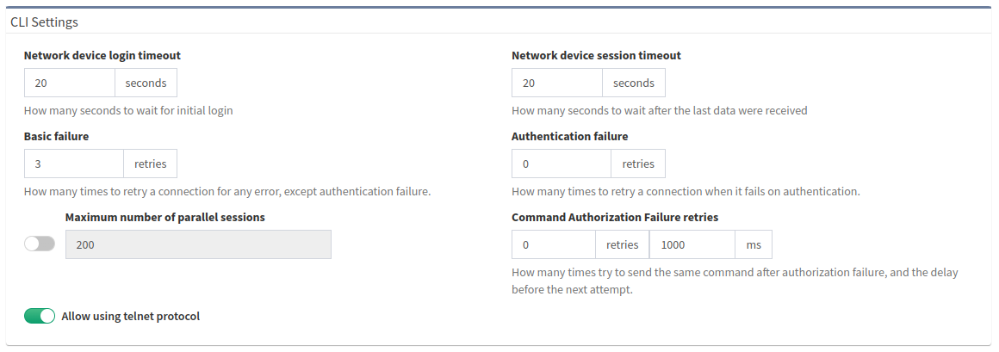

# Fine-Tune SSH/Telnet CLI Parameters

IP Fabric's discovery is primarily using Command-Line Interface (CLI) to
discover network elements. There are certain default CLI parameters that can be
found in **Settings --> Discovery & Snapshots --> Discovery Settings -->
Advanced CLI --> CLI settings**:

According to the summary of issues in the very first completed snapshot,
the CLI Settings can be adjusted. Here are some of the most common
errors and adjustments:

| Error                                                                             | Error Type                    | How to mitigate                                                                                                    |
| --------------------------------------------------------------------------------- | ----------------------------- | ------------------------------------------------------------------------------------------------------------------ |
| connect ETIMEDOUT XX.XX.XX.XX:22                                                  | Connection error              | Received no response from the destination.                                                                         |
| connect ECONNREFUSED XX.XX.XX.XX:22                                               | Connection error              | The connection to the destination is being blocked by an access-list or firewall.                                  |
| read ECONNRESET                                                                   | Connection error              | Connection reset by FW or destination                                                                              |
| All configured authentication methods failed                                      | Authentication error          | Unable to authenticate to the destination host                                                                     |
| Authentication failed                                                             | Authentication error          | Unable to authenticate to the destination host                                                                     |
| Authentication failed - login prompt appeared again                               | Authentication error          | Unable to authenticate to the destination host                                                                     |
| SSH client not received any data for last 120000 ms! `cmd => show vrrp  \| e #^$` | Command timeout               | The command `show vrrp  \| e #^$` timed out. Increase **device session timeout.**                                  |
| Can't detect prompt                                                               | Command timeout               | Unable to detect CLI prompt. Increase **network device login timeout.**                                            |
| Command "enable" authorization failed, tried 2x                                   | Command authorization failure | The command wasn't authorized. **Increase command authorization failure retries** or increase the timer value (ms) |

### Network device login timeout

Timeout before the logging prompt is received. It may take longer for
remote branches over low-speed lines, or destined to overloaded devices.

### Network device session timeout

Too many **_Command Timeout_** errors during the Discovery process may
indicate that **_Network device session timeout_** is too short and it
may be necessary to expect a delay for a response to arrive.

### Maximum number of parallel sessions

To prevent flooding your network with too many SSH/TELNET sessions set
**_Maximum number of parallel sessions_**. This setting can be also
helpful if the AAA server (TACACS/Radius) has a limit of parallel AAA
requests for users.

In rare cases, the Cisco ISE or similar systems may rate limit the
command authorization. When there are too many authorization failures
and Cisco ISE is in place, try to limit the number of parallel sessions
down to 10 and steadily increase.

### Basic failure

How many times to retry a connection for any error, except
authentication failure.

### Authentication failure

**_Authentication failure_** can occur even if a user is authorized to
login but may happen, for example, when an AAA server is overloaded or
an authentication packet is lost.

### Command Authorization Failure retries

If you see many examples of **_Authentication error_** during the
Discovery process, please adjust **_Authentication failure_** and
**_Command Authorization Failure retries_**.
