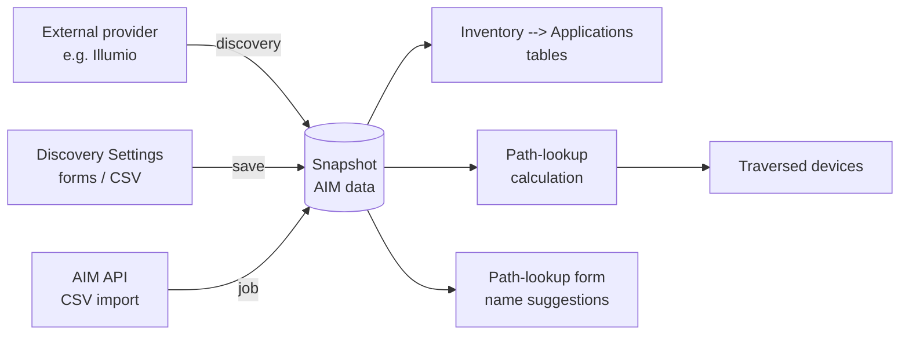

# Application Infrastructure Mapping (AIM)

--8<-- "snippets/aim_license_required.md"

IP Fabric models the network: devices, interfaces, routing, and security. What
that model does not know by itself is which **applications** depend on it.
Application Infrastructure Mapping (AIM) closes that gap. It ingests your
application inventory, correlates it with the discovered network, and answers
questions that previously needed a diagram and a guess -- above all, *which
network devices carry this application's traffic?*

The result is evidence-based rather than assumed: the application data comes from
the systems that already track it, and the network path is computed by the same
path-lookup engine IP Fabric uses everywhere else.

## Concepts

AIM adds four record types to a snapshot, plus one that is computed:

| Concept                | Description                                                                                              |
| :--------------------- | :-------------------------------------------------------------------------------------------------------- |
| **Application**        | A business application, optionally labelled with an environment.                                          |
| **Workload**           | An endpoint that makes up part of an application -- a server, a container, a virtual machine.              |
| **Workload interface** | An IP address belonging to a workload. A workload can have several.                                       |
| **Flow**               | Observed communication between two workloads, with addresses, ports, and protocol.                        |
| **Traversed device**   | A network device a flow's traffic passes through. Not ingested -- computed on demand by a path lookup.     |

A flow can span two applications, since its source and destination workloads may
belong to different ones.

## How AIM Data Gets In

Three ingestion methods are supported, and they can be used side by side:

| Method                                   | Configured in                                             | Refreshed by                        |
| :--------------------------------------- | :-------------------------------------------------------- | :---------------------------------- |
| **External data provider, via API crawling** | Discovery Settings, Integrations tab                   | Each discovery run.                 |
| **Records maintained in IP Fabric**      | Discovery Settings -- forms, or a CSV import in the UI      | Saving the settings form.           |
| **The AIM API**                          | `POST /aim/import/{snapshotId}`, with CSV files            | Each API call.                      |

Illumio is the external provider supported today; the source is not limited to
micro-segmentation platforms, and support for further platform types is planned
for future releases.

All three write into the same AIM inventory, so consumers do not need to care
which route the data took. Configuration for the first two is described in
[Application Mapping](../IP_Fabric_Settings/Discovery_and_Snapshots/Discovery_Settings/application_mapping.md),
and the third in
[Application Infrastructure Mapping API](../IP_Fabric_API/Application_Infrastructure_Mapping/index.md).

## Working With AIM Data

**Browse the inventory.** **Inventory --> Applications** presents the data as
four tables -- Applications, Workloads, Flows, and Devices -- with links between
them. See [Applications](../IP_Fabric_GUI/inventory/applications.md).

**Identify the network devices.** Which devices carry a flow is a separate,
on-demand calculation that you start per application or per single flow from the
Applications and Flows tables. See
[Calculating Devices](../IP_Fabric_GUI/inventory/applications.md#calculating-devices).

**Open the path as a diagram.** A calculated flow links straight into the
path-lookup diagram, pre-filled from the flow's own addresses, ports, and
protocol.

**Search path lookup by name.** In the path-lookup form, the source and
destination IP address fields also match application and workload names, so an
address can be found through the application that owns it. See
[Searching by Application or Workload Name](../IP_Fabric_GUI/diagrams/how_to_use_path-lookup.md#searching-by-application-or-workload-name).

**Automate it.** Everything above is available over the API -- ingestion,
calculation, and reading the inventory tables -- and through the IP Fabric MCP
Server for use from an AI assistant.

!!! info "The Devices table needs a calculation, not an import"

    No ingestion method fills the Devices table. Until a path lookup has run for
    a flow, that flow contributes no devices, and the application's device count
    stays at `0`. This is the single most common surprise when setting AIM up.

## Licensing

AIM is a premium add-on, controlled by the product license rather than by a
setting. Without the AIM feature enabled:

- The **Application mapping** section is hidden from the Discovery Settings menu.
- **Inventory --> Applications** shows an overview of the capability instead of
  the tables. See
  [Without an AIM License](../IP_Fabric_GUI/inventory/applications.md#without-an-aim-license).
- The AIM API endpoints return `403`.
- The path-lookup address fields behave as before, matching IP addresses and DNS
  names only.

For what the add-on covers, see
[go.ipfabric.io/aim](https://go.ipfabric.io/aim). To get started, contact your
Customer Success Manager or email
[support@ipfabric.io](mailto:support@ipfabric.io), then upload the reissued
license file -- see [Getting AIM](licensing.md#getting-aim). For how device
licensing works in general, see [Licensing](licensing.md).

## Documentation Map

| To do this                                                     | See                                                                                                             |
| :------------------------------------------------------------- | :-------------------------------------------------------------------------------------------------------------- |
| Connect an external data provider                              | [Application Mapping -- Integrations](../IP_Fabric_Settings/Discovery_and_Snapshots/Discovery_Settings/application_mapping.md#integrations) |
| Maintain applications, workloads, and flows in the UI          | [Application Mapping](../IP_Fabric_Settings/Discovery_and_Snapshots/Discovery_Settings/application_mapping.md)    |
| Browse the AIM inventory and calculate devices                 | [Applications](../IP_Fabric_GUI/inventory/applications.md)                                                       |
| See the AIM section in the wider inventory                     | [Inventory](../IP_Fabric_GUI/inventory/index.md)                                                                 |
| Find an address by application name in path lookup             | [How To Use Path Lookup](../IP_Fabric_GUI/diagrams/how_to_use_path-lookup.md#searching-by-application-or-workload-name) |
| Ingest CSV data over the API                                   | [AIM API -- Import](../IP_Fabric_API/Application_Infrastructure_Mapping/index.md#import-aim-data-from-csv-files)  |
| Read the AIM inventory tables over the API                     | [AIM API -- Inventory Tables](../IP_Fabric_API/Application_Infrastructure_Mapping/index.md#aim-inventory-tables)  |
| Test an integration's connection over the API                  | [AIM API -- Verify](../IP_Fabric_API/Application_Infrastructure_Mapping/index.md#verify-an-aim-integration-connection) |
| Automate the whole ingest-to-devices sequence                  | [End-to-End Workflow](../IP_Fabric_API/Application_Infrastructure_Mapping/end_to_end_workflow.md)                |
| Work with AIM from an AI assistant                             | [Using AIM Through the MCP Server](../IP_Fabric_API/Application_Infrastructure_Mapping/mcp_server_guide.md)       |

## Current Scope

AIM is delivered in stages. As of this release:

- **Illumio** is the supported external data provider. Other platform types are
  planned.
- **Flow collection from Illumio** covers a rolling 24-hour window, capped at
  25,000 flows per query. Both values are fixed and not configurable in the UI --
  see
  [Illumio Requirements](../IP_Fabric_Settings/Discovery_and_Snapshots/Discovery_Settings/application_mapping.md#illumio-requirements).
- **Traversed devices** are produced by an on-demand calculation, per application
  or per flow, rather than continuously.
- **Application-name suggestions** in path lookup cover the Unicast and Host to
  Gateway forms; the Multicast form suggests addresses and DNS names only.
- A per-application detail page, connectivity and path analysis at flow level,
  and intent and risk validation aggregated per application are on the roadmap.
  The capability overview shown on an unlicensed instance lists what is planned.
