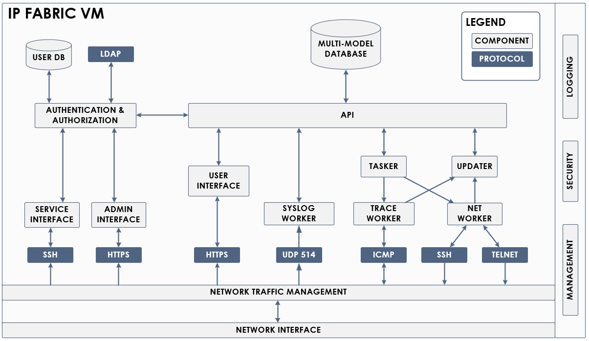

# IP Fabric Overview

The IP Fabric network infrastructure management platform provides on-demand network discovery, advanced analytics, and in-depth engineering visibility. The lightweight discovery capabilities (through SSH or Telnet) quickly detect the current network state, including detailed data for each address and port. A network model of gathered data reconstructs the topologies for each switching and routing protocol to enable cross-technology analysis of upstream and downstream relationships. Dependencies and dependents are calculated for each network element, allowing analysis to represent each aspect of the network in the context of productivity impact on the downstream hosts and network devices, while the immediate productivity impact of performance and capacity is calculated for each user and every element.

## Architecture

A distributed system of microservice components resides within the IP Fabric VM, all based around a multi-model database with a mathematical network model at its core. Operating system-level controls provide high availability, security, and log collection. The kernel-level bidirectional traffic shaper and application-level worker flow control mechanisms provide comprehensive traffic management and automatically respond to any signs of network congestion to ensure that only freely available bandwidth is utilized. The user interface is available on port `443` of the VM's IP address through any modern web browser and on any screen. Table output can be exported into CSV format for further processing, and selected reports are exportable into Word format.



## Operational Requirements

### Browser Requirements

To access your IP Fabric GUI, we recommend using a browser version that is no older than one year. We support most major browsers, including:

- Google Chrome and Chromium-based browsers (e.g., Brave, Opera, Vivaldi, Edge)
- Mozilla Firefox and its maintained forks (e.g., LibreWolf)
- Safari

For a seamless experience, we recommend using a browser at Full HD (1920 × 1080 px) resolution or higher without custom scaling.

### Hardware Requirements

The IP Fabric platform runs on any x64 CPU with these instructions: `avx`, `popcnt`, `sse`, `sse2`, `sse4.1`, `sse4.2`, `sse4a`, and `ssse3`. The system runs with at least 4 parallel threads, but scheduling can handle operations down to a single thread if necessary. IP Fabric utilizes around 8 GB of RAM when idle, and an additional 8 GB of RAM is required for collected network information. The base installation requires 80 GB of disk space, with an additional 50 MB per network device.

!!! info "Solid State Storage Recommendation"

    For optimal performance, we recommend using solid-state drives (SSDs) with a minimum of 2000 IOPS for virtual machine storage. Replacing traditional spinning disks with solid-state drives (SSDs) will significantly improve the performance of database-intensive operations, such as [System Maintenance](../IP_Fabric_Settings/system/Backup_and_Maintenance/system_maintenance.md).

The minimum requirements are:

| CPU | RAM   | Disk  |
| --- | ----- | ----- |
| 4   | 16 GB | 90 GB |

Since every network environment is different, we cannot recommend one general setting. Instead, we provide three examples of hardware requirements. Each example assumes 5 loaded snapshots, 1 snapshot being discovered, 100 unloaded snapshots on disk, and disk space overhead for IP Fabric and system logs.

For networks with medium complexity and many access points (>50%) or networks with basic complexity (simple dynamic routing, few or no VRFs, small sites):

| Devices | CPU |    RAM |     Disk |
| ------: | --: | -----: | -------: |
|     500 |   4 |  16 GB |    90 GB |
|   1 000 |   8 |  16 GB |    90 GB |
|   2 000 |  12 |  32 GB |   100 GB |
|   5 000 |  16 |  64 GB |   250 GB |
|  10 000 |  20 | 100 GB |   450 GB |
|  20 000 |  24 | 190 GB |   850 GB |

For networks with complex configurations (large routing tables, many VRFs, many STP domains, large MAC and ARP tables, etc.) and few or no access points (<20%):

| Devices | CPU |    RAM |     Disk |
| ------: | --: | -----: | -------: |
|     500 |   4 |  24 GB |    90 GB |
|   1 000 |   8 |  36 GB |   100 GB |
|   2 000 |  12 |  64 GB |   160 GB |
|   5 000 |  16 | 150 GB |   400 GB |
|  10 000 |  20 | 280 GB |   750 GB |
|  20 000 |  24 | 560 GB | 1 500 GB |

For managed service provider (MSP) networks:

| Devices | CPU |    RAM |    Disk |
| ------: | --: | -----: | ------: |
|     500 |   8 |  40 GB |  150 GB |
|   1 000 |  12 |  70 GB |  250 GB |
|   2 000 |  16 | 128 GB |  500 GB |
|   5 000 |  20 | 300 GB | 1200 GB |

!!! warning

    If you plan to use FTP/SFTP IP Fabric backup, the recommended disk space must be doubled: 180 GB for 500 devices, 200 GB for 1 000 devices, and so on.

!!! info "Additional resources requirements"

    To ensure you have sufficient resources, please use the following formulas:

    Data **disk storage** requires 1 MB per device per each snapshot (example: 1350 devices, plan is to keep up to 100 snapshots => 135 GB data storage).

    **Memory** requires 5 MB of RAM per device for each **loaded** snapshot (example: 1200 devices, up to 100 snapshots but only 3 loaded at a time (1200 x 5 = 6000 x 3) => 18 GB RAM).

!!! note

    The recommended hardware resources may not allow for running the most demanding graph traversal functions. These functions may require a sizable memory pool to complete successfully.

### Supported Virtualization Platforms

For deploying the IP Fabric appliance, we recommend using either VMware ESXi or vSphere. For more information, please see [Deploying IP Fabric Virtual Machine (VM) -- OVA Distribution Details](../platform_first_steps/01-deployment.md#ova-distribution-details).

It is also possible to run IP Fabric on any other virtualization platform using our qcow2/OVA images, but we can provide only limited support for those platforms.

### Network Connectivity Requirements

During snapshot operations, you can control the network bandwidth limit, which never exceeds the aggregate of set bandwidths in any direction, providing an additional safety measure.

IP Fabric should be connected to a network that has direct connectivity to managed devices. A [jumphost server](../IP_Fabric_Settings/Discovery_and_Snapshots/Global_Configuration/jumphost.md#setting-up-jumphost) can also be set up and used. (A jumphost server requires an installation of SSH Python version 3.6+.)

Inbound flows:

| Source port (remote) | Destination port (local) | Protocol | Description                                                            |
| -------------------- | ------------------------ | -------- | ---------------------------------------------------------------------- |
| > 1024               | 443                      | TCP      | User Interface                                                         |
| > 1024               | 8443                     | TCP      | Administrative Interface                                               |
| 443                  | > 1024                   | TCP      | Network Infrastructure Interaction -- API; Support, Updates (Optional) |
| 22                   | > 1024                   | TCP      | Network Infrastructure Interaction -- SSH                              |
| 23                   | >1024                    | TCP      | Network Infrastructure Interaction -- Telnet                           |
|                      |                          | ICMP     | Network Infrastructure Interaction -- Traceroute                       |

Outbound flows:

| Source port (local) | Destination port (remote) | Protocol                     | Description                                                            |
| ------------------- | ------------------------- | ---------------------------- | ---------------------------------------------------------------------- |
| 443                 | >1024                     | TCP                          | User Interface                                                         |
| 8443                | >1024                     | TCP                          | Administrative Interface                                               |
| >1024               | 443                       | TCP                          | Network Infrastructure Interaction -- API; Support, Updates (Optional) |
| >1024               | 22                        | TCP                          | Network Infrastructure Interaction -- SSH                              |
| >1024               | 23                        | TCP                          | Network Infrastructure Interaction -- Telnet                           |
|                     |                           | ICMP                         | Network Infrastructure Interaction -- Traceroute                       |

Internet connectivity is used to check for product updates, perform upgrades, setup the Support VPN, send error reports, and submit support tickets.

### Network Access Credentials Requirements

#### Network Device Access

IP Fabric accesses network infrastructure devices via CLI (command-line interface) using SSH or Telnet. All device interactions are recorded on the platform, and only `read-only` or `operator` group privilege level 1 credentials are required.

Below are examples of commands used for Cisco IOS:

```
terminal length 0
show version
show inventory
show etherchannel summary
show interfaces [status|switchport]
show ip int [brief]
show ip vrf
show ip arp
show ip route
show ip cef
show ip access-list
show cdp neighbors detail
show lldp neighbors detail
show mac address-table
show spanning-tree [detail|mst|summary]
show standby [brief]
show vrrp [brief]
show vlan brief
```

At the beginning, IP Fabric fingerprints the device using the `show version` command (or equivalent) to identify the vendor and system version. A `terminal length` command is optional but highly recommended, as it greatly improves the speed of the device interaction, reduces the load on the network and the device, and improves collection precision.

#### Additional Device Access

Since firewalls do not follow privilege levels, it may be necessary to
explicitly specify the commands allowed for each user. The following list specifies the exec-mode commands needed for firewall discovery.

```
show version
show interface
show route
show arp
show context
terminal pager 0
```

Turning off paging greatly improves the speed of discovery and allows a terminal pager command, making it highly recommended although not mandatory. The commands can be allowed through the central `TACACS` or `RADIUS` access control system, or they can be configured locally on a device. The following example adds the necessary commands to a privilege-1 user:

```
privilege show level 1 mode exec command interface
privilege show level 1 mode exec command arp
privilege show level 1 mode exec command route
privilege show level 1 mode exec command context
privilege cmd level 1 mode exec command terminal
```

A list of all commands used for CLI discovery can be found in the [feature/vendor matrix](https://matrix.ipfabric.io).

### Staging vs Production Deployment

IP Fabric is a complex solution with multiple moving parts. We thoroughly test every release before making it available to our customers. Testing comprises automated unit testing at the code level and automated tests run against various physical and virtual lab environments. These environments emulate complex networks with many devices from multiple vendors. Despite these efforts, issues can still arise after deploying a new version of IP Fabric to the customer's environment. For example, it is not feasible to replicate the entire network or a combination of particular device models.

Therefore, we suggest a 2-stage deployment of new IP Fabric releases for complex or critical implementations. The first stage is a _staging_ deployment, used to verify the functionality of the new release within the customer's environment.

!!! info

    You will need a valid license for the staging deployment. Please contact our sales team to check your eligibility for a complimentary license.

The second stage is the deployment to the production/live environment. The staging environment's sizing follows the suggestions mentioned above for a standard deployment. We don't provide special staging builds; these are just regular production builds, which are deployed separately to potentially avoid disrupting the day-to-day use of IP Fabric within the organization.

We suggest making the staging as close as possible to the final production environment. The staging environment should discover the same devices as the production (e.g., there is only a limited value if the staging environment "sees" only 500 network devices, while the whole network consists of thousands of devices). On the other hand, it is perfectly fine to provision the staging environment dynamically if your deployment environment allows it. Also, a typical "acceptance test" on the staging environment lasts only a couple of days to verify overall functionality.
