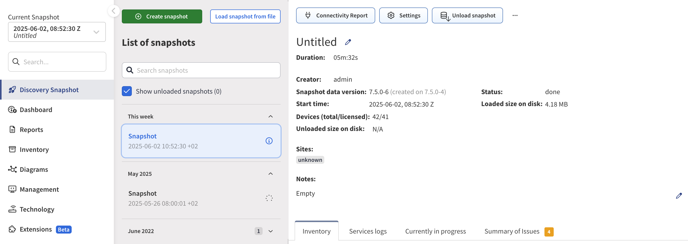

# How Snapshots Work

Network snapshots record the state of the network at a specific time, enabling you to retrieve historical information, track network state changes, analyze connectivity, and more. A network snapshot is a fully functional software copy of the network, including all configuration and state data. The active network view displays information from a network snapshot, which can be selected using the **Current Snapshot** drop-down menu in the left panel of the main GUI.

## Snapshot Management

Up to 5 (100 when using PSQL) snapshots can be loaded simultaneously into active memory. When the snapshot is active, it is considered "loaded". Other snapshots can be stored on the HDD, with only free HDD space being the limiting factor.

Locking an active snapshot will always keep it in memory.

Unloading a snapshot will move network state information from RAM to HDD. It usually takes several minutes to load and unload the snapshot, depending on the network size.

Snapshots can be downloaded for external storage, which can be later uploaded back to the system.

Snapshots can be cloned to accommodate change management practices. For example, when change comparison is desired but only a small part of the network is affected by the change. A snapshot can be restricted to a specific portion of the network through **IP Scope** in **Settings --> Discovery & Snapshots --> Discovery Settings --> Discovery**. This will enable visual comparison of a portion of the network and provide historical data for the collected portion of the network. However, when comparing a partial snapshot with a full snapshot, many false positives will appear because a large portion of the network will be missing.

Snapshots can also be permanently deleted from the system.

## Snapshot Manipulation

New network state snapshots can be created from the **Discovery Snapshot** section using the **Start discovery** button.

To add devices to an existing snapshot, use the **+ Add Devices** button. When adding devices, no data is overwritten.

To refresh network state data for specific devices in an existing snapshot:

1. Select the devices you want to refresh:

   

2. Click **Refresh Devices**:

   

To delete devices from an existing snapshot:

1. Select the devices you want to delete:

   

2. Click **Delete Devices**:

   
