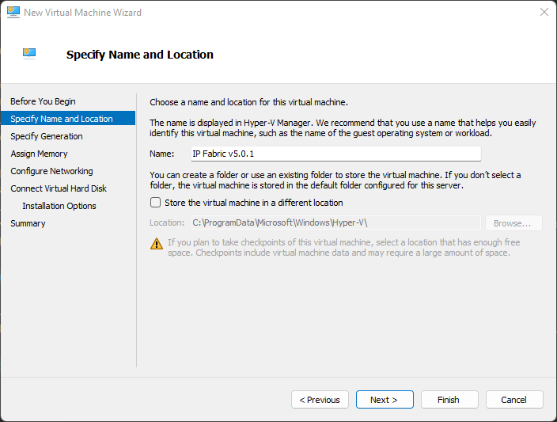
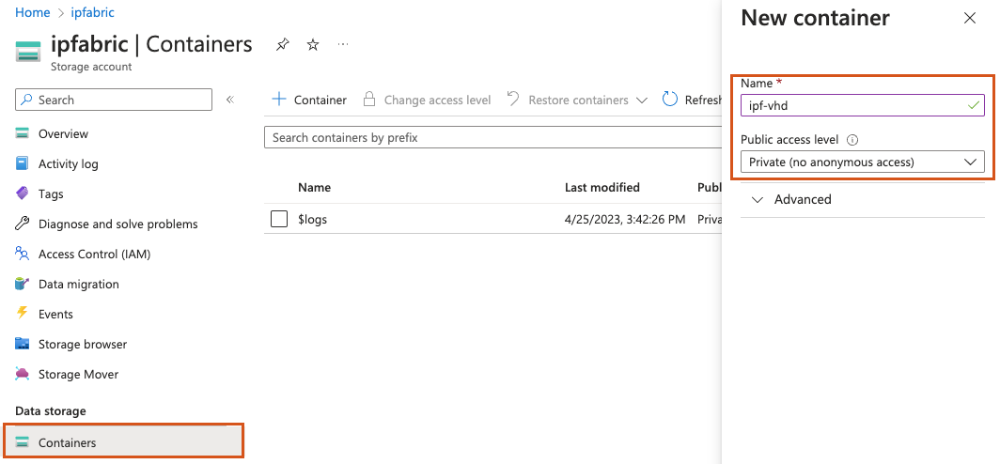
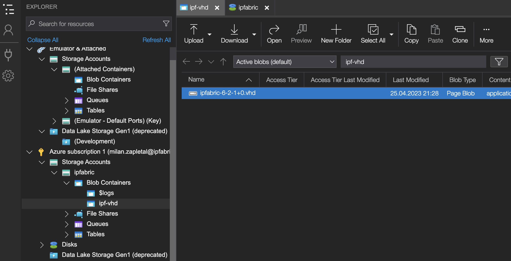
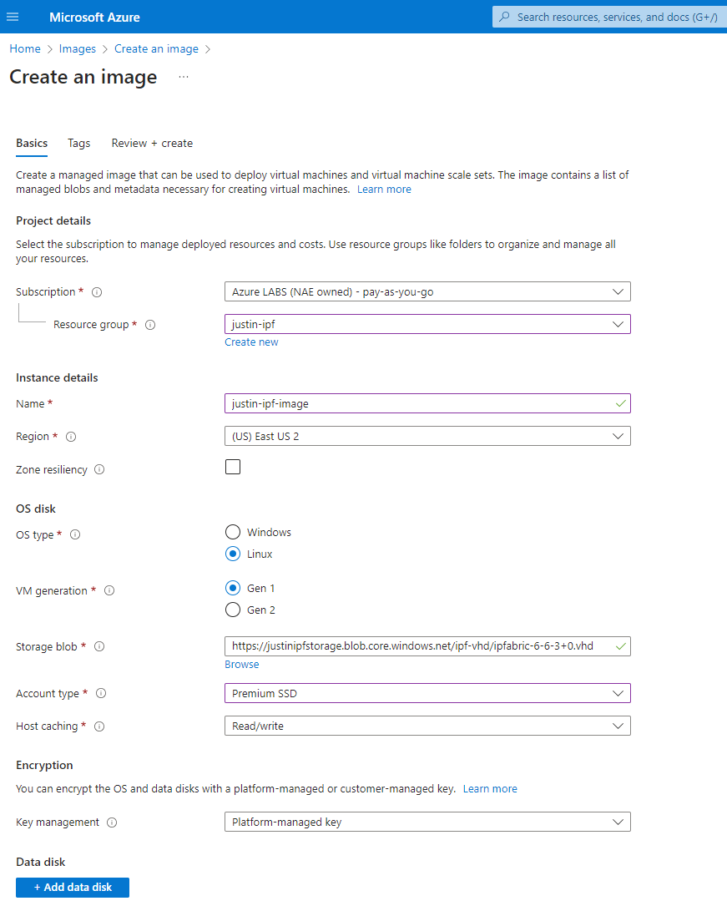

# Deploying the IP Fabric Virtual Machine (VM)

All VM images are available at  [https://releases.ipfabric.io/ipfabric/#current](https://releases.ipfabric.io/ipfabric/#current). Access is restricted to registered customers only. Please contact our [sales representative](mailto:sales@ipfabric.io) if you are interested in a trial of IP Fabric.

!!! important

    Please remember that IP Fabric uses CLI access (SSH or Telnet) to connect to devices for collecting data. It's important to place the VM in the proper network segment to prevent high ACL or firewall configuration overhead.

## Deploying on VMware OVA Virtual Machine

1. Deploy the OVA to your vSphere environment as described in
   [Deploy an OVF or OVA Template](https://docs.vmware.com/en/VMware-vSphere/6.5/com.vmware.vsphere.vm_admin.doc/GUID-17BEDA21-43F6-41F4-8FB2-E01D275FE9B4.html).
2. [Edit VM settings](https://docs.vmware.com/en/VMware-vSphere/6.5/com.vmware.vsphere.vm_admin.doc/GUID-4AB8C63C-61EA-4202-8158-D9903E04A0ED.html) and adjust according to your network size as described in the [Operational Requirements](../overview/index.md#operational-requirements) section.
   1. Change CPU count.
   2. Change memory size.
   3. [Add a new empty virtual disk or resize the main system disk](../System_Administration/increase_disk_space.md).
3. Power on the VM and [complete the First Boot Wizard](02-boot_wizard.md).

!!! note "Invalid OVF checksum algorithm: SHA256"

    Importing the OVA on older vSphere/ESXi hosts may result in an error stating that the OVF checksum
    is invalid. Please refer to [this documentation](../support/known_issues/IP_Fabric/error_messages/invalid_ovf_checksum.md)
    on how to resolve the issue.

## Deploying on Hyper-V Virtual Machine

The `qcow2` disk image file can be converted to different formats.
Using this method, we will create a `VHDX` usable on Microsoft Hyper-V and manually create a new VM.

1. Download `ipfabric-*.qcow2` from the official source.

2. Convert the `qcow2` image to `VHDX`. (Be sure to change the filenames in the command examples below.)

   - Windows instructions:
     1. Download the [QEMU disk image utility for Windows](https://cloudbase.it/qemu-img-windows/).
     2. Unzip `qemu-img-windows`.
     3. Run: `qemu-img.exe convert ipfabric-<*>.qcow2 -O vhdx -o subformat=dynamic ipfabric-<*>.vhdx`

   - Linux instructions:
     1. Install `qemu-utils`: `sudo apt install qemu-utils`
     2. Run: `qemu-img convert -f qcow2 -o subformat=dynamic -O vhdx ipfabric-<*>.qcow2 ipfabric-<*>.vhdx`

3. Create a new Hyper-V virtual machine and specify its **Name** and **Location**:

   

4. In the **Specify Generation** step, select `Generation 1`:

   

5. Assign memory. (Check requirements in the [Operational Requirements](../overview/index.md#operational-requirements) section.)

   

6. Configure networking:

   

7. Connect a virtual hard disk:

   

8. Verify the Summary and click **Finish**:

   

9. Wait for the VM to be created.

10. Edit the VM CPU settings. (Check requirements in the [Operational Requirements](../overview/index.md#operational-requirements) section.)

    

    

11. Optionally, increase the disk size based on the [Operational Requirements](../overview/index.md#operational-requirements) section.

    - [Extend the system disk or add a new empty virtual disk](../System_Administration/increase_disk_space.md#increase-disk-space-for-hyper-v) if necessary.

12. Close the VM Settings window.

13. Start the VM.

## Deploying a Virtual Machine to Nutanix

!!! note

    The Nutanix image is based on Virtual Disks of VMware vSphere OVA image. As Nutanix officially supports import of VMware VMs, the instructions below are based on the same image as used in the [VMware deployment](#deploying-on-vmware-ova-virtual-machine) section.

1. Download the `ipfabric-*-.OVA` file from the official source.

2. Extract the downloaded OVA file using 7-Zip or any similar software. The structure of extracted files should look like below:

   

3. Import the `.vmdk` files to the Nutanix hypervisor and follow Nutanix's official documentation -- [Nutanix import OVA](https://portal.nutanix.com/#page/kbs/details?targetId=kA03200000099TXCAY) and [Quick tip how to deploy a VM from OVF to AHV](https://next.nutanix.com/installation-configuration-23/quick-tip-how-to-deploy-a-vm-from-an-ovf-to-ahv-33613).

4. Edit the VM hardware settings and adjust according to the network environment size. (Check requirements in the [Operational Requirements](../overview/index.md#operational-requirements) section.)

   1. Change CPU count.
   2. Change memory size.
   3. [Extend the system disk or add a new empty virtual disk](../System_Administration/increase_disk_space.md) if necessary.

5. Start the VM and check if the system starts without any interruptions.

## Deploying a Virtual Machine on KVM

We currently have the limitation that drives need to be `/dev/sdx`. Usually, Linux hypervisors use the `virtio-blk` driver, which is represented as `/dev/vdx` in the guest system. To overcome this limitation, use `virtio-scsi` as the drive controller.

1. Download `qcow2` system disk to your KVM hypervisor.

2. Resize the `qcow2` data disk so it corresponds to [your network's needs](../overview/index.md#operational-requirements) if necessary. Use the following command:

   ```shell
   qemu-img resize ipfabric-disk1.qcow2 100G # (up to 1000G for 20 000 devices)
   ```

3. Deploy the VM to your hypervisor with the `virt-install` utility by issuing the following command (chose CPU and RAM size according to the size of your network):

   ```shell
   virt-install --name=IP_Fabric --disk path=<path to the disk>.qcow2 --graphics spice --vcpu=4 --ram=16384 --network bridge=virbr0 --import
   ```

   - This command deploys a new virtual machine with the name `IP_Fabric`, system `qcow2` disk, 4 CPU cores, 16 GB of RAM, and connects the VM to the internet through the `virtbr0` interface. (If your machine has a different bridge interface name or you want to connect it to the internet directly through the device network card, you need to change the `--network` parameter.)
   - This command also starts up the VM.

4. Additionally, you can [create and add a new empty virtual disk](../System_Administration/increase_disk_space.md) if needed.

## Deploying a Virtual Machine on VirtualBox

!!! warning

    Deploying IP Fabric on VirtualBox is currently not officially supported -- it is not tested, and we cannot guarantee that it will work.

1.  Download the `OVA` image.

2.  Import the `OVA` image via **File --> Import Appliance...**:

    

3.  In the next step of the **Import Virtual Appliance** guide:

    1. Set **CPU** and **RAM** as per the [hardware requirements](../overview/index.md#hardware-requirements) for your use-case.

    2. Set the **Network Adapter** to `Paravirtualized Network (virtio-net)`.

    3. Keep the `Import hard drives as VDI` option checked for importing the disk image in the default VirtualBox format. (Otherwise, the disk image will be imported as VDMK, the default format of VMware.)

    

4.  Right-click the newly created virtual machine and select its **Settings...**

5.  In the **System** section, select `ICH9` as the **Chipset**:

    

6.  In the **Display** section, select `VMSVGA` as the **Graphics Controller**:

    

    - Or to what VirtualBox suggests when an invalid Graphics Controller is selected:

    

  !!! warning

      When an invalid Graphics Controller is selected, it can lead to issues in the virtual machine and even on the host machine.

7.  In the **Storage** section, select `virtio-scsi` as the Controller **Type**:

    

8.  In the **Network** section, select `Bridged Adapter` and re-check in **Advanced** that the **Adapter Type** is `Paravirtualized Network (virtio-net)`:

    

9.  Start the VM.

## Deploying a Virtual Machine on Microsoft Azure

### Uploading the IP Fabric Disk File

The first step of deploying to Azure requires creating a VHD file from the `qcow2` image, uploading it to a blob storage container, and then creating an Image to use for a Virtual Machine.

1. Log in to the [Microsoft Azure Portal](https://portal.azure.com/) and create or use an existing Resource Group.

   In the [Microsoft Azure documentation](https://learn.microsoft.com/en-us/azure/azure-resource-manager/management/manage-resource-groups-portal#what-is-a-resource-group), a **resource group** is defined as:

   > ... a container that holds related resources for an Azure solution. The resource group can include all the resources for the solution, or only those resources that you want to manage as a group. You decide how you want to allocate resources to resource groups based on what makes the most sense for your organization. Generally, add resources that share the same lifecycle to the same resource group so you can easily deploy, update, and delete them as a group.

   Please follow the instructions in [Create resource groups](https://learn.microsoft.com/en-us/azure/azure-resource-manager/management/manage-resource-groups-portal#create-resource-groups).

   

2. Create or use an existing Storage Account for the IP Fabric VM.

   A storage account is an Azure Resource Manager resource. Resource Manager is the deployment and management service for Azure. For more information, see [Azure Resource Manager overview](https://learn.microsoft.com/en-us/azure/azure-resource-manager/management/overview) and [Creating Storage Account](https://docs.microsoft.com/en-us/azure/storage/common/storage-account-create?tabs=azure-portal#create-a-storage-account-1).

   

3. Create or use an existing Blob Storage Container.

   Azure Blob Storage allows you to store large amounts of unstructured object data. You can use Blob Storage to gather or expose media, content, or application data to users. Because all blob data is stored within containers, you must create a storage container before you can begin to upload data. To learn more about Blob Storage, read the [Introduction to Azure Blob Storage](https://learn.microsoft.com/en-us/azure/storage/blobs/storage-blobs-introduction).

   

4. Convert the IP Fabric-provided `qcow2` image to VHD using [QEMU](https://www.qemu.org/download/). The recommended way to convert the image:

   ```shell
   qemu-img convert -f qcow2 -o subformat=fixed,force_size -O vpc ipfabric-6-3-1+1.qcow2 ipfabric-6-3-1+1.vhd
   ```

  !!! important "QEMU Version"

      Please use `qemu-img` version `2.6` or higher. According to the [Azure documentation](https://learn.microsoft.com/en-us/azure/virtual-machines/linux/create-upload-generic#resizing-vhds):

      > There is a known bug in qemu-img versions >=2.2.1 that results in an improperly formatted VHD. The issue has been fixed in QEMU 2.6. We recommend using either qemu-img 2.2.0 or lower, or 2.6 or higher.
      
      You may check the `qemu-img` version that you are using with:
      
      ```shell
      qemu-img --version
      ```

5. [Upload the VHD image](https://learn.microsoft.com/en-us/azure/virtual-desktop/set-up-customize-master-image#upload-master-image-to-a-storage-account-in-azure) to the storage account blob container created using the [Azure Storage Explorer](https://azure.microsoft.com/en-us/products/storage/storage-explorer/).

   

  !!! important "VHD Upload"

      For uploading the VHD image, please use the Azure Storage Explorer (a native Windows app) instead of the Azure web UI. If you upload the VHD image via the Azure web UI, you might encounter the following error:
      
      > The specified cookie value in VHD footer indicates that disk 'ipfabric-6-3-1+1.vhd' with blob https://.../vhd/ipfabric-6-3-1+1.vhd is not a supported VHD. Disk is expected to have cookie value 'conectix'.

### Sizing the IP Fabric VM

Prior to creating the IP Fabric image, it is necessary to know the type of server required.
Azure Regions contain different server sizes, so performing this step will ensure you select the correct Region in the next step.

#### IP Fabric Hardware Requirements

1. Check the IP Fabric [Hardware Requirements](../overview/index.md#hardware-requirements) documentation.
2. Record the number of CPUs.
3. Record the RAM requirements.

#### Azure VM Finder

For this example, we will use minimum of 16 CPUs and 32 GB memory requirements.

1. Please visit the [Azure Find your VM](https://azure.microsoft.com/en-us/pricing/vm-selector/) website.
2. Select `Find VMs by workload type`.
3. Select all for `Workload type` and click `Next`.
4. Enter minimum and maximum CPU and RAM values.
   1. vCPU: min 16, max 24
   2. RAM: min 32 GB, max 56 GB
5. Select `Premium SSD` for `Disk Storage`.
6. `Data Disk` can be left as default as IP Fabric does not use a separate disk for data.
7. Under `Operating system`: `To use a custom VM image, select Linux and then CentOS to see VM availability and pricing information.`
8. Select your preferred Region(s).
9. Under the `Recommended Virtual Machine(s)`, find an `Instance` with either an **Intel or AMD processor** that will suit your needs.
10. Record the `Instance` and `Region` names you would like to use for the deployment.

### Creating an Image


Search and select `Images` in the portal's search bar, and then `Create` a new Image.



1. Select the correct `Subscription` and `Resource group`.
2. Name the image.
3. Select the `Region` that was recorded from [Azure VM Finder](#azure-vm-finder).
4. Set `OS type` to `Linux`.
5. **Set `VM generation` to `Gen 1`.**
6. Browse the `Storage blob` to find and select your uploaded VHD.
7. Set `Account type` to `Premium SSD`.
8. Set `Host Caching` to `Read/write`.
9. Set `Key management` to `Platform-managed key`.
10. Optional: Add custom `Tags`.
11. Select `Review + create`, wait for validation, and then click `Create`.

### Creating a Virtual Machine

After creating the Image, go to the Resource and select `Create VM`:


#### Basics


1. Fill out the required `Project details` and `Instance details` sections:

   1. Select the correct `Subscription` and `Resource group`.

   2. Name the virtual machine.

   3. Select an `Availability Zone`.

   4. Using the information in [Sizing the IP Fabric VM](#sizing-the-ip-fabric-vm), select the appropriate instance size.

2. Specify an `Administrator account` using Password authentication with a secure password.

  !!! warning "Username"

      Username **must not** be `autoboss`, `osadmin`, or `root`. Optionally, use the default `azureuser`.

  !!! note "SSH Public Key"

      Specifying `SSH public key` authentication will disable SSH Password authentication for the entire VM requiring either:

      - Manually editing `/etc/ssh/sshd_config` to enable password authentication for the `osadmin` user.
      - Using the configured key(s) to SSH into the VM anytime CLI access is required (most secure).

3. `Inbound port rules > Public inbound ports` should be set to `None`.

4. Set `Licensing > License type` to `Other`.

#### Disks


1. Enabling `Encryption at host` is recommended if it is available.

2. Select the OS disk size based on [resource requirements matrix](../overview/index.md#hardware-requirements).

3. OS disk type can be `Premium SSD (locally-redundant storage)` or `Premium SSD (zone-redundant storage)`.

#### Networking


1. Select or create a new `Virtual network` and `Subnet`.

2. Please see [Network security groups](https://learn.microsoft.com/en-us/azure/virtual-network/network-overview#network-security-groups) for information on securing access to your VM.

!!! danger "Public IP"

    **IP Fabric contains sensitive information about your network, so it is highly recommended to use private networks only.**

#### Other Configuration Options

1. `Management`: Can be left to defaults.
2. `Monitoring` and `Advanced`:
   - This is outside the scope of a normal IP Fabric deployment.
   - Installing `Extensions` may impact the application, and future upgrades could remove these from the VM.
   - If required, please reach out to your Solution Architect to explore options.
3. `Tags`: Optional, assign custom tags to the resources being created.

#### Review + Create

Ensure validation passed and click `Create`.

### Post Deployment

1. Connect to the IP Fabric VM via SSH with the username created during the deployment:

   ```shell
   # password authentication:
   ssh azureuser@ip_address

   # SSH public key authentication:
   ssh -i identity-file.pem azureuser@ip_address
   ```

2. Run the [First Boot Wizard](02-boot_wizard.md):

    ```shell
    sudo ipf-cli-config -a
    ```

!!! important "Console Access"

    Please note that the Azure serial console might not be accessible for setting the `osadmin` password in the [First Boot Wizard](02-boot_wizard.md).
    In that case, please contact the IP Fabric Support team or your Solution Architect. 
    We can connect to the appliance via SSH with the default/factory `osadmin` password (that is overwritten during the First Boot Wizard) and run the First Boot Wizard manually.
