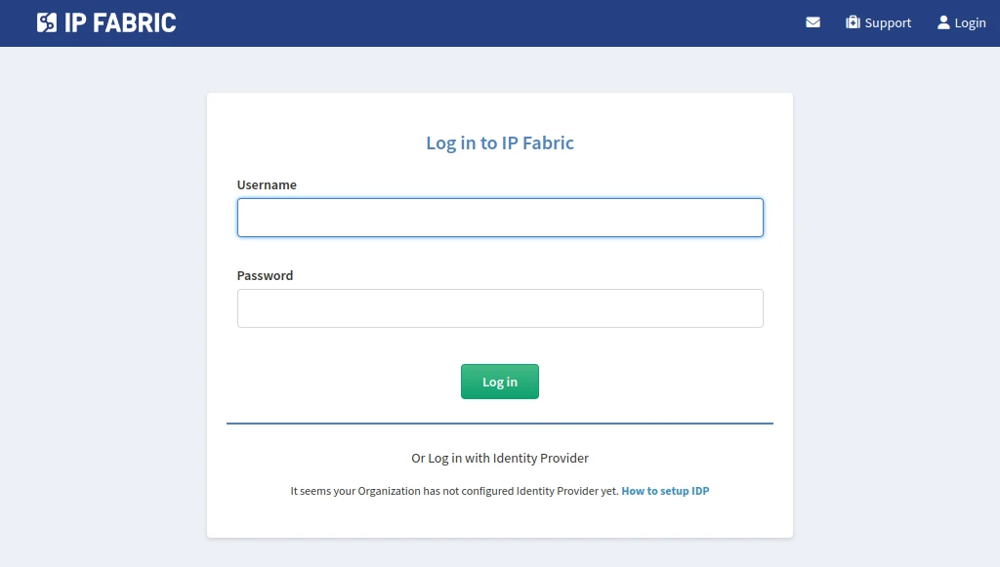
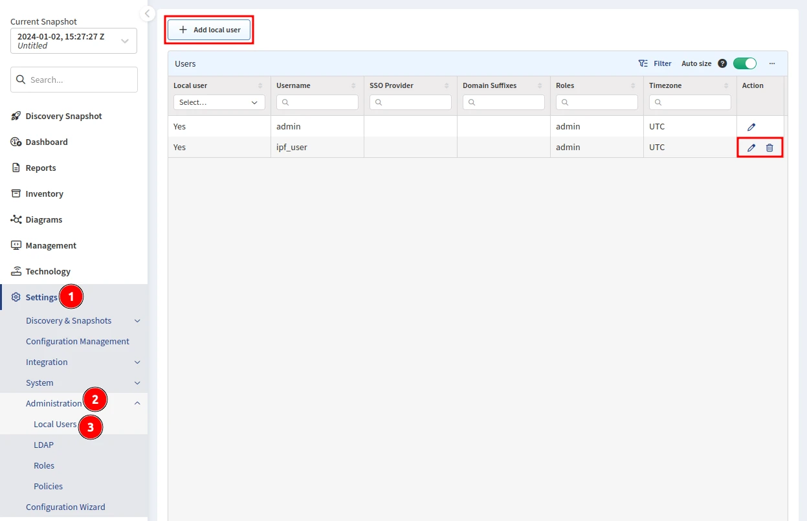

# Access User Interface and Install License

## Accessing the Main User Interface

Type the IP Fabric VM's address into your web browser and allow HTTPS exceptions in case of a warning.

!!! note "Trusted Certificate"

    You can replace a self-signed SSL certificate with a trusted one in the web UI.

The system requires a license file that uniquely identifies the system and links it to the dedicated support channels.

Please keep the license file safe, as it is also used as part of the key to encrypt sensitive information.

Drag the `license.key` file into the **Drop a file** area. Or click the area (or the **Upload & accept** button) and browse to the file.

If the license installation fails, contact the IP Fabric Support team.

Once the license is validated, the system will present a login screen.

Log in with the username `admin` and a password created in a previous step ([IPF CLI Config](02-ipf_cli_config.md)).

## Managing additional users

When logged in with the `admin` account, you can manage all users in the main IP Fabric user interface.

Navigate to **Settings --> Administration --> Local Users** to create, edit, delete local users, and change their passwords.

