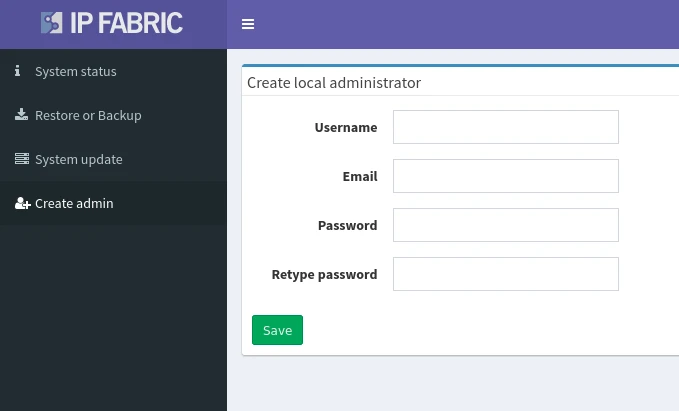

# Access User Interface and Install License

## Creating the First IP Fabric User

To create the first user, please log in to the **System Administration** UI on port `8443`.

After logging in as the `osadmin` user, go to the **Create admin** menu and set up a new local administrator account.

!!! info

    On a clean IP Fabric installation, there is no user for the main GUI
    present by default. It is mandatory to create a new local administrator
    account.

With this new account, you will be able to log in to the main IP Fabric user
interface.

In **Settings --> Administration --> Local Users** of the main interface, you
can change the password of the new account.

In **Settings --> Administration --> Local Users**, you can also create or delete local users and change their passwords.

## Accessing the Main User Interface

Type the IP Fabric VM's address into your web browser and allow HTTPS exceptions in case of a warning.

!!! note "Trusted Certificate"

    You can replace a self-signed SSL certificate with a trusted one in the web UI.

The system requires a license file that uniquely identifies the system and links it to the dedicated support channels.

Please keep the license file safe, as it is also used as part of the key to encrypt sensitive information.

Drag the `license.key` file into the **Drop a file** area. Or click the area (or the **Upload & accept** button) and browse to the file.

If the license installation fails, contact the IP Fabric Support team.

Once the license is validated, the system will present a login screen.

Log in with the account created in [Creating The First IP Fabric User](#creating-the-first-ip-fabric-user):

