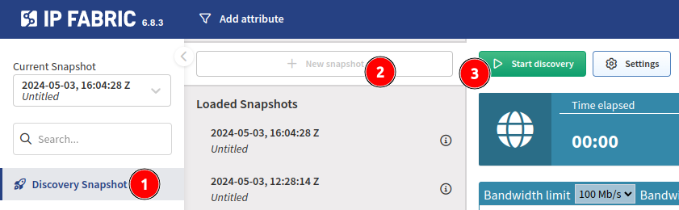

# Initial Discovery

Now that you have entered the essential details, you can start the discovery!

## Option 1 -- via the Configuration Wizard

You can click the **Start Discovery** button in step 4 of the
[Configuration Wizard](04-configuration_wizard.md).

## Option 2 -- via the Discovery Snapshot Page

On the **Discovery Snapshot** page, click **+ New snapshot** and then **Start
discovery**:

IP Fabric will attempt to connect to the default gateway of the VM and any
provided Seed IP Addresses. Once connected to a device, IP Fabric will
fingerprint the vendor, model, and version, and adjust accordingly to run
the [necessary commands](https://matrix.ipfabric.io). You can read more about
the discovery process at
[How Discovery Works](../overview/How_Discovery_Works/CLI_discovery.md).

After the discovery is completed, all of the state data is available, and you
can start exploring [IP Fabric GUI](../IP_Fabric_GUI/discovery_snapshot.md).

**Enjoy using IP Fabric!**

If no devices are discovered, or something is missing, check this
[documentation page](../overview/How_Discovery_Works/common_problems/no-devices-discovered.md)
for known cases or contact our Support team.
