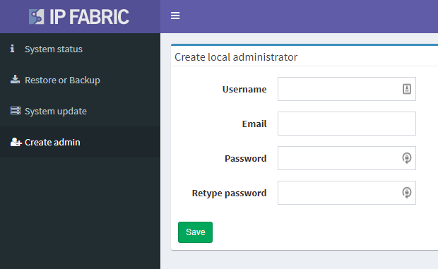
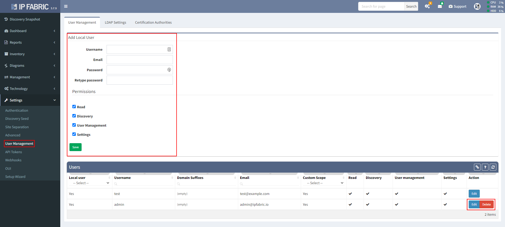

# Invalid Default Username And Password

Default username to the main IP Fabric user interface is `admin` with password
`netHero!123`.

For an unknown reason, it might happen that on the first start-up
default system username and password is not working. To fix this issue,
please login to the System administration running on port `8443`.
After login as `osadmin` user go to **Create admin** and there
create a new local administrator account.

With this new account, you can log in to the main IP Fabric user
interface and change a password to the default admin account or delete
it. This can be done in **Setting → User Management** menu. Also, other
user accounts can be created here.

