# Adding AAA User To Cisco ACS

In this chapter we will go through basic Cisco ACS configuration. We
will describe how you can create network device groups, users that will
be able to access the devices in these groups, and the authorization
policies that will determine the rights the users will be granted on
these devices.

Here is a brief description of some of the components in ACS:

-   **Network device groups** – groups of network devices, usually with
    similar functions.
-   **Identity groups** – groups of users.
-   **User accounts** – user accounts will be placed in the Identity
    groups.
-   **Authorization profiles** – profiles that control what rights are
    permitted. They are associated with a Network device group and an
    Identity group.

In our example, we will create the following:

-   a single device group named **RoutersHQ** for the routers.
-   a single router that will be placed in the **RoutersHQ** device group.
-   two Identity groups – **Admin** and **HelpDesk**
-   two users – an administrator that will be placed in the **Admin
    group**, and a user that will be placed in the **HelpDesk group**.
-   two authorization policies – the **AdminRole** group with the full
    privilege level 15 access, and the **HelpDeskRole** with the privilege
    level 1 access to the devices in the RoutersHQ device group.

We can create the ACS components listed above. First, we need to create
a device group called **RoutersHQ**. To do so, go to **Network Resources \>
Network Device Groups \> Device Type \> Create**:

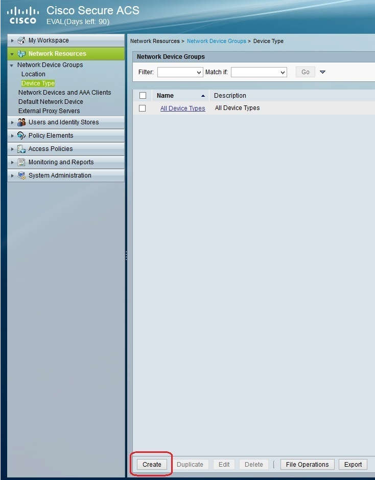

Enter the device group information and click the **Submit** button:

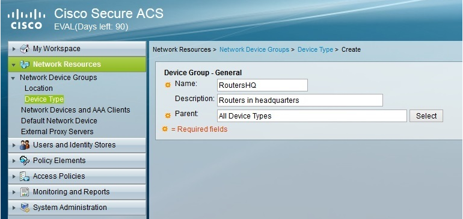

After the device group has been created, we need to add a router in it.
To do this, go to **Network Resources \> Network Devices and AAA Clients
\> Create**:

Under **Name**, enter the name for the router (it does not have to match the
real router’s hostname). Under **Device Type**, select the device group
you’ve created in the previous step. Under **IP address**, enter the IP
address of the router. Under **Authentication options**, click the checkbox
next to the protocol that will be used and type the password.

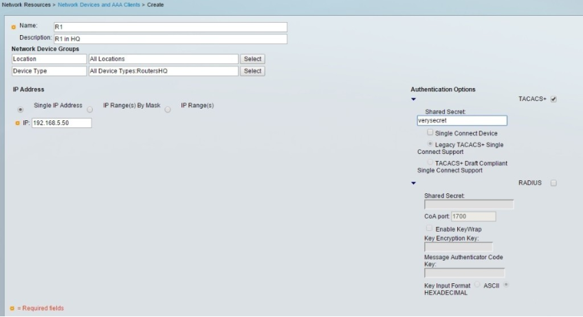

Next, we need to create two user groups: **Admin** and **HelpDesk**. To do this,
go to **Users and Identity Stores \> Identity Groups \> Create**:

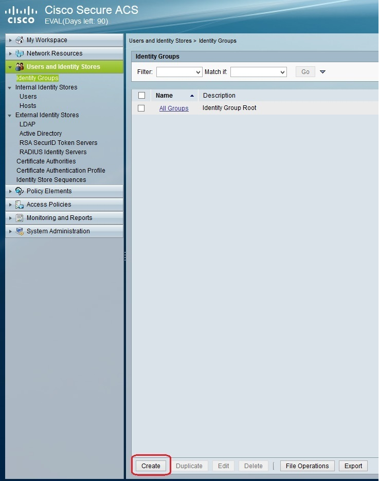

Enter the group information:

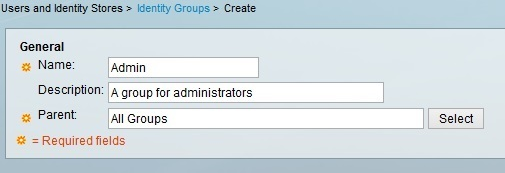

Repeat the process to create the second group:

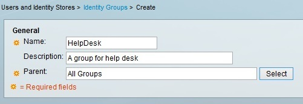

Now we need to create two users and place them in the appropriate
identity groups. To do that, go to **Users and Identity Stores \> Internal
Identity Stores \> Users \> Create**:

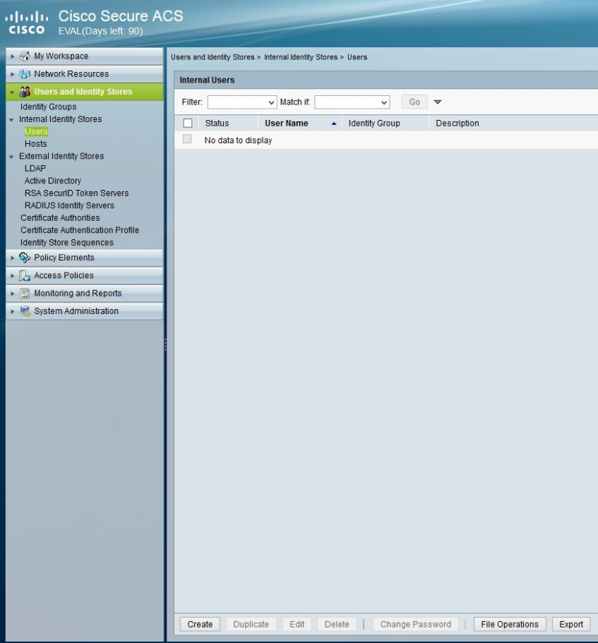

Under** Name**, enter **Administrator**. Under **Identity Group**, select
the **Admin** group. Under **Password**, configure the password for the user.
When you are done, click **Submit** to create the user:

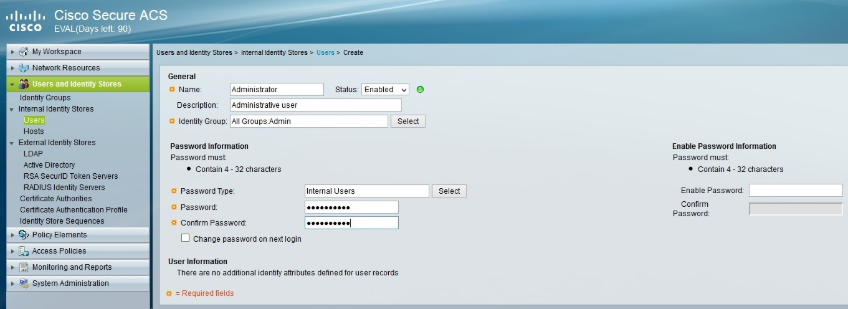

Repeat the process for the **Helpdesk** user. Make sure to select
the **HelpDesk** group:

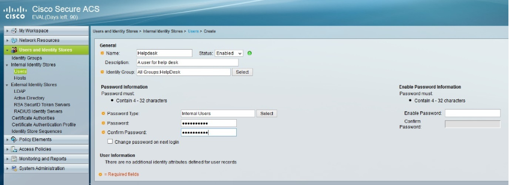

The next step is to create authorization policies to give full access to
users in the **Admin** group and limited access to users in
the **HelpDesk** group. Go to **Access Policies \> Access Services \>
Default Device Admin \> Authorization \> Create**:

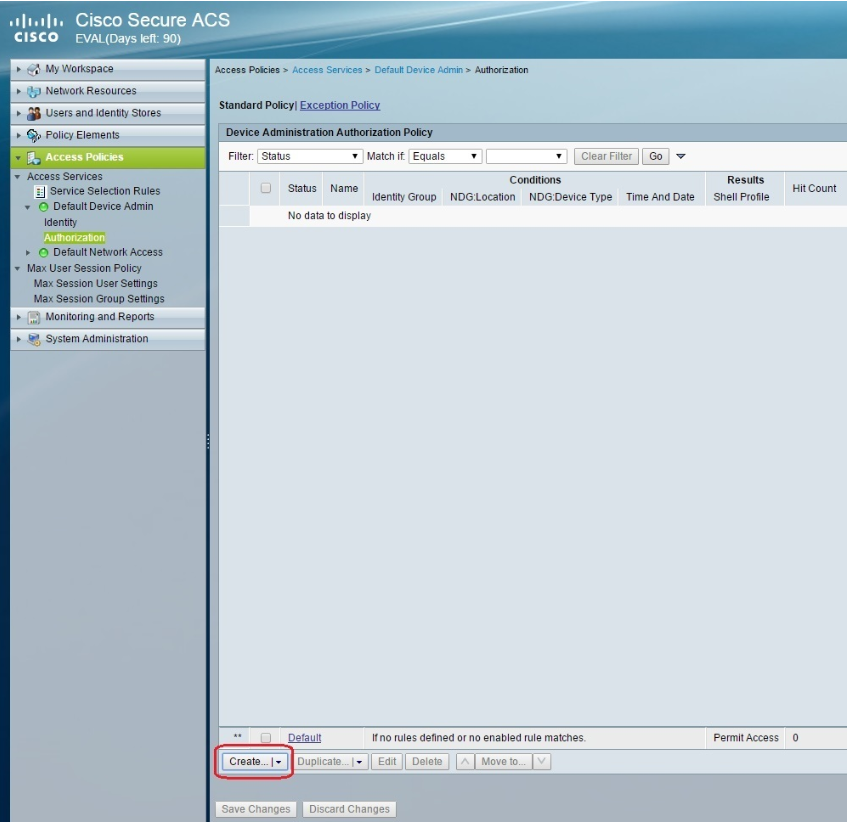

Name this policy **AdminRole**. Under **Identity Group**, choose
the **Admin** group. Under **NDG:Device Type**, choose
the**RoutersHQ** device group. Click the **Select** button next
to **Shell Profile**:

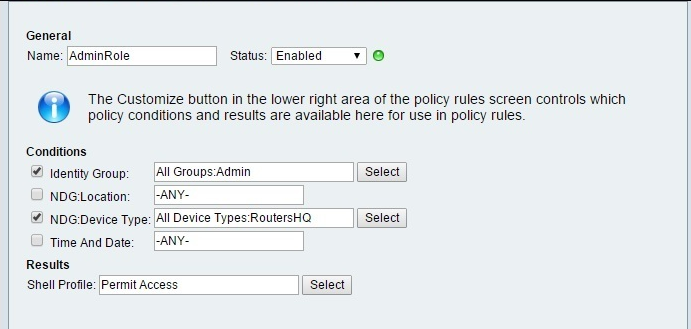

We will not use the preconfigured profiles – we will create our own.
Click** Create**:

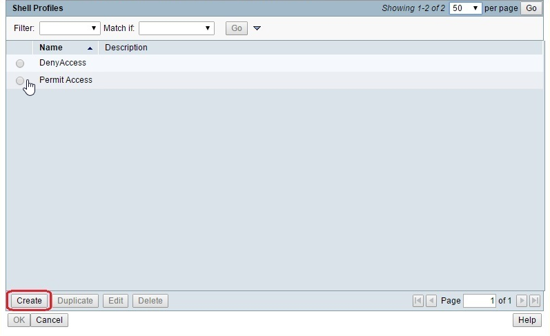

Name the profile and click the **Common Tasks** tab:

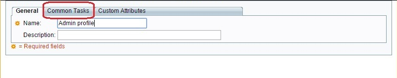

Change the **Default privilege **level to **Static**, and assign the
privilege level of **15**:

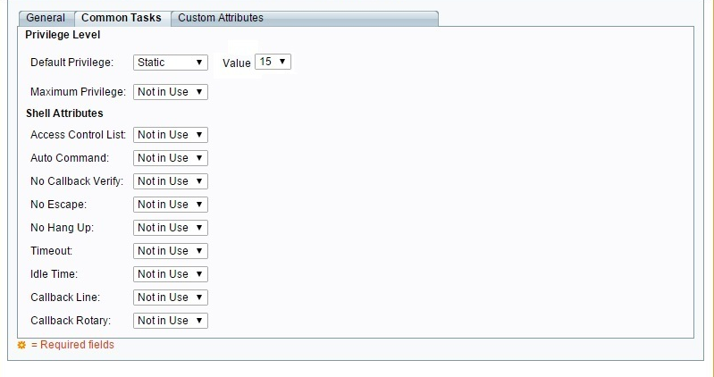

Click **Submit**. We need to repeat the process to create the **HelpDeskRole**:

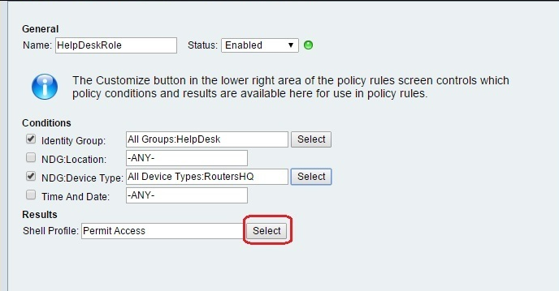
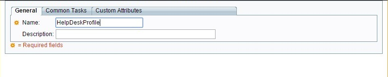

This time, assign the privilege level of **1**:

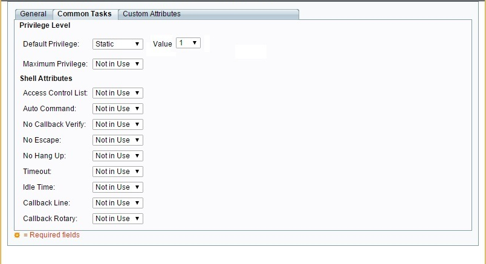

  

You can now test the user and then add it to IP Fabric authentication
list.
