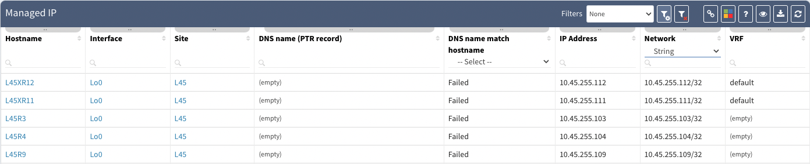

# Inconsistent VRF Names On Cisco Platforms

For different Cisco families, the default VRF name may be inconsistent
in technology tables where the VRF name is present. There are the
following examples:

- Cisco IOS - using `default` string to identify main VRF

- Cisco IOS-XE - using `empty` string to identify main VRF

As per the following example, the excerpt from the
**Technology -> Addressing -> Managed IP** table, all records are for Cisco
devices, but different families are involved:

## How The Internal Algorithms Operate

Internally, IP Fabric understands the discrepancy and uses the special
labels to identify default VRF and to simulate the End-to-End path
correctly.
