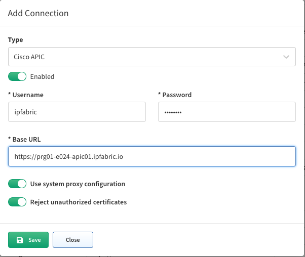
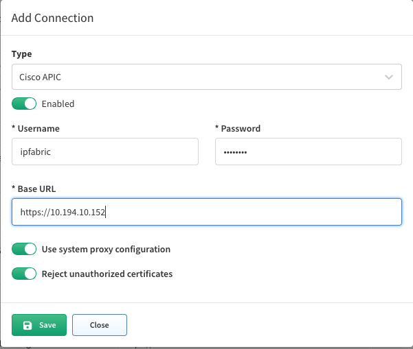

# APIC Tables are all empty except Controllers

Even though APIC Vendor API setting are set correctly, you are not able to see anything in ACI related tables, except **Controllers** table.

The reason for this is in the way APIC is discovered.

APIC discovery is running in "hybrid" discovery. Information about controllers are collected through SSH, but the rest of the data are collected thought the API.

If all tables except Controllers are empty, mapping between SSH and API data failed. If all tables are empty, SSH discovery also was not successful.

Until 6.0.1 release there were issues with API to SSH mapping, if FQDN was used in Vendor API settings.

IP Fabric was trying to map FQDN `baseurl` to hostname and because the domain is not usually part of the hostname, mapping was failing.

For example:

```
hostname PRG01-E024-APIC01 != FQDN prg01-e024-apic01.ipfabric.io
```

The workaround is to use IP address of the APIC controller instead of FQDN in the Vendor API settings:

!!! failure

    

!!! success

    

Afterwards IP address from Vendor API settings is used for mapping instead of hostname to FQDN.
