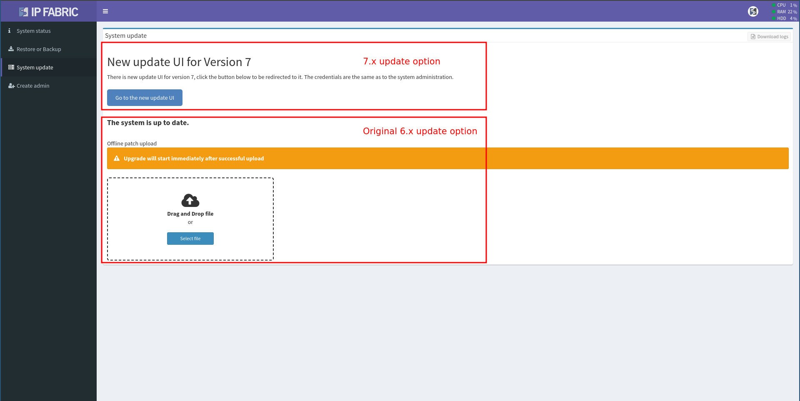
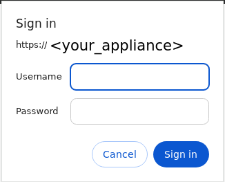
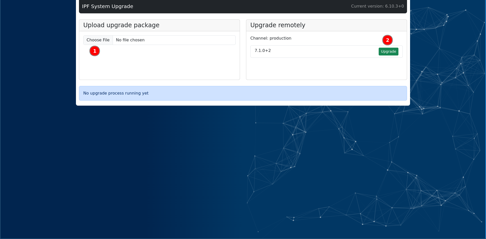
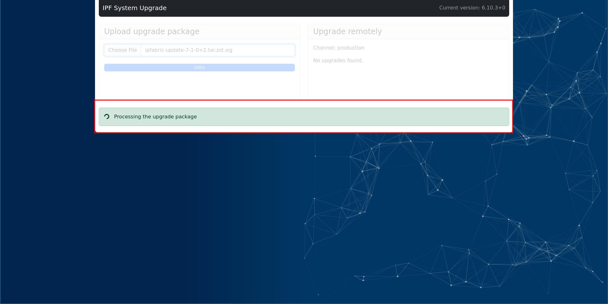

# IP Fabric v6.10

!!! danger "Unreleased Version"

    This is an upcoming IP Fabric version, which has not been released yet and
    is not available for download.

--8<-- "snippets/upgrade_version_policy.md"

--8<-- "snippets/clear_browser_cache.md"

## v6.10.0 (UNRELEASED)

### New Upgrade Process

The upgrade process for the IP Fabric appliance has been updated.

Starting from version `6.10` and for later `6.x` releases, there are now two
distinct upgrade branches.

#### Upgrade to `6.x` Based Version

The upgrade process for version `6.10` and later remains consistent with
previous versions. You can perform the upgrade either online or by uploading the
upgrade package.

The upgrade is performed through the familiar System Update interface.
Additionally, the interface now includes a link to upgrade to versions `7.0` and
higher.

   
#### Upgrade to `7.x` Based Version

When you choose to upgrade to version `7.x`, you will be redirected to the new
upgrade service.

This service requires re-authentication with `osadmin` account, even if you are
already logged in the System Administration interface.

After successful authentication, the new upgrade interface appears, providing
two options:

1. Manually upload the upgrade file.
2. Upgrade over the internet, if the appliance is connected.

The new upgrade service operates on port `443`, so no additional firewall ports
need to be opened.

During the upgrade, the service displays the progress, and once the upgrade is
complete, the appliance will reboot automatically.

!!! Note

    When both upgrades (`6.x` and `7.x`) are available, it is recommended to upgrade
    to the `7.x` version.

    In this case, the green indicator on the appliance will show the `7.x`
    upgrade.

### API Changes

#### API Endpoints Deprecation

The below API endpoints have been marked as deprecated and the intention is to
remove them in the next major version `7.0`.

- `/tables/interfaces/transfer-rates/*`
- `/tables/interfaces/errors/*` except for `/tables/interfaces/errors/disabled`
- `/tables/interfaces/drops/*`

### Improvements

- **Improvements -- Cisco APIC:**
  - When an unsupported class is received in API response, the unsupported class
    is removed in the next request. Previously, this functionality did not work
    when the `returnPartialData` configuration parameter was set to `true`.
  - Vendor API client logging was extended.
- **Versa Routing Table Processing** -- The processing speed of routing tables
  has been dramatically improved, resulting in a significant performance boost.
This enhancement resolves issues where discovery process would get stuck when
processing very large routing tables.
