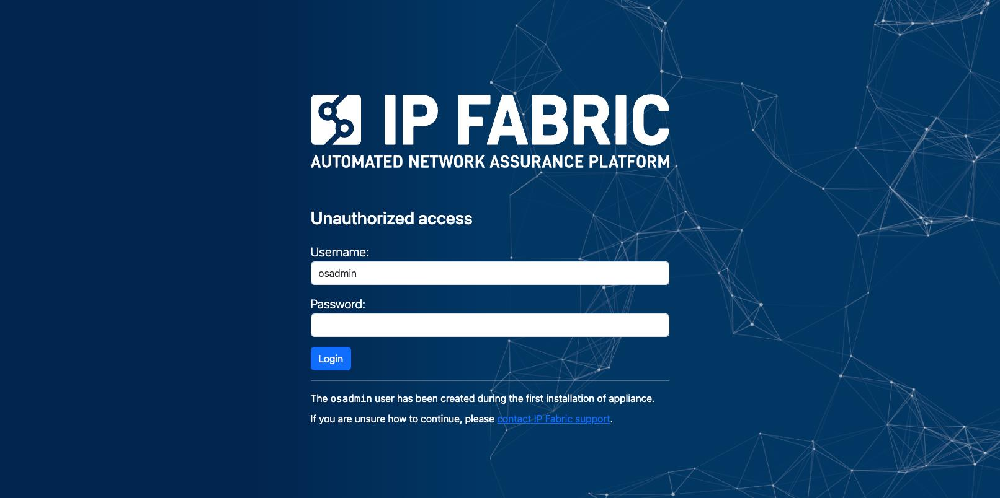

# IP Fabric v6.10

--8<-- "snippets/upgrade_version_policy.md"

--8<-- "snippets/clear_browser_cache.md"

## v6.10.7 (February 4th, 2025; GA)

```
SHA256 (ipfabric-update-6-10-7+0.tar.gz.sig) = a2e066672810aeb48210c8e361888e7525bd42e58436a49c4c223c03b72bc20a
MD5 (ipfabric-update-6-10-7+0.tar.gz.sig) = f3b15495664f76f29afdb89059f622a4
SHA256 (ipfabric-6-10-7+0.ova) = 2997e64716a3d518b946824ecd91954b4b80d2539b42325638d4ba2a793049ce
MD5 (ipfabric-6-10-7+0.ova) = a41c1e5bb2f4da39421307da9eaef527
SHA256 (ipfabric-6-10-7+0.qcow2) = 2cecdd26a7ef2d6e052d6ea15df593f27aa4f2bb8b8c2e284ead48b910470815
MD5 (ipfabric-6-10-7+0.qcow2) = 26e2f183f5ea7ef4af8e7c718a8e6dba
SHA256 (ipfabric-6-10-7+0.vmdk) = 4a858e0a13d3c30462ea959cd475da3b94ae0f6cec68eab19615948e2b780fab
MD5 (ipfabric-6-10-7+0.vmdk) = 02e056826dbcf9cca33d36292d02af92
```

- A **critical vulnerability** has been fixed. We strongly recommend that all customers upgrade to this version. If upgrading is not feasible, please contact our [support team](https://support.ipfabric.io) for assistance in applying the hotfix.
- Resolved kernel-related issues that prevented older installations from upgrading to the `7.0` release.

## v6.10.6 (December 30th, 2024; GA)

- The login method for the new upgrade portal to version `7.x` has been changed.
Basic authentication has been replaced with a cookie-based login method.

## v6.10.5 (November 27th, 2024; GA)

- Fixed issue for air-gapped environments unable to reach `callhome.ipfabric.io` service.

## v6.10.4 (October 21st, 2024; GA)

```
SHA256 (ipfabric-update-6-10-4+0.tar.gz.sig) = fa6e94456a842e03a740c1b8ebae66fa26bd14d55667b0dcb732e06b925eac5b
MD5 (ipfabric-update-6-10-4+0.tar.gz.sig) = e93ed0db74f6c24fab801c1ea6f8a3da
SHA256 (ipfabric-6-10-4+0.ova) = ee5d9148b4ef8060421e37b5866bb8c411db7873e3e6ba7001a826662c1cc353
MD5 (ipfabric-6-10-4+0.ova) = 4ebd3b8329947dc46f4e5fbe66e0148d
SHA256 (ipfabric-6-10-4+0.qcow2) = 7b9809fb92feff9fb9f3bbb521e562d132d05cd0dfcfdd01c0e9cdc0b63d0347
MD5 (ipfabric-6-10-4+0.qcow2) = 01cb0fb21fc7adc6f1e58b5c03a1cf32
SHA256 (ipfabric-6-10-4+0.vmdk) = 5668857bfb46be8349e9744046be6495c00e2a6a3042598fd2c6f219e876e8c0
MD5 (ipfabric-6-10-4+0.vmdk) = f22702794e6b0ab626ff09228066da7e
```

### New Upgrade Process

The upgrade process for the IP Fabric appliance has been updated.

Starting from version `6.10` and for later `6.x` releases, there are now two
distinct upgrade branches.

#### Upgrade to `6.x` Based Version

The upgrade process for version `6.10` and later remains consistent with
previous versions. You can perform the upgrade either online or by uploading the
upgrade package.

The upgrade is performed through the familiar System Update interface.
Additionally, the interface now includes a link to upgrade to versions `7.0` and
higher.


#### Upgrade to `7.x` Based Version

When you choose to upgrade to version `7.x`, you will be redirected to the new
upgrade service.

This service requires re-authentication with `osadmin` account, even if you are
already logged in the System Administration interface.



After successful authentication, the new upgrade interface appears, providing
two options:

1. Manually upload the upgrade file.
2. Upgrade over the internet, if the appliance is connected.


The new upgrade service operates on port `443`, so no additional firewall ports
need to be opened.

During the upgrade, the service displays the progress, and once the upgrade is
complete, the appliance will reboot automatically.


!!! Note

    When both upgrades (`6.x` and `7.x`) are available, it is recommended to upgrade
    to the `7.x` version.

    In this case, the green indicator on the appliance will show the `7.x`
    upgrade.

### API Changes

#### API Endpoints Deprecation

The below API endpoints have been marked as deprecated and the intention is to
remove them in the next major version `7.0`.

- `/tables/interfaces/transfer-rates/*`
- `/tables/interfaces/errors/*` except for `/tables/interfaces/errors/disabled`
- `/tables/interfaces/drops/*`

### Improvements

- **Improvements -- Cisco APIC:**
  - When an unsupported class is received in API response, the unsupported class
    is removed in the next request. Previously, this functionality did not work
    when the `returnPartialData` configuration parameter was set to `true`.
  - Vendor API client logging was extended.
- **Versa Routing Table Processing** -- The processing speed of routing tables
  has been dramatically improved, resulting in a significant performance boost.
  This enhancement resolves issues where discovery process would get stuck when
  processing very large routing tables.

### Known Issues

- Sometimes, downloading a new IPF version via the **Update Portal** freezes and requires recovery. Please follow [these](../../support/known_issues/IP_Fabric/download_process_freeze.md)
steps to recover the download process.
