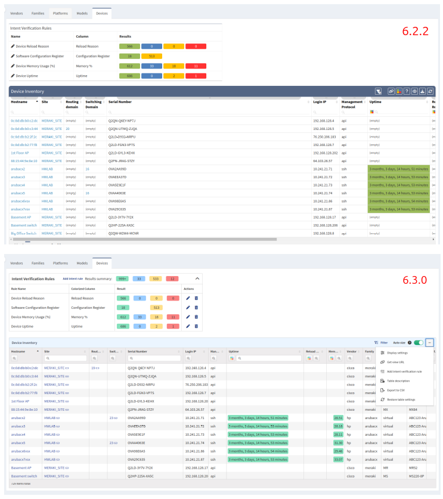

# IP Fabric v6.3 (Camlet)

--8<-- "snippets/upgrade_version_policy.md"

--8<-- "snippets/clear_browser_cache.md"

### Upgrade Notices

- During the update process locked snapshots will be unloaded together with other snapshots and their lock will be preserved. Therefore, such snapshots won't be deleted by snapshot retention.
- Upgrade to `v6.3` will break custom SSO integrations and will require a change to the `/etc/ipf-dex.yaml` file. Simply replace the `vX.Y` in this file with `v6.3` and then run `systemctl restart ipf-dex`.

  ```yaml
  staticClients:
    - id: ipfabric
      redirectURIs:
        - "https://demo1.eu.ipfabric.io/api/vX.Y/auth/external/azure"
  ```

  For more information, please refer to the [SSO documentation](../../IP_Fabric_Settings/administration/sso.md#sso-configuration-ipf-dexyaml). If you would like assistance please contact your Solution Architect.

## v6.3.2 (September 4th, 2023)

!!! important "Not a GA"

    This release is available only to early adopters for testing purposes.

```shell
SHA256 (ipfabric-update-6-3-2+1.tar.gz.sig) = dae0f2be799ebfbccb53f6f65158ba66f3a419b3401ff21c7a6e5ead4725de19
MD5 (ipfabric-update-6-3-2+1.tar.gz.sig) = 7d82a812efa6b29d973bd6f4a903d31e
SHA256 (ipfabric-6-3-2+1.qcow2) = 3d9fc23a8a9c067ed08a155d38e81845544db3eb894ef122c41b559bff96a24a
MD5 (ipfabric-6-3-2+1.qcow2) = c7b75bca231d180df541dde57c39f01b
SHA256 (ipfabric-6-3-2+1.ova) = 68cf6f3af1ae6ba37247947ce1fbdce8716198fe399903b66c92816e2cb24680
MD5 (ipfabric-6-3-2+1.ova) = 85a8723cfa734aa58c6d0a9f23349809
```

- A fix for SSO has been implemented to ensure that updating the `redirectURIs` in the `/etc/ipf-dex.yaml` configuration file is only required after a major version upgrade (i.e. `6.3.0` --> `7.0.0`). For more information and example please see the [SSO Static Clients](../../IP_Fabric_Settings/administration/sso.md#static-clients) documentation.

## v6.3.1 (August 16th, 2023)

```shell
SHA256 (ipfabric-update-6-3-1+1.tar.gz.sig) = cc1e79afd9b28f648f362bb002308433faa4a727349036169c4569cd8ed143f4
MD5 (ipfabric-update-6-3-1+1.tar.gz.sig) = 6c48708a464841f0a65036e3f78dad24
SHA256 (ipfabric-6-3-1+1.qcow2) = e124b39d192fafc8e0ed2c5daab6e6ef70beaf18d581f2585243810c7362b96c
MD5 (ipfabric-6-3-1+1.qcow2) = 167cf96f9d06057a9117d412a5b4861e
SHA256 (ipfabric-6-3-1+1.ova) = 32931352ce394d184c7f74d570b073dcabd529eff0bcbe30fb6a6f87b19afb5b
MD5 (ipfabric-6-3-1+1.ova) = bacc07182c48474b943924283b01e334
```

### Versioned API Error responses

- All version related HTTP errors have aligned with [documentation](../../IP_Fabric_API/index.md#api-versioning). Improperly set version in request will result in an error response with `410 Gone` HTTP code and current product and API versions in its response body. Before it was returning `404 Not Found`.

### Discovery

- Number of devices processed by a single discovery worker is now configurable. Reach out to the support or solution architect team if adjustments are needed.

### Fixed Known Issues

- Editing OUI entries is broken in the UI (**Settings --> Discovery & Snapshots --> Global Configuration --> OUI**).
  OUI can be viewed and all previous changes are kept, but cannot be added or changed at the moment.
  - ID: `NIM-11931`
  - Root cause: UI uses wrong API endpoint URLs after restructuring settings menu.
  - Workaround: Use API `/settings/oui/*` directly.
  - Affected version: 6.3.0
- Custom policies with access to table endpoints don't allow to export table as CSV
  - ID: `NIM-11916`
  - Root cause: Custom policies could grant access only to `POST` HTTP method on table endpoints while export uses `GET` method
  - Workaround: Use admin access to export tables
  - Affected version: 6.3.0
- CSV exports blank file when Intent Filter is applied (any filter with a `color`)
  - Root cause: CSV export does not support exporting `reports` (intent) information with the data causing the filter returning no data.
  - ID: `NIM-12011`
  - Workaround: Use IP Fabric API to download the filter data and convert to CSV
  - Affected versions: 6.3.0
- Routing table parsing and validation may restart discovery workers and stop discovery
  - Root cause: Parsing and validation of large BGP routing tables can stuck discovery workers for more than allowed 1 minute. Discovery workers may be disconnected from the discovery process and restarted. If too many restarts of discovery workers are performed, discovery process will stop.
  - ID: `NIM-11490`
  - Workaround: Limit download of BGP routing to minimum.
  - Affected versions: 6.2.0 and later
- Product stopped respecting system's OpenSSL CA store
  - Root cause: product build doesn't include a respective flag `use-openssl-ca` for runtime
  - ID: `NIM-12047`
  - Workaround (shown on `nimpee-update`):
    - log in to your machine as `osadmin` user via SSH
    - execute `sudo su -` and put in your password to get root privileges
    - put int `systemctl edit nimpee-update` which should open a unit file for `nimpee-update` in editor
    - add following line under `[Service]` settings, un-comment (remove `#` character) if needed
      ```
      [Service]
      Environment="NODE_OPTIONS=--use-openssl-ca"
      ```
    - restart nimpeeUpdate service using `systemctl restart nimpee-update`
  - Affected versions: 6.3.0
- Lowered maximum memory for discovery worker process (from 6GB to 4GB)
  - Root cause: product build doesn't include a respective flag `max-old-space-size` for runtime
  - ID: `NIM-12047`
  - Workaround: no workaround
  - Affected versions: 6.3.0


## v6.3.0 (July 31st, 2023)

```shell
SHA256 (ipfabric-update-6-3-0+4.tar.gz.sig) = a51ea5af4de03ce2765c92876e78b7c214391180dee8ad1bf3dfc719af6d7f5e
MD5 (ipfabric-update-6-3-0+4.tar.gz.sig) = 3c5b5ef71b91dd87d2005576ba80c9f2
SHA256 (ipfabric-6-3-0+4.qcow2) = 29d9f659c34134d51cffe957add19e3b2d23e7905fd44a08af12278b3b802934
MD5 (ipfabric-6-3-0+4.qcow2) = 2be181483c56c1d4fe0544cea01dd267
SHA256 (ipfabric-6-3-0+4.ova) = 227e0851792dee75559f2e14f948bd7871b83ec7d47527bcc87fd842b729e5e0
MD5 (ipfabric-6-3-0+4.ova) = ccac181a8c17a3f82cd14a0cdfa49b6f
```

For the list of delivered tickets, please consult the [Low-Level Release Notes for 6.3.0](../release_notes_low-level/6.x/6.3.x/6.3.0.md).

### Backward incompatible changes

- API Tokens and Webhook Secrets become auto-generated and non-editable by a user. They are available to view only once after creation, and the user won't be able to view or edit them any further. From now, both tokens and secrets will always be 32 characters long and generated randomly. If API Token or Webhook secret values are lost, they should be recreated.
- Column type of `selectorLocalAddress` and `selectorRemoteAddress` columns in IPsec tunnels table was changed to a string. We no longer allow `ip` filter operator with the given columns.
- Legacy NAT tables have been replaced with NAT44 table (`tables/security/nat44`) in release 6.1. This release removes the remaining two legacy tables - `tables/addressing/nat/rules` and `tables/addressing/nat/pools`.

### Important changes

- Vendor API `Slug` can only contain `a-zA-Z0-9_-`. Previously created configurations will be automatically modified by removing not-allowed characters from `Slug` according to the new validation rules.
- SSO `roleName` can only contain `a-zA-Z0-9_-`. Previously created roles will be automatically modified by removing not-allowed characters from role name according to the new validation rules. Make sure specified `roleName` refers to the existing role in the system.
- Limiting the number of the Discovery services restarts -- from now on it is possible to change the default number of discovery service restarts. This may help you if your full discovery never completes. To change this setting, please contact our customer support team.
- You can use the `Test Connection` button to check the Vendor API connectivity settings. The connection is not tested automatically with each change, but only when you click the button. This lets you save the Vendor API settings even if the controller is unreachable from IP Fabric.

### New table layout

In most sections with tables, we have switched to the new table layout (which also includes improved configuration of `Intent Verification Rules` and `Advanced Filters`).



### New tables for customers using RBAC

The following new tables have been added to IP Fabric. If you are utilizing RBAC
please verify and update your
[Policies](../../IP_Fabric_Settings/administration/policies.md) to ensure your
users are able to view them as well as using the Path Lookup autocomplete.
If you need assistance please contact your Solution Architect.

- Technology Tables
  - POST `/tables/serial-ports` (Technology --> Serial Ports)
  - POST `/tables/routing/protocols/is-is/levels` (Technology --> Routing --> IS-IS --> Levels)
  - Tables under Technology --> Routing --> LISP
    - POST `/tables/routing/protocols/lisp/ipv4-routes` (Routes --> IPv4)
    - POST `/tables/routing/protocols/lisp/ipv6-routes` (Routes --> IPv6)
    - POST `/tables/routing/protocols/lisp/ipv4-databases` (Map Resolvers --> IPv4)
    - POST `/tables/routing/protocols/lisp/ipv6-databases` (Map Resolvers --> IPv6)
- Path Lookup: These new endpoints will search the IP Fabric database and autocomplete the IP Address dropdown fields.
  - POST `/tables/addressing/path-lookup-sources-unicast`
  - POST `/tables/addressing/path-lookup-sources-multicast`

### Network Discovery

- Cisco
  - Viptela -- added vBond Orchestrator discovery support.
  - Firepower -- added support for Threat Defense NAT policies (NAT44).
  - Cisco Software-Defined Access (SDA) -- added support for [Locator/ID Separation Protocol](../../IP_Fabric_GUI/technology_tables/lisp.md) (LISP).
- Juniper
  - Junos -- added support for [configuration groups](https://www.juniper.net/documentation/us/en/software/junos/junos-overview/cli/topics/concept/junos-software-configuration-groups-understanding.html) for tasks Zone Firewall, NAT44 and ACL (see our [feature matrix](https://matrix.ipfabric.io) for more details).
- Opengear
  - IM -- added support of basic discovery (see our [feature matrix](https://matrix.ipfabric.io) for more details).
- NSX-T -- API rate limiting was added to NSX-T discovery.
- Versa -- `refillRate` can be changed in the database settings and Pagination Limit in the Vendor API controller settings.
- IP Fabric
  - New Vendor API worker -- we have added a new worker to IP Fabric that only handles Vendor API data. Before, `worker@1` processed both Vendor API and CLI data. This change allows us to process up to 60 Vendor API devices simultaneously, instead of 20. You can contact our customer support team to adjust this default value if necessary.
  - Vendor API load-balancing -- IP Fabric can now process devices from multiple Vendor API controllers simultaneously. This change should speed up the discovery process and reduce the load on the Vendor API controllers.

### Re-organized Settings menu structure

To make the **Settings** menu more logical and intuitive, we have re-organized its items (including renaming some of them).

The following table shows how the items in the old menu map to those in the new menu:

| Old location                                  | Location in 6.3                                                           |
| :-------------------------------------------- | :------------------------------------------------------------------------ |
| Authentication                                | Discovery & Snapshots --> Discovery Settings --> Device Credentials       |
| Discovery Seed                                | Discovery & Snapshots --> Discovery Settings --> Discovery Seeds          |
| Site Separation                               | Discovery & Snapshots --> Discovery Settings --> Site Separation          |
| Advanced --> Discovery                        | Discovery & Snapshots --> Discovery Settings --> Discovery                |
| Advanced --> Assurance Engine                 | Discovery & Snapshots --> Discovery Settings --> Assurance Engine         |
| Advanced --> Disabled Discovery Tasks         | Discovery & Snapshots --> Discovery Settings --> Disabled Discovery Tasks |
| Advanced --> Snapshots                        | Discovery & Snapshots --> Snapshot Retention                              |
| Advanced --> SSH/Telnet                       | Discovery & Snapshots --> Discovery Settings --> Advanced CLI             |
| Advanced --> SSH/Telnet --> Jumphost settings | Discovery & Snapshots --> Global Configuration --> Jumphost               |
| Advanced --> Vendors API                      | Discovery & Snapshots --> Discovery Settings --> Vendors API              |
| Advanced --> Configuration Management         | Configuration Management                                                  |
| Advanced --> IP FABRIC Certificate            | System --> IPF Certificates                                               |
| Advanced --> System                           | System --> Backup & Maintenance                                           |
| Advanced --> SNMP                             | System --> SNMP                                                           |
| User Management --> Users                     | Administration --> Local Users                                            |
| User Management --> LDAP                      | Administration --> LDAP                                                   |
| User Management --> Policies                  | Administration --> Policies                                               |
| User Management --> Roles                     | Administration --> Roles                                                  |
| Certificate Authorities                       | System --> Certificate Authorities                                        |
| API Tokens                                    | Integration --> API Tokens                                                |
| Webhooks                                      | Integration --> Webhooks                                                  |
| Device Attributes                             | Discovery & Snapshots --> Global Configuration --> Device Attributes      |
| OUI                                           | Discovery & Snapshots --> Global Configuration --> OUI                    |
| Configuration Wizard                          | (unchanged)                                                               |

### Known issues
- Tasker does not follow restart stop limit
  - ID `NIM-12058`
  - Root cause: Tasker service does not follow limit of 3 restarts: If during the hybrid Vendor API discovery (APIC, FTD, Check Point, etc.) `tasker` process encounters an issue, it is restarted and discovery is started anew. This can lead to infinite discovery and filling the system disk with logs.
  - Workaround: no workaround
  - Affected versions: 6.2.0
