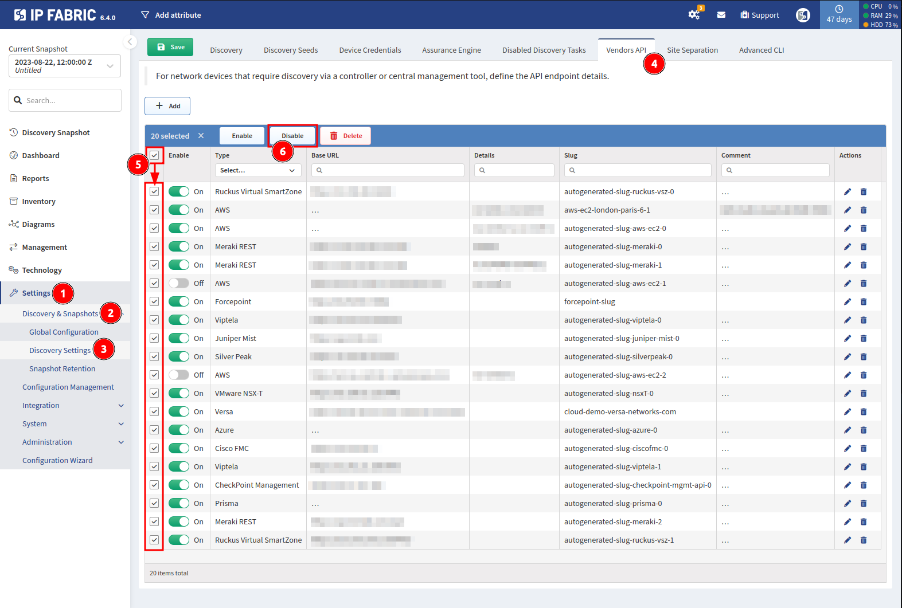

# IP Fabric v6.4

!!! danger "Unreleased version"

    This is an upcoming IP Fabric version, which has not been released yet and is not available for download.

--8<-- "snippets/clear_browser_cache.md"

## v6.4.0 (UNRELEASED)

### GUI

- Added support for bulk actions on Vendor APIs (in both the global and
  snapshot-specific settings). This is useful for enabling, disabling or
  deleting all (or multiple) Vendor APIs at once.

  

### Network Discovery

When the discovery process is automatically stopped due to a discovery service
being restarted multiple times, the resulting snapshot will be marked as
`FAILED` (and it will contain a `The discovery process failed. Data in this
snapshot is incomplete.` note).

- Palo Alto
  - PAN-OS -- added support for SNMP (see our [feature matrix](https://matrix.ipfabric.io) for more details).
- Cisco
  - ACI -- added basic support for Service Graphs
    - Service graphs inventory added to [SDN](../../IP_Fabric_GUI/technology_tables/SDN.md)
    - Supported rules can be found in a [Routing policies](../../IP_Fabric_GUI/technology_tables/routing.md/#routing-policies)
- AWS
  - **Update the related IAM policy prior to upgrading to `6.4`.** Download the policy JSON file [IAM-policy-IPF_6.4.json](../../IP_Fabric_Settings/Discovery_and_Snapshots/Discovery_Settings/Vendors_API/aws/IAM-policy-IPF_6.4.json). 
  - Transit Gateway routing significant update - added support for connect, peering and direct-connect-gateway attachments. Improved support for VPC and VPN attachments.
  - initial Direct Connect support - Direct Connect Gateway with transit virtual interfaces only. E2E path-lookup over Direct Connect isn't fully supported yet.
- New source of information for identifying neighbours
 - We now support ACI endpoint tables as a possible source of information for
   identifying neighbours during the discovery process. You may add/remove the
   `ACI endpoints` entry in the `What information is used to identify
   neighbours` field in **Settings --> Discovery & Snapshots --> Discovery
   Settings --> Discovery tasks settings**. We only consider devices as
   neighbours if their OUIs are enabled for discovery in **Settings -->
   Discovery & Snapshots --> Global Configuration --> OUI**.
