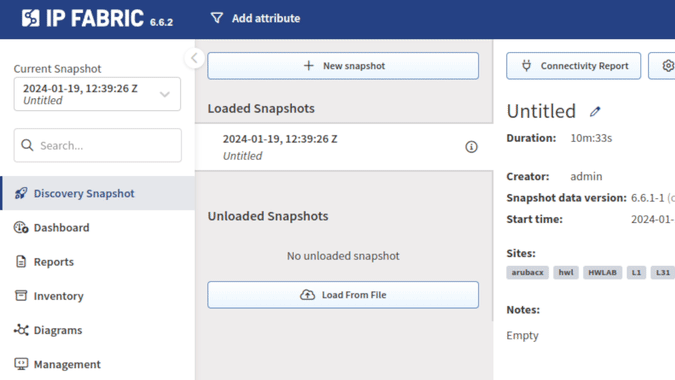
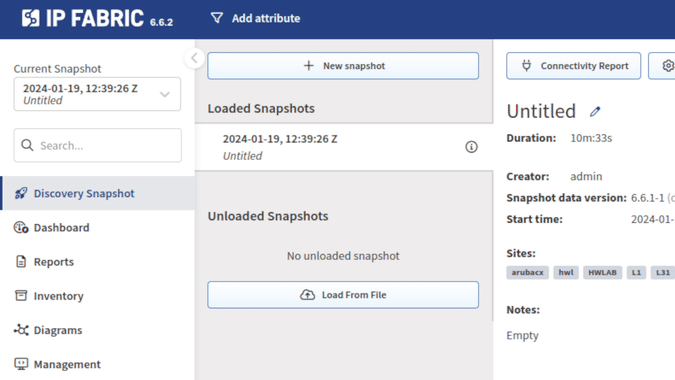

# IP Fabric v6.6

--8<-- "snippets/upgrade_version_policy.md"

--8<-- "snippets/clear_browser_cache.md"

## v6.6.3 (January 29th, 2024; GA)

```
SHA256 (ipfabric-update-6-6-3+0.tar.gz.sig) = 467a1a5147f9a061b070d3c04ad773ab8d4db85ccb3df55312fb50bac708b06c
MD5 (ipfabric-update-6-6-3+0.tar.gz.sig) = e9d275e4bb60dedd5d2c062a4e5f0847
SHA256 (ipfabric-6-6-3+0.qcow2) = c285d5e3ce51c90634d8b7fd8529e97a760ace2de25e087a3c616baf19d6b202
MD5 (ipfabric-6-6-3+0.qcow2) = 8cfe67f86af443bee7b1609bffbd6bc5
SHA256 (ipfabric-6-6-3+0.ova) = 7b351e5ce065d21f2665a54862d8b9a6894f442200a8a56c7d1c6bf756c8996c
MD5 (ipfabric-6-6-3+0.ova) = e52d04cfcde3d68bc768010785762249
```

### Upgrade Notices

- During the update process, locked snapshots will be unloaded together with
  other snapshots and their lock will be preserved. Therefore, such snapshots
  won't be deleted by snapshot retention.
- Upgrade to `6.6` may break custom SSO integrations and will require a change
  to the `/etc/ipf-dex.yaml` file. Since the `6.3.2` release, we are omitting minor
  API version for SSO configuration, and only major version will need to be
  changed with the next major IP Fabric version. Simply replace the `vX.Y` string in
  this file with `v6` and then run `systemctl restart ipf-dex`.

  ```yaml
  staticClients:
    - id: ipfabric
      redirectURIs:
        - "https://demo1.eu.ipfabric.io/api/vX/auth/external/azure"
  ```

  For more information, please refer to the
  [SSO documentation](../../IP_Fabric_Settings/administration/sso.md#sso-configuration-ipf-dexyaml).
  If you would like assistance, please contact your Solution Architect.

### Network Discovery

- Fortinet
  - FortiGate -- Added initial support for Aggregate IPsec tunnels with limited support in path-lookup -- evaluation of security rules is not supported yet.
- Palo Alto
  - PAN-OS -- Added support for
    - [IP wildcard](https://docs.paloaltonetworks.com/pan-os/9-1/pan-os-admin/policy/policy-objects) object in Zone Firewall.
    - [DHCP server](https://docs.paloaltonetworks.com/pan-os/9-1/pan-os-web-interface-help/network/network-dhcp/dhcp-server).
    - Discovery of Panorama in management and log collector modes.
- Cisco
  - FMC -- Added support for Device Groups
  - All families -- Devices banners are now being parsed and stored in our tables. See [Banner](../../IP_Fabric_GUI/technology_tables/management_table.md#banners) for more details.
- Arista
  - EOS -- Devices banners are now being parsed and stored in our tables. See [Banner](../../IP_Fabric_GUI/technology_tables/management_table.md#banners) for more details.
- Palo Alto
  - PAN-OS -- Devices banners are now being parsed and stored in our tables. See [Banner](../../IP_Fabric_GUI/technology_tables/management_table.md#banners) for more details.

### Important Product Changes

- API-discovered devices are now available in the global Device Attributes settings via Serial number search autocomplete.
- A request to `POST /discovery/trigger-config-backup` now will return `403 Forbidden` instead of `404 Not Found` if an API-discovered device `sn` is provided as parameter.
- API worker maximum memory usage is now limited to 8GB (instead of 4GB) to minimize possibility out of memory crash because of heavy calculations operations.
- Cisco FMC API client can detect refresh token expiration and re-authenticate when it happens.
- Only Force Point API client will repeat requests which failed with recoverable network errors (was previously enabled for all client). Configuration of number of requests, timeouts etc. is hard-coded as described in previous release notes. We are working on runtime configuration, which would enable tweaking those with IP Fabric Support assistance.

### Experimental Features

Newly added features which need to be explicitly enabled in service files. If you are interested in trying them out, please contact our Support or Solution Architect team and we will gladly help you with enabling these features.

- Citrix ADC
  - Basic discovery support was added as PoC and needs to be enabled manually
    (`ENABLE_DISCOVERY_DEVICES_CITRIX`).

### Known Issues

#### State Refresh Issues in `Discovery Snapshot` Section With Webhook Enabled

When a webhook is configured and enabled in **Settings --> Integration -->
Webhooks**, a newly started discovery won't show progress until you switch to
another menu section (for example **Dashboard**) and back to **Discovery
Snapshot** (or until you refresh the page).

| With webhook -- incorrect behavior | Without webhook -- correct behavior |
| :--------------------------------- | :---------------------------------- |
|  |  |

You may also encounter that after deleting a snapshot, it is still being shown
among `Loaded/Unloaded Snapshots` until you switch to another menu section and
back (or until you refresh the page).

#### `Network Analysis Report` Table Not Showing All Loaded Snapshots

**Reports --> Network Analysis Report** should allow you to download `Network
Analysis Report` documents for each loaded snapshot. However, on version `6.6`
(and a few previous major releases), it does not show all loaded snapshots.

This will be addressed in the upcoming `6.7` release.

A workaround is to reboot the IP Fabric appliance or just restart the IP Fabric
API service (with `sudo systemctl restart nimpee-api`).
