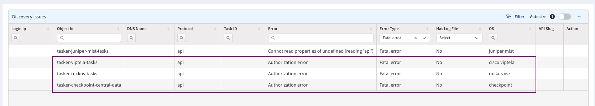

# IP Fabric v6.8

!!! danger "Unreleased version"

    This is an upcoming IP Fabric version, which has not been released yet and
    is not available for download.

## v6.8.4 (May 14th, 2024; GA)
```
SHA256 (ipfabric-update-6-8-4+0.tar.gz.sig) = 2660ef87f9cf512650dd67bb454feb0953bdd03e7db22f4234f1634043cac07e
MD5 (ipfabric-update-6-8-4+0.tar.gz.sig) = bcc3f6b55e5467835c7954362b6e35c5
SHA256 (ipfabric-6-8-4+0.ova) = 20146eceb07d63499d6c3a6b4803db657853ad3272f67976ae28130c48b7dc27
MD5 (ipfabric-6-8-4+0.ova) = 57586d9fefafdb06ac3dc4f333f60517
SHA256 (ipfabric-6-8-4+0.qcow2) = 9b55944acc2c6a30fbd435a125d0fcf8e70ea5047d0f9d11ef88961d9eb0b98a
MD5 (ipfabric-6-8-4+0.qcow2) = c3001363d8eb7e1695d63658442a6340
SHA256 (ipfabric-6-8-4+0.vmdk) = f8385667921641bbb63e312ee26a12fc4f6a8ba51918cfca6184a3edda50068f
MD5 (ipfabric-6-8-4+0.vmdk) = 4da10b0f213a6af0c1c88982115f4dbe
```

### Network Discovery

- Combined API + CLI discovery support for SD-WAN vendors [Versa](../../IP_Fabric_Settings/Discovery_and_Snapshots/Discovery_Settings/Vendors_API/Versa_Networks_SD-WAN.md) and [Viptela](../../IP_Fabric_Settings/Discovery_and_Snapshots/Discovery_Settings/Vendors_API/Cisco_Viptela_SD-WAN.md#cisco-viptela-sd-wan)
  - If combined discovery is enabled, routing tables are downloaded via CLI to avoid big data transfers over the controller. The discovery time should be improved.
  - After finishing all API calls, IP Fabric tries to connect to one of the device IPs (the default limit is 10 IPs, now configurable with IP Fabric Support). Credentials from the global discovery settings are used. If the device is not reachable, the routing table won't be downloaded.
- Azure -- The issue with multiple subcriptions has been fixed. Multiple subscriptions can now be specified and will be correctly discovered.
- Silver Peak (HPE Aruba EdgeConnect) -- Stale ARP records are stored due to a
  very short expiration time (TTL).
- HPE Citrix Aruba CX -- Support for Policy-Based Routing was added.
- Fortinet FortiSwitch
  - It is not necessary to enable it manually (`ENABLE_DISCOVERY_DEVICES_FORTISWITCH`) anymore.
  - Support for MCLAG and transceivers was added.
- Cisco (NX-OS, IOS-XR, ACI, ASA, FTD, IOS, IOS-XE) -- Support for bandwidth on interfaces was added.

### New CIDR Operators for Table Routing Columns

- Operators:
  - is strict supernet (API: `gt`, UI: `>`)
  - is supernet (API: `gte`, UI: `>=`)
  - is strict subnet (API: `lt`, UI: `<`)
  - is subnet (API: `lte`, UI: `<=`)
  - overlaps (API: `sect`, UI: `@`)
  - does not overlap (API: `nsect`, UI: `!@`)
- All new operators take IPv4 CIDR as a value.
- The operators are available for IPv4 routing table columns (e.g., in **Technology --> Routing --> Routes**).
- The operators can be used for table data filtering and in intent verification rule definitions.

### Other Changes

- Discovery error detection and reporting have been improved.
  - In a snapshot's **Summary of Issues**, any Vendor API discovery failure
    is now being reported (for example, due to missing/wrong
    credentials):<br/>
    
- `Device Change` dashboard widget -- The `Number of Changes` axis' scale has
  been changed from linear to logarithmic. This adjustment should improve
  visualization overall and prevent confusion with scale in certain cases.
- You can now update device attributes on an existing snapshot from global settings in
  **Discovery Snapshot --> Settings --> Device Attributes**. This action fully replaces
  all attributes on the snapshot.
- You can filter [Disabled Discovery Tasks](../../IP_Fabric_Settings/Discovery_and_Snapshots/Discovery_Settings/disabled_discovery_tasks.md) by device's Serial Number. This should help with targeting specific devices.
- In Table Description, there's a link to a separate page with the API documentation. Additionally, we've ensured that the information in our API documentation accurately reflects the behavior of our endpoints.
