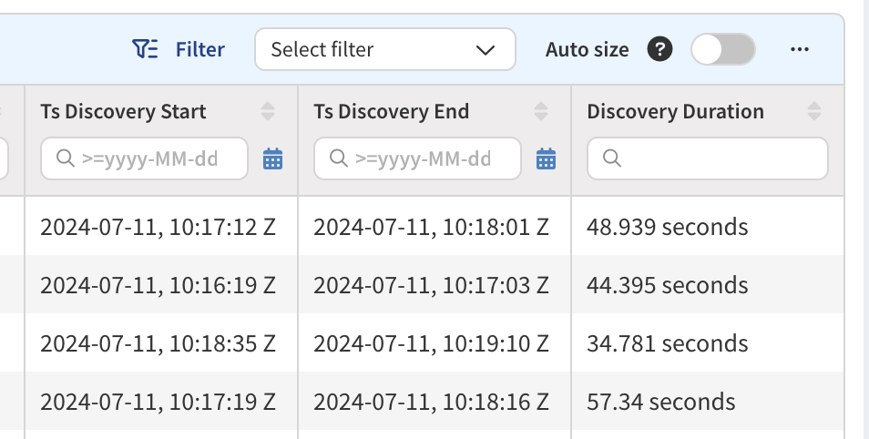

# IP Fabric v6.9

--8<-- "snippets/6.6.3_online_upgrade_issue.md"

--8<-- "snippets/upgrade_version_policy.md"

--8<-- "snippets/clear_browser_cache.md"

### Upgrade Notices

- During the update process, locked snapshots will be unloaded together with
  other snapshots, and their locks will be preserved. Therefore, such snapshots
  won't be deleted by snapshot retention.
- The upgrade to version `6.9` may break custom SSO integrations and will
  require a change to the `/etc/ipf-dex.yaml` file. Since the `6.3.2` release,
  we are omitting the minor API version for SSO configuration, and only the
  major version will need to be changed with the next major IP Fabric version.
  Simply replace the `vX.Y` string in this file with `v6` and then run
  `systemctl restart ipf-dex`.

  ```yaml
  staticClients:
    - id: ipfabric
      redirectURIs:
        - "https://demo1.eu.ipfabric.io/api/v6/auth/external/azure"
  ```

  For more information, please refer to the
  [SSO documentation](../../IP_Fabric_Settings/administration/sso.md#sso-configuration-ipf-dexyaml).
  If you would like assistance, please contact your Solution Architect.

## v6.9.7 (August 08th, 2024; GA)

```
SHA256 (ipfabric-update-6-9-7+0.tar.gz.sig) = b23860a5bf0822995c78552f24ac390238f85280d67d0187482e5bf8d07ac69c
MD5 (ipfabric-update-6-9-7+0.tar.gz.sig) = 1b25cbaeb4530e85997524af3a1888b4
SHA256 (ipfabric-6-9-7+0.ova) = cbf57e5827e0d3077b63a765859b881340a53a0f7a517e3fe88d643727d0f715
MD5 (ipfabric-6-9-7+0.ova) = f8eb83d019bc750caf9b366647fba4c3
SHA256 (ipfabric-6-9-7+0.qcow2) = b0dc62bb91a848d3d6fd535ee0a6f27ffdd525b933e624af4357245a56dfb3ed
MD5 (ipfabric-6-9-7+0.qcow2) = 993509f7ce678662beac293c3bffb62e
SHA256 (ipfabric-6-9-7+0.vmdk) = bcfb19ea7115a2e3c6d2856c91f2f98c232ee59377ae8aee04f4d0f9b8ba1b4d
MD5 (ipfabric-6-9-7+0.vmdk) = addb7058c0551b4e0308ee6db5eb7c59
```

### Security Fixes

- Fixed the issue with enable passwords being logged in plaintext in the CLI log
  while discovering Opengear devices with the `Neighbors` task enabled. For
  details and remediation, please see 
  [NIM-13396: Opengear – Prevent `sudo` Password From Being Logged](../../support/security_bulletins.md#nim-13396-opengear-prevent-sudo-password-from-being-logged)
  in our Security Bulletin.

### Authentication

`accessToken` and `refreshToken` have been removed from the response body of all
endpoints (`/auth/login`, `/auth/token`, and `/auth/token/swap`) as a security
enhancement to protect against XSS attacks. If you use this authentication
method in your scripts, please update them to use the `Set-Cookie` headers. For
more details, see [Token API](../../IP_Fabric_API/authentication.md#token-api).

### Network Discovery

- Versa -- LLDP support was added.
- Stormshield (SN) -- Support for filter (firewall) rules was added.
- Brocade (FastIron) -- NTP support was added.
- Fortinet FortiGate -- SD-WAN support was added. For more details, see
  [Fortinet SD-WAN Known Issues](../../support/known_issues/Vendors/fortinet/sdwan.md).
- Overloaded server detection for HTTP/HTTPS-based Vendor APIs was improved.

### Frontend

#### Simplified Vendor API Credential Management
- In this release, we’ve streamlined the process for managing Vendor API credentials.
  Now, when editing Vendor API settings, it is no longer needed to re-enter credentials each time.

### Other Changes

- **Settings --> Discovery & Snapshots --> Discovery Settings --> Advanced CLI
  --> CLI Settings**
  - The **Authentication failure** field (how many times to retry a connection 
    when it fails on authentication) now has an increased maximum value (5,
    previously 2). The default value is still 0.
  - The option to amend **Network device authentication timeout** (how many
    seconds to wait for the login prompt to appear) was added. The default value 
    is 300 seconds.
  - The option to amend **Command response timeout** (how many minutes to wait
    for a device to finish sending the response to a command) was added. The
    default value is 180 minutes.
- **Settings --> Discovery & Snapshots --> Discovery Settings --> Device
  Credentials**
  - Usernames & passwords accept ASCII printable characters only.
- **Discovery Snapshot --> (specific snapshot) --> Settings --> Device
  Credentials**
  - Usernames & passwords accept ASCII printable characters only.
- **Inventory --> Devices --> Device Details**
  - The option to download device data in JSON format was added.
- The `nimpee-net-config` command for the First Boot Wizard has changed to
  `ipf-cli-config`. Also, the First Boot Wizard is now known as IPF CLI Config.
- Jumphost services have been renamed from `jumphost@<ID>.service` to
  `ipf-jumphost@<ID>.service` (adding the `ipf-` prefix).
- Path-lookup topology improvements:
  - neighbor calculation in STP over ACI scenarios,
  - fixed host-to-gateway simulation for wireless hosts connected to AP,
  - more realistic handling of VRF leaks in BGP routes.
- Path-lookup security & ACI improvements:
  - more accurate security evaluation for tunnels using zone firewalls,
  - improved handling of source & destination groups in ACI ACL rules,
  - improved handling of VXLAN network identifiers (VNI's) in output security evaluation,
- DB performance improvements:
  - memory optimizations when saving STP edges,
  - sped up VLAN-related DB queries.
- Added start and end timestamps of individual device discovery, data shown
  in new columns of **Inventory --> Devices** table:
  

### Experimental Features

Newly added features that need to be explicitly enabled in service files. If
you are interested in trying them out, please contact our Support or Solution
Architect team, and we will gladly help you with enabling these features.

- VeloCloud
  - Basic device info support was added as Proof of Concept (PoC) and needs to
    be enabled manually (`ENABLE_DISCOVERY_DEVICES_VELOCLOUD`).
