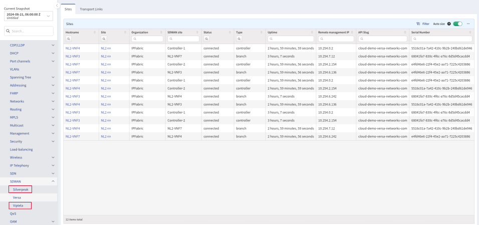

# IP Fabric v7.0

!!! danger "Unreleased Version"

    This is an upcoming IP Fabric version, which has not been released yet and
    is not available for download.

--8<-- "snippets/upgrade_version_policy.md"

--8<-- "snippets/clear_browser_cache.md"

## v7.0.0 (UNRELEASED)

### Breaking Changes

#### API Endpoint Changes

Several API endpoints have been updated or removed in this major release.

##### Replaced Endpoints

- `/tables/sdwan/links` has been replaced by `/tables/sdwan/versa/links`
- `/tables/sdwan/sites` has been replaced by `/tables/sdwan/versa/sites`
- `/tables/load-balancing/f5-partitions` has been replaced by `/tables/load-balancing/partitions`
- `/tables/mpls/l2vpn/curcit-cross-connect` has been replaced by `/tables/mpls/l2vpn/circuit-cross-connect`
- `/tables/cloud/virtual-machines-interfaces` has been replaced by `/tables/cloud/endpoints/virtual-machines-interfaces`
- `/tables/cloud/virtual-machines` has been replaced by `/tables/cloud/endpoints/virtual-machines`
- `/tables/management/osver-consistency` has been replaced by:
  - `/tables/inventory/os-version-consistency/platforms`
  - `/tables/inventory/os-version-consistency/models`

API version is no longer part of the token endpoint, rendering the following path inaccessible:

- `<API_VERSION>/auth/token` (use `/auth/token` instead)

##### Removed Endpoints

The following endpoints have been permanently removed:

- `/tables/networks/domain`
- `/tables/spanning-tree/radius`
- `/tables/spanning-tree/topology`
- `/tables/addresing/path-lookup-sources`
- `/tables/attributes/summary`

#### Replaced Endpoint Properties

The following column names have been changed:

- `/tables/management/ntp/summary`: `reachableSources` -> `synchronizedSources`
- `/tables/management/ntp/sources`: `reachable` -> `sync`

!!! info "NTP Synchronization Status"

    It was determined that some vendors report a reachable status along with a synchronization
    status causing the data to incorrectly mark some sources as not reachable.  These columns
    were renamed to more accurately describe their property.

#### Removed Endpoint Properties

The following properties have been removed from tables:

- `/tables/networks/policies/routing/interfaces`: `status`
- `/tables/inventory/devices`: `mac`

#### Removed alias `f` in URLs

- Support for `f` as an alias for `filters` in table URLs has been dropped.

  - This URL is **no longer** supported:

    `https://<IPF_IP_or_FQDN>/inventory/os-versions?options={"f":{"and":[{"version":["eq","15.5(2)T"]},{"platform":["eq","i86bi_linux"]}]}}`

  - This URL remains supported:

    `https://<IPF_IP_or_FQDN>/inventory/os-versions?options={"filters":{"and":[{"version":["eq","15.5(2)T"]},{"platform":["eq","i86bi_linux"]}]}}`

### Technology Tables

- SDWAN -- New vendor specific tables were added under **Technology --> SDWAN** menu. Support for [Cisco Viptela](../../IP_Fabric_GUI/technology_tables/SDWAN/viptela.md) and [Silverpeak](../../IP_Fabric_GUI/technology_tables/SDWAN/silverpeak.md) was added.

### Network Discovery

#### Vendor Support

- Check Point -- Identity awareness collecting was updated with a new extended
  command. For more details, see
  [Checkpoint Known Issues](../../support/known_issues/Vendors/checkpoint.md).

#### Improvements

- [Site Separation](../../IP_Fabric_Settings/Discovery_and_Snapshots/Discovery_Settings/site_separation.md)
  functionality using regular expressions was improved with the option
  to build advanced **Site Name** values using template strings.
- [Duplicate IPs Discovery](../../IP_Fabric_Settings/Discovery_and_Snapshots/Discovery_Settings/discovery/duplicate_ips_discovery.md),
  configured since the `6.4` release using the environment variable
  `SUBNETS_TO_ALLOW_PROCESSING_DUPLICIT_IP`, has been promoted to a product
  feature and can now be set directly in GUI.
  - If you previously configured `SUBNETS_TO_ALLOW_PROCESSING_DUPLICIT_IP`, you
    will have to manually set the subnets in the GUI again.

### Frontend

#### Sharable links

- Added support for
  [URL links that point to a specific snapshot](../../IP_Fabric_GUI/discovery_snapshot.md#create-url-pointing-to-specific-snapshot).
- Links to tables can now be shared
  [with a snapshot ID and full filter representation](../../IP_Fabric_GUI/technology_tables/index.md#create-links-to-table-views).

### Configuration Management

#### Versa

- Support for configuration backup was added for Versa devices when the discovery is running in [Combined (CLI+API) discovery mode](../../IP_Fabric_Settings/Discovery_and_Snapshots/Discovery_Settings/Vendors_API/Versa_Networks_SD-WAN.md).

### Other Changes

- Techsupport files are now compressed with `zstd` instead of `gzip` for
  improved speed and compression ratio.
- `nimpee-net-config` was renamed to `ipf-cli-config`
- `ipf-cli-config` removes `proxy.cred` for OpenVPN when setting up anonymous proxy
- `docker` runtime was added to the appliance.
- PostgreSQL 15 was added to the appliance.
- New script in `/opt/ipf-debian-repositories/bin/ipf-debian-repositories.sh` can be
  [used to re-enable Debian repositories](../../System_Administration/Command_Line_Interface/How_to/add_system_repositories.md).

### New Tables

The following new tables have been added to the product (in addition to the ones listed in
[Replaced Endpoints](#replaced-endpoints). Please ensure if using custom RBAC you review your policies and roles to
ensure your users have appropriate permissions to view these if allowed.

- `/tables/routing/protocols/bgp/routes`
- `/tables/cloud/vendors/aws/inventory`
- `/tables/cloud/vendors/azure/inventory`
- `/tables/cloud/vendors/gcp/inventory`
- `/tables/cloud/nodes/inventory`
- `/tables/cloud/nodes/tags`
- `/tables/sdwan/silverpeak/overlay`
- `/tables/sdwan/silverpeak/underlay`
- `/tables/sdwan/viptela/bfd-sessions`
- `/tables/sdwan/viptela/bfd-summary`
- `/tables/sdwan/viptela/control-connections`

!!! note "Solution Architect Managed RBAC"

    The Solution Architect team has published a
    [managed RBAC configuration](https://gitlab.com/ip-fabric/integrations/python-ipfabric/-/blob/develop/examples/settings/RBAC/managed_rbac.py?ref_type=heads)
    located in the Python SDK which is updated on every major and minor release.  This should be run after every upgrade
    if you decide to use these policies and roles.

### Experimental Features

Newly added features that need to be explicitly enabled in service files. If
you are interested in trying them out, please contact our Support or Solution
Architect team, and we will gladly help you with enabling these features.

- VeloCloud
  - VeloCloud discovery has been enhanced with basic networking support. To enable VeloCloud discovery, you must [manually activate the feature flag](../../System_Administration/Command_Line_Interface/Feature_Flags.md#velocloud-discovery) (`ENABLE_DISCOVERY_DEVICES_VELOCLOUD`).
