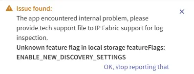

# IP Fabric v7.12

--8<-- "snippets/upgrade_version_policy.md"

--8<-- "snippets/clear_browser_cache.md"

## Known Issues

### Cosmetic "Unknown Feature Flag" Error in the Dashboard

Users who previously enabled the **New Discovery Settings** preview may see an
`Issue found` pop-up in the dashboard referencing an unknown feature flag in
local storage:

`Unknown feature flag in local storage featureFlags: ENABLE_NEW_DISCOVERY_SETTINGS`

{.center}

This issue is purely cosmetic and does not affect platform functionality.
Stale browser data referencing a feature flag that no longer exists causes it.

**Workaround**

- Hard refresh the browser or clear your browser cache.
- Or, click `OK, stop reporting that` in the notification to dismiss the message.

## v7.12.3 (June 19th, 2026; GA)

```
SHA256 (ipfabric-update-7-12-3+0.tar.zst.sig) = 83102bff79d8e80e5ec7de65f06acf14ab6da941c6e309c2641b70f4e1c78c32
MD5 (ipfabric-update-7-12-3+0.tar.zst.sig) = 1e1d1d8c7024de20fa9d73fc6a9a8763
SHA256 (ipfabric-7-12-3+0.qcow2) = 8f5bcd0917fce5054562a81578be15a8ccdca4b57a29c8eb3ad236ae7ae7acc7
MD5 (ipfabric-7-12-3+0.qcow2) = 7d630f96f17f04ddadfa4ffc1b02d8b2
SHA256 (ipfabric-7-12-3+0.vmdk) = 2bc0ee9080bcde81721d665bd3a0307928c6bb1b12a3cf4a27a22b23f74e05f1
MD5 (ipfabric-7-12-3+0.vmdk) = ddaa377604a7aabb4a707b6a6de79f2e
SHA256 (ipfabric-7-12-3+0.vhdx.zst) = fedf0591056494eeda7c1be30aae4fdbd63134b30f65b29277bc3bde865e51d4
MD5 (ipfabric-7-12-3+0.vhdx.zst) = 1419822a8ca8c688860054e366fcf5d4
SHA256 (unsupported-ESXi6.7U2-ipfabric-7-12-3+0.ova) = 7670f47443a02132f2af93851c6252b228fc1015c85d20347bfc36f72c7490c2
MD5 (unsupported-ESXi6.7U2-ipfabric-7-12-3+0.ova) = 16d945feebf839b6634c28d1aa21bfbc
SHA256 (unsupported-ESXi7.0-ipfabric-7-12-3+0.ova) = 25c07bd9a27bc1c5d3b0dcc234485b03c815675728dd21ceddab79cc0af4fbb9
MD5 (unsupported-ESXi7.0-ipfabric-7-12-3+0.ova) = c65f4212e305127a4423fc9806045dc5
SHA256 (ESXi8.0-ipfabric-7-12-3+0.ova) = 2ab665cf6e3fee886578a3fc2e08ea7293919d181941f130772ccd2982cda471
MD5 (ESXi8.0-ipfabric-7-12-3+0.ova) = fe1161158d711ec08603a57bf7ee79d6
```

### Bug Fixes

- Fixed an issue where the **BGP Community** filtering table always displayed `1` in the **# of communities** column.
- Fixed an issue where the **Add Devices to Snapshot** worker attempted device connections more times than expected.
- Fixed an issue in Azure E2E Path Lookup where traffic incorrectly entered transit.
- Fixed FortiGate prompt detection when processing the "end" command during discovery.
- Fixed a migration failure from 7.11 to 7.12 caused by a duplicate entry in `vSslCertificates`.

## v7.12.2 (June 15th, 2026; GA)

### New Features

- Path lookup now supports disabling regex matching for the Application value, allowing you to use a plain string instead.

### Improvements

- Added a new **Device Configuration Collection** API job type that becomes visible when Configuration Management runs its next update.
- Discovery or snapshot load jobs no longer block downloading snapshots, toggling MCP, or exporting appliance configurations.
- Updated licensing documentation to clarify that AWS VPC endpoints (`vpce`) do not use a license.
- Fixed an issue where discovery could remain stuck in the `Discovery onDone started` state due to CLI log compression running at the end of discovery. CLI logs for successfully discovered devices are now compressed immediately, reducing end-of-discovery processing overhead.

#### Vendor Support

- **D-Link**
  - Added support of basic discovery for D-Link **DES-3000 family** switches (DES-3028, DES-3052, DES-3200) and **DGS-1210/ME**. See [Feature Matrix](https://matrix.ipfabric.io) for more details.
  - Covered features include:
    - **Platform & system**: init, device information
    - **Configuration**
    - **Interfaces**: Layer 2 interfaces, Layer 3 interfaces, port-channel
    - **Network data**: ARP, MAC table, LLDP
    - **Routing & switching**: routing table, STP, VLAN
    - **Management**: AAA, NTP, SNMP, logging
  
- **Meraki**
  - **VRF**
    - Added support for VRF on Meraki Catalyst switches.
    - The ARP table, routing table, and L3 interfaces now reflect this support.
  - **Filtering Options**
    - Added support for discovery [filtering options](../../IP_Fabric_Settings/Discovery_and_Snapshots/Discovery_Settings/Vendors_API/Cisco_Meraki.md#filtering-options) in `Meraki REST` Vendor API 
      configuration. You can now limit Meraki discovery to specific networks, platforms, or tags using `equal`, `not equal`, and `regex` operators combined with `And` / `Or` logic.

- **Extreme VOSS**
  - **IS-IS**
    - Added support for IS-IS on VOSS family. See [Feature Matrix](https://matrix.ipfabric.io) for more details.

- **Alcatel AOS**
  - **IS-IS**
    - Added support for IS-IS on AOS family. See [Feature Matrix](https://matrix.ipfabric.io) for more details.

- **Azure**
  - IP Fabric now reads the management group hierarchy to build resource context.
  - This requires a second custom role with `Microsoft.Management/managementGroups/read` and `Microsoft.Management/managementGroups/descendants/read` assigned at the management group scope. See [Azure -- Management Group Access](../../IP_Fabric_Settings/Discovery_and_Snapshots/Discovery_Settings/Vendors_API/azure.md#management-group-access).

- **GCP** 
  - Added Load Balancer SSL Certificate Visibility support.

  !!! warning "New GCP Permissions Required"

      Add new permissions to your [GCP IAM role](../../IP_Fabric_Settings/Discovery_and_Snapshots/Discovery_Settings/Vendors_API/GCP_Google_Cloud_Platform.md#how-to-create-a-custom-role) to enable this feature.

### Cloud Table Column Deprecation

As part of upcoming changes to the cloud data model, several columns in the existing `/technology/cloud/...` tables are deprecated in `v7.12`. A future release will remove them.

The affected tables describe cloud resources (subnets, VPC endpoints, scaling groups, etc.), not network devices. The device-centric columns inherited from the old model are no longer meaningful:

- **Hostname** and **Serial Number (`sn`)** -- Deprecated in all existing cloud tables, with the exception of `/technology/cloud/nodes/inventory`.
- **Device interface** -- Deprecated in `/technology/cloud/endpoints/virtual-machines-interfaces`.

!!! warning "Automation Concerns"

    Update all scripts, automations, intent rules, and reports that reference these columns before upgrading to the release that removes them.

