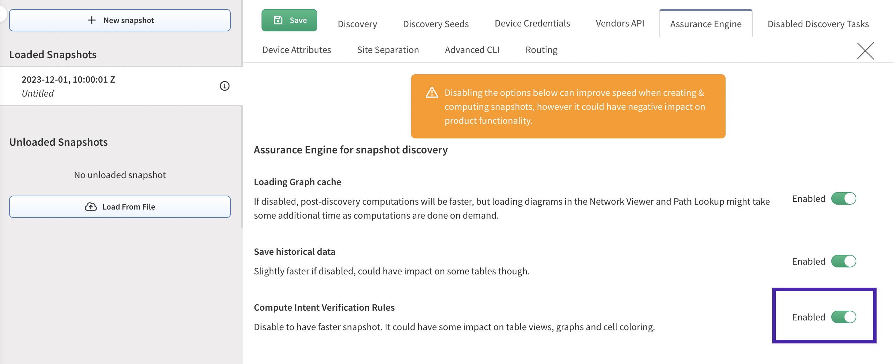

# IP Fabric v7.2

!!! danger "Unreleased Version"

    This is an upcoming IP Fabric version, which has not been released yet and
    is not available for download.

--8<-- "snippets/upgrade_version_policy.md"

--8<-- "snippets/clear_browser_cache.md"

## v7.2.0 (UNRELEASED)

### API Endpoints Deprecation

The below API endpoints have been marked as deprecated and the intention is to remove them in the next major version `8.0`.

- `/tables/networks/gatewayRedundancy`
- `/tables/networks/networks`

### System Administration UI Removal

The System Administration UI on port `8443` has been deprecated in version `7.0` and is no longer accessible. All its functionalities have been replaced by an alternative:

* [System Status](../../IP_Fabric_GUI/tips/system_status.md)
* [Backup and Maintenance](../../System_Administration/Command_Line_Interface/How_to/backup_restore_CLI.md)
* [System Update](../../System_Administration/system_update.md)
* [Restore Admin Access](../../System_Administration/IPF_CLI_Config/set_gui_admin_pass.md)

### Layout Optimization for Large Circular Graphs

Circular graphs with over 100 nodes experienced slow rendering and oversized layouts due to complex line-crossing minimization calculations. This also impacted snapshot discovery/loading performance due to prolonged node position caching.

For graphs exceeding 100 nodes, we now automatically apply the **universal layout** instead of the circular layout. This ensures:

- Faster rendering (reduced layout computation time)
- Improved readability of large graphs
- Optimized snapshot performance (quicker node position caching)

The layout type change (circular --> universal) is not yet reflected in API responses or the UI. This visibility will be added in an upcoming release.

### New Features

#### Automated SSO

- We have developed a new script to simplify the SSO setup process for the IP
  Fabric application. More details can be found on the
  [Automated Single Sign-On (SSO)](../../IP_Fabric_Settings/administration/sso/#automated-sso-enablement-for-the-ipf-applicatio/)
  page.

#### Azure Network Load Balancers (NLB) support

- Data collection and end-to-end path lookup via NLB nodes are supported. However, path lookup via Azure private links is not supported yet.
  
  !!! warning "Do not forget to update IAM policy"

      To collect Azure Network Load Balancers, the corresponding IAM policy must be updated.
      You can download the new policy [here](../../IP_Fabric_Settings/Discovery_and_Snapshots/Discovery_Settings/Vendors_API/azure/azure-role-7_2.json).

#### Enhanced BGP Community Controls for Optimized Discovery

- Introduced per-device, per-protocol (IPv4/IPv6), and per-VRF BGP community configurations to limit downloaded routes during discovery.
- This feature prioritizes community-based filtering over global thresholds, ensuring precise data collection while reducing processing time. Ideal for large-scale networks with extensive BGP tables. For more information see [Routing](../../IP_Fabric_Settings/Discovery_and_Snapshots/Discovery_Settings/routing.md)
  
### Improvements

#### GUI

- We have updated default tabs settings for consoleServer devices in Device Explorer:
  added Serial Ports, removed QoS, MAC and Port Channel. This resets previous tab settings for this device type.
- Edges in topology graphs now support multiple labels, which can be displayed either inline or on separate lines. These settings are customizable in the Visualization Setup panel of the Network Viewer, allowing configuration for each protocol or group type individually.
- Additional columns were added to **Inventory --> Interfaces** table, all hidden by default:
  - `Clearing Type`
  - `Clearing Value`
  - `Last Input Type`
  - `Last Input Value`
  - `Last Output Type`
  - `Last Output Value`

#### Advanced Filters

- **Device Attribute-Based Advanced Filters**
  now supports Attributes as a device property.

  This allows you to:

  - Filter data using predefined Attributes, such as `siteName`.
  - Use custom Attributes for more specific filtering.

- For a complete list of properties and supported tables, refer to [Technology Tables -- Device-Based Advanced Filters](../../IP_Fabric_GUI/technology_tables/index.md#device-based-advanced-filters).

#### Discovery Settings

- Saving discovery settings with missing or expired credentials is now allowed. Users can decide whether the
  missing data is important for running the discovery or can add the data later. Clear messages and dialogs
  will inform users of any potential issues.

#### Vendor Support and Improvements

- Added Silver Peak API key authentication support.
- Added IPv6 BGP neighbors support for Arista (EOS), Cisco (IOS, IOS-XE, NX-OS), FS (FSOS), PaloAlto (PAN-OS).
- Added URL filtering support in firewall rules for Cisco (FTD), Fortinet (FortiGate), PaloAlto (PAN-OS).
- Added support for SR-MPLS TE with BGP On-Demand Next Hop (ODN) functionality for Cisco (IOS-XR).
- Added threat feeds support for FortiGate firewalls (IP lists only).
- The HP vendor has been renamed to HPE.
- The bookmark `Detail` for all AWS devices has changed. The differences are:
  - The `Family` column value is now empty (previously was set to `ec2`)
  - The `Version` column value is now empty (previously was set to `2016-11-15`)

#### Technology Tables

- **Unmanaged Neighbors Detail** -- Fixed an issue in the **Technology --> Interfaces --> Connectivity matrix --> Unmanaged Neighbors Detail** table where Intent Verification rules could incorrectly highlight rows for specific datasets. Unique row IDs have been enforced to resolve the inconsistency.

  !!! important

      If Intent Verification rules were configured for this table, you may need to trigger their recalculation. To do this, you can either:

      - In **local settings** of the relevant snapshot(s), toggle **"Compute Intent Verification"** off, save settings, then toggle the rule back on; or

       { width="600" .center}

      - Manually unload and reload the relevant snapshot(s)

#### Site separation

- Devices now automatically inherit their site name from connected peers via **CDP/LLDP**, **STP topology neighbors**, or devices in the same **L3 network**, in order of priority, when rule **Try to assign devices without sites based on device neighborship** is enabled.
