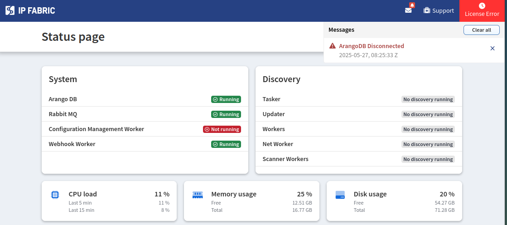

# IP Fabric v7.2

--8<-- "snippets/upgrade_version_policy.md"

--8<-- "snippets/clear_browser_cache.md"

## v7.2.13 (May 21st, 2025; GA)
```
SHA256 (ipfabric-update-7-2-13+0.tar.zst.sig) = 72a601e4cc8ab96357a8c9f548baadec325202f2c5cbde9ca0561ce8dfd5ee72
MD5 (ipfabric-update-7-2-13+0.tar.zst.sig) = e5b8c418ca26e7c6f2238630a31ad383
SHA256 (ipfabric-7-2-13+0.qcow2) = 89559066030712f77588fbcb3c11d589dc9e6ae0d57d2093325adbb355ccd5e2
MD5 (ipfabric-7-2-13+0.qcow2) = 42c37a6c19d94972fcf6348aaf236a84
SHA256 (ipfabric-7-2-13+0.vmdk) = 2e4f16417876d1ad5b1db83734ae072d69a72e9e7acb2d0004264821ab7381b5
MD5 (ipfabric-7-2-13+0.vmdk) = 695d4a50ca02966347260c25a2c06b52
SHA256 (ipfabric-7-2-13+0.vhdx.zst) = c2913e00532c463f6169fccfc9bc61f47f4807706383b64064e1f6b962b3e183
MD5 (ipfabric-7-2-13+0.vhdx.zst) = e6bf775527ec3fa214788ddb590e83c8
SHA256 (unsupported-ESXi6.7U2-ipfabric-7-2-13+0.ova) = 7d139e0cec5c5ddc334c5e36fdcfe4b00482fcc42c5e7dae3ad59fc6ba89a052
MD5 (unsupported-ESXi6.7U2-ipfabric-7-2-13+0.ova) = 9c6a5e2f3cd60e25f79f9b10d5d4c0aa
SHA256 (unsupported-ESXi7.0-ipfabric-7-2-13+0.ova) = 3991d48fd1f32af695ff5bc7037b49d83e75c73d15e08a370dd6919c46b5ff4f
MD5 (unsupported-ESXi7.0-ipfabric-7-2-13+0.ova) = 098e77c4f2000488459a29a6957691e2
SHA256 (ESXi8.0-ipfabric-7-2-13+0.ova) = 5d7934b2168f1ce92c7da7bff08aabd37e71ba532635c82c7985d48545a01777
MD5 (ESXi8.0-ipfabric-7-2-13+0.ova) = 51b3bb7cb54160f4295d4abdc9711aff
```
### Post-Upgrade Notice

If you encounter a `Something went wrong` error when accessing the IP Fabric GUI after upgrading, clear your browser cache using `CTRL`+`F5` (Windows/Linux) or `Command`+`Shift`+`R` (macOS). This resolves issues caused by outdated cached resources.

{.center}

### Known Issues

#### License or Database Errors After Upgrade

If the IP Fabric GUI redirects to the status page after an upgrade and displays errors such as **License Error**, **ArangoDB Disconnected**, or **Failed to load initial app data**, this may indicate an issue with the ArangoDB configuration.  

{.center}  

{.center}  

 **To diagnose the issue:**  

1. Log in to the IP Fabric appliance via CLI and switch to the root user using `sudo -i`.  

2. Check if ArangoDB is listening on port `8529` via IPv6 (expected for IP Fabric `7.2`): 

   ```  
   root@IPF:~# lsof -i | grep 8529 | grep LISTEN  
   arangod      952    arangodb   26u  IPv6   19501      0t0  TCP *:8529 (LISTEN)  
   ```  

   If ArangoDB is bound to IPv4 instead, this likely causes the error:  

   ```  
   root@IPF:~# lsof -i | grep 8529 | grep LISTEN  
   arangod     874 arangodb   26u  IPv4  20599      0t0  TCP *:8529 (LISTEN)  
   ```  

3. Verify the `arangod.conf` file in `/etc/arangodb3` is a symbolic link to `arangod.conf.ipf`. The directory should show:  

   ```  
   root@IPF:~# cd /etc/arangodb3  
   root@IPF:/etc/arangodb3# ls -lsa | grep arangod.conf  
   0 lrwxrwxrwx   1 root root    16 Nov 27  2023 arangod.conf -> arangod.conf.ipf  
   4 -rw-r--r--   1 root root  1687 Feb 11 12:07 arangod.conf.ipf  
   4 -rw-r--r--   1 root root  1696 Nov 27  2023 arangod.conf.ipf-orig  
   ```  

**If the symlink is missing (i.e., `arangod.conf` is a regular file):**  

1. Run these commands to restore the symlink:  

   ```  
   cd /etc/arangodb3/  
   mv arangod.conf arangod.conf.bkp  
   ln -s arangod.conf.ipf arangod.conf  
   systemctl restart arangodb3  
   ```  

2. Confirm the symlink exists and ArangoDB uses IPv6:  

   ```  
   root@IPF:/etc/arangodb3# ls -lsa | grep arangod.conf  
   0 lrwxrwxrwx   1 root root    16 May 27 09:30 arangod.conf -> arangod.conf.ipf  
   4 -rw-r--r--   1 root root  1697 May 27 09:22 arangod.conf.bkp  
   4 -rw-r--r--   1 root root  1693 Jan 22  2021 arangod.conf.dpkg-old  
   4 -rw-r--r--   1 root root  1687 Apr 23 13:42 arangod.conf.ipf  
   4 -rw-r--r--   1 root root  1696 Mar  4 10:44 arangod.conf.ipf-orig  

   root@IPF:~# lsof -i | grep 8529 | grep LISTEN  
   arangod    876 arangodb   26u  IPv6  17979      0t0  TCP *:8529 (LISTEN)  
   ```  

After these steps, the GUI should function correctly.  

#### BGP Communities Filtering Issues

The new BGP communities filtering feature during discovery correctly passes tags to settings **only in automatic snapshots**. However:

1. Manual snapshot triggers fail to activate this feature

2. Even when tags are passed correctly, **filters aren't applied** during Cisco IOS-XR discovery

3. Any modifications to these sections:

   - `Configuration Management`  
   - `Snapshot Retention`  
   - `System → SNMP`  
   - `System → Backup & Maintenance`  

   **remove** the BGP communities filter from `Discovery Settings`  

These issues are scheduled for resolution in an upcoming patch release.

## v7.2.5 (March 17th, 2025; EA)

### API Endpoints Deprecation

The below API endpoints have been marked as deprecated and the intention is to remove them in version `7.5`.

- `/tables/networks/gatewayRedundancy`
- `/tables/networks/networks`

### System Administration UI Removal

The System Administration UI on port `8443` has been deprecated in version `7.0` and is no longer accessible. All its functionalities have been replaced by an alternative:

* [System Status](../../IP_Fabric_GUI/tips/system_status.md)
* [Backup and Maintenance](../../System_Administration/Command_Line_Interface/How_to/backup_restore_CLI.md)
* [System Update](../../System_Administration/system_update.md)
* [Restore Admin Access](../../System_Administration/IPF_CLI_Config/set_gui_admin_pass.md)

### RBAC Fixes

After reviewing our built-in RBAC policies, we have made the following changes. This is to ensure that the policies
are more consistent with the intended use cases. If your roles require access to these endpoints, please create a
[custom RBAC policy](../../IP_Fabric_Settings/administration/policies.md) and assign it to the 
[required role(s)](../../IP_Fabric_Settings/administration/roles.md).

These policies have been removed from the built-in `others` (ID of `read`) and moved to `settings`:

- `POST /os/generate-nimpee-cert`: Generate IP Fabric certificate
- `POST /os/upload-nimpee-cert`: Upload certificate to platform
- `POST /os/maintenance`: Trigger platform maintenance
- `POST /os/snapshots-retention`: Trigger snapshot retention
- `POST /os/techsupport`: Generate techsupport file
- `POST /os/clean-db`: Clean system database
- `POST /jobs/{key}/cancel`: Cancel specific job
- `POST /jobs/{key}/force-stop`: Force stop running system job
- `POST /jobs/{key}/stop`: Stop running system job
- `GET /jobs/{key}/download`: Return result of system job
  - With the introduction of the new [Configuration Import/Export](#configuration-importexport) users without `settings` policies are able to download and view all settings.
  - Our team is working on a feature to provide RBAC based on the type of file (configuration, snapshot, techsupport). This will be available in a future release.

### System upgrade improvements

- The upgrade UI has switched from basic HTTP authentication to cookie/session-based authentication.
- Downloading a remote upgrade package via the UI now displays download progress, which is also logged in the systemd journal.
- Improved timeout management provides better handling on systems with slow disk I/O or during network interruptions.

### Layout Optimization for Large Circular Graphs

Circular graphs with over 100 nodes experienced slow rendering and oversized layouts due to complex line-crossing minimization calculations. This also impacted snapshot discovery/loading performance due to prolonged node position caching.

For graphs exceeding 100 nodes, we now automatically apply the **universal layout** instead of the circular layout. This ensures:

- Faster rendering (reduced layout computation time)
- Improved readability of large graphs
- Optimized snapshot performance (quicker node position caching)

The layout type change (circular --> universal) is not yet reflected in API responses or the UI. This visibility will be added in an upcoming release.

### New Features

#### Configuration Import/Export

- We have developed a new feature that allows you to import and export configurations of the IP Fabric application across multiple IP Fabric instances.
  More details can be found on the [Configuration Import/Export](../../IP_Fabric_Settings/system/Backup_and_Maintenance/configuration_import_export.md) page.

#### Azure Network Load Balancers (NLB) support

- Data collection and end-to-end path lookup via NLB nodes are supported. However, path lookup via Azure private links is not supported yet.
  
  !!! warning "Do not forget to update IAM policy"

      To collect Azure Network Load Balancers, the corresponding IAM policy must be updated.
      You can download the new policy [here](../../IP_Fabric_Settings/Discovery_and_Snapshots/Discovery_Settings/Vendors_API/azure/azure-role-7_2.json).

#### Enhanced BGP Community Controls for Optimized Discovery

- Introduced per-device, per-protocol (IPv4/IPv6), and per-VRF BGP community configurations to limit downloaded routes during discovery.
- This feature prioritizes community-based filtering over global thresholds, ensuring precise data collection while reducing processing time. Ideal for large-scale networks with extensive BGP tables. For more information see [Routing](../../IP_Fabric_Settings/Discovery_and_Snapshots/Discovery_Settings/routing.md)

#### Connections between IPsec & VXLAN tunnel endpoints now visible in path-lookup

- For easier identification of where IPsec and VXLAN tunnels start and end, especially when traversing multiple devices, direct links between tunnel endpoints
are now visible in path lookups. More details can be found in [IPsec & VXLAN tunnel endpoints](../../IP_Fabric_GUI/diagrams/how_to_use_path-lookup.md/#ipsec-vxlan-tunnel-endpoints).

#### BGP Route Collection Enhancement

We have introduced filtered BGP route collection support, allowing network administrators to explicitly define which networks to collect. This enables focused BGP route analysis while optimizing system resources across **Cisco IOS/IOS-XE**, **IOS-XR**, **NX-OS**, **Juniper JunOS** and **Arista EOS** platforms.

For detailed information about the new API endpoints and configuration options, see [BGP Route Collection API](../../IP_Fabric_API/Settings/bgp_route_collection.md).

### Improvements

#### GUI

- We have updated default tabs settings for consoleServer devices in Device Explorer:
  added Serial Ports, removed QoS, MAC and Port Channel. This resets previous tab settings for this device type.
- Edges in topology graphs now support multiple labels, which can be displayed either inline or on separate lines. These settings are customizable in the Visualization Setup panel of the Network Viewer, allowing configuration for each protocol or group type individually.
- Additional columns were added to **Inventory --> Interfaces** table, all hidden by default:
  - `Clearing Type`
  - `Clearing Value`
  - `Last Input Type`
  - `Last Input Value`
  - `Last Output Type`
  - `Last Output Value`
- An additional column  was added to **the Inventory --> Devices** table and is hidden by default:
  - `Credentials Notes`
- [Global filter](../../IP_Fabric_GUI/global_filter.md) now allows for selecting all possible values of given attribute using the `Select all` option.

#### Advanced Filters

- **Device Attribute-Based Advanced Filters**
  now supports Attributes as a device property.

  This allows you to:

  - Filter data using predefined Attributes, such as `siteName`.
  - Use custom Attributes for more specific filtering.

- For a complete list of properties and supported tables, refer to [Technology Tables -- Device-Based Advanced Filters](../../IP_Fabric_GUI/technology_tables/index.md#device-based-advanced-filters).

#### Discovery Settings

- Saving discovery settings with missing or expired credentials is now allowed. Users can decide whether the
  missing data is important for running the discovery or can add the data later. Clear messages and dialogs
  will inform users of any potential issues.

#### Network Discovery

- **New Capabilities -- Cisco (FTD), Fortinet (FortiGate), PaloAlto (PAN-OS)**

  - Support for URL filtering has been added.
  - In Path Lookup under `Advanced Packet Options`, new search fields are now available:
    - `Site category`: Matches the name of a URL filter category. Works for both built-in and custom categories. The field accepts regex if multiple categories are needed in the result.
    - `URL / DOMAIN`: Matches a specific URL against applicable security rules.

- **New Capabilities -- PaloAlto (PAN-OS)**
  - Support for URL-type objects of `External Dynamic List` has been added.

- **New Capabilities -- Fortinet (FortiGate)**
  - Support for URL-type objects of `External Resource` has been added.

#### Vendor Support and Improvements

- Added Silver Peak API key authentication support.
- Added IPv6 BGP neighbors support for Arista (EOS), Cisco (IOS, IOS-XE, NX-OS), FS (FSOS), PaloAlto (PAN-OS).
- Added support for IPv6 BGP Route limit - [see documentation](../../IP_Fabric_Settings/Discovery_and_Snapshots/Discovery_Settings/discovery/limit_download_of_bgp_routes.md)
  - Arista: EOS
  - Cisco: NX-OS, IOS, IOS-XE, IOS-XR, Viptela
  - Juniper: JunOS
  - Nokia: TiMOS
- Added URL filtering support in firewall rules for Cisco (FTD), Fortinet (FortiGate), PaloAlto (PAN-OS).
- Added support for SR-MPLS TE with BGP On-Demand Next Hop (ODN) functionality for Cisco (IOS-XR).
- Added threat feeds support for FortiGate firewalls (IP lists only).
- The HP vendor has been renamed to HPE.
- The bookmark `Detail` for all AWS devices has changed. The differences are:
  - The `Family` column value is now empty (previously was set to `ec2`)
  - The `Version` column value is now empty (previously was set to `2016-11-15`)
- Added support for Nokia TiMOS version 23 and above

#### Technology Tables

- **Unmanaged Neighbors Detail** -- Fixed an issue in the **Technology --> Interfaces --> Connectivity matrix --> Unmanaged Neighbors Detail** table where Intent Verification rules could incorrectly highlight rows for specific datasets. Unique row IDs have been enforced to resolve the inconsistency.

  !!! important

      If Intent Verification rules were configured for this table, you may need to trigger their recalculation. To do this, you can either:

      - In **local settings** of the relevant snapshot(s), toggle **"Compute Intent Verification"** off, save settings, then toggle the rule back on; or

       { width="600" .center}

      - Manually unload and reload the relevant snapshot(s)

#### Site separation

- Devices now automatically inherit their site name from connected peers via **CDP/LLDP**, **STP topology neighbors**, or devices in the same **L3 network**, in order of priority, when rule **Try to assign devices without sites based on device neighborship** is enabled.

### Experimental Features

Newly added features which need to be explicitly enabled in service files. You can enable these yourself using our [feature documentation](../../System_Administration/Command_Line_Interface/Feature_Flags.md) or if you are not comfortable self-enabling these features or need further clarification, contact our Support or Solution Architect team. We will gladly help you.

#### Configuration Management Optimizations

To accelerate device configuration retrieval, you can try to enable different [Git performance optimizations](../../System_Administration/Command_Line_Interface/Feature_Flags.md#configuration-management-optimizations) for configuration management.  

