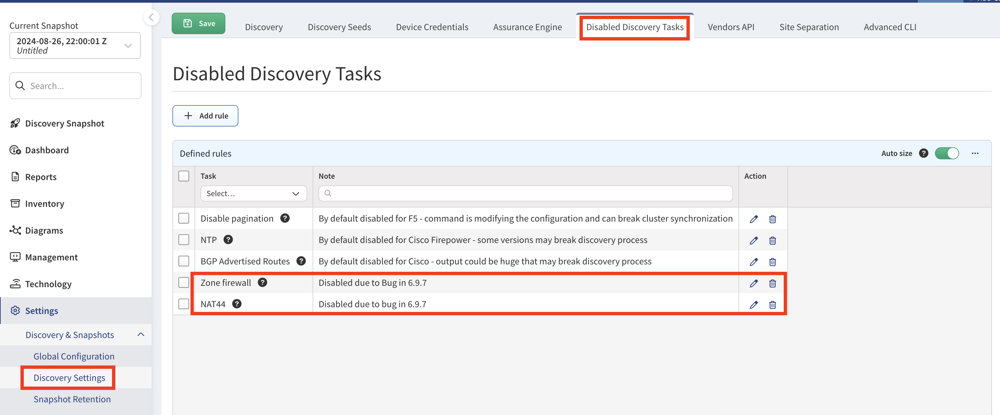
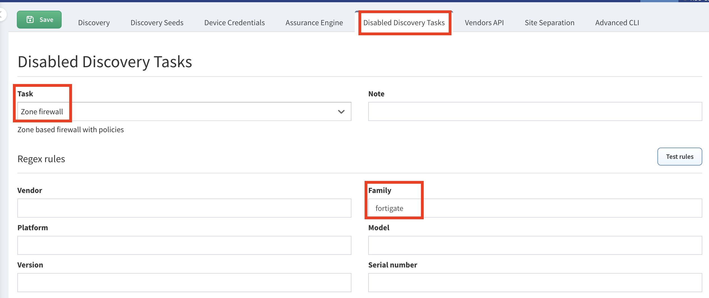
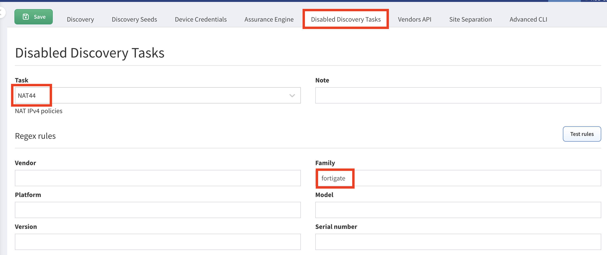
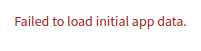
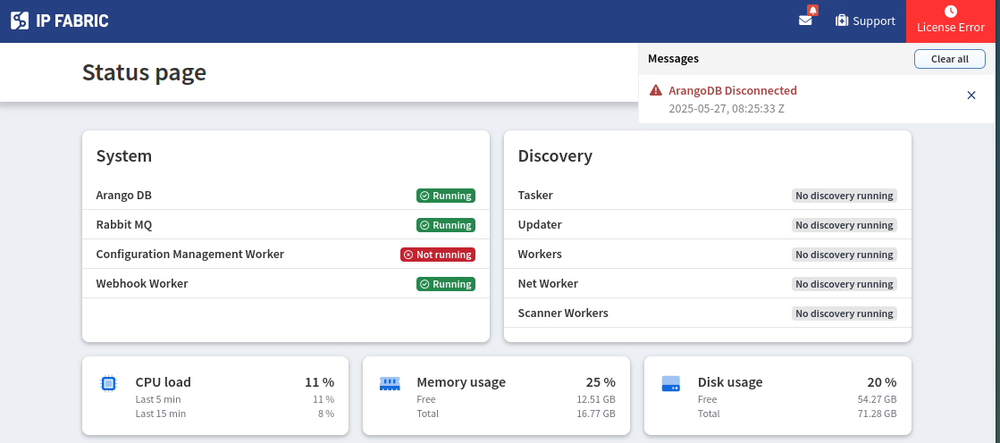

# IP Fabric v7.3

--8<-- "snippets/upgrade_version_policy.md"

!!! danger "Before Upgrading to `v7.5`"

    The upcoming `v7.5` release introduces a new PostgreSQL-based database, which brings updated hardware requirements.
    To ensure stability and optimal performance after the upgrade, we strongly recommend **using directly attached SSD or NVMe storage**.

    To evaluate your current system's readiness, please run the hardware assessment tool manually using the following command:

    ```
    sudo ipf-checker -d -s
    ```

    Please share the results with our Customer Support team. As performance baselines are still being established, we will need to review each result individually.

    You can provide the results by:

    1. **Generating a Techsupport file** with System logs only after running the command, or

    2. **Copying the terminal output** into a text file.

    Please ensure you create a ticket in our [Customer Support Portal](https://support.ipfabric.io) and attach the results file for our analysis.

--8<-- "snippets/clear_browser_cache.md"

## Known Issues

#### Fortinet NAT44 and Zone Firewall Tasks Causing Discovery Issues

When NAT44 and Zone Firewall tasks are enabled, discovery processes may hang or
experience significant delays when handling Fortinet devices. This can result
in failed discoveries or cause devices to be missing from snapshots.

Temporarily disabling both `NAT44` and `Zone firewall` discovery tasks for the
`fortigate` **Family** (in **Settings --> Discovery & Snapshots --> Discovery
Settings --> Disabled Discovery Tasks**) is the recommended hotfix until this
issue is resolved in one of the upcoming releases.







#### NX-OS Routing Table Discovery Issues

In version `7.3`, we introduced support for the Cisco NX-OS `show ip route detail full` command to retrieve truncated routing table information. Unfortunately, this implementation causes the discovery algorithm to hang when processing certain NX-OS devices.

If you're experiencing extended discovery times (9+ hours), this issue is likely the cause. As a temporary workaround, disable the **Routing table** task for affected devices (SNs or whole NX-OS family) under:
**Settings → Discovery & Snapshots → Discovery Settings → Disabled Discovery Tasks**.

Processing of `show ip route detail full` commands has improved significantly in version `7.3.20`. You may not experience these issues after the upgrade.

## v7.3.20 (September 15th, 2025; GA)

```
SHA256 (ipfabric-update-7-3-20+0.tar.zst.sig) = 53a1e4bbe86c5cc1342bc97294cb9f1a50f267fbdccfde87924d598da9191142
MD5 (ipfabric-update-7-3-20+0.tar.zst.sig) = 59e237c72a0719fca2cd5958fda3a047
SHA256 (ipfabric-7-3-20+0.qcow2) = 5113f6c86d61ab6cb995f2f02f746697b8c1af94f7f1f7c52d3cffe85ab1429a
MD5 (ipfabric-7-3-20+0.qcow2) = 51205f748c6ab05b1090090b7e472ce8
SHA256 (ipfabric-7-3-20+0.vmdk) = 21a5dbfb54e79f1525399f856b98f0b428cec6541c7be074e947dc46f357cf98
MD5 (ipfabric-7-3-20+0.vmdk) = 5e17aec67b6f58f4a518f92591c6812c
SHA256 (ipfabric-7-3-20+0.vhdx.zst) = c25125c5072688f460439b1c66b77145cd3045d0e2c7797cf79410fc73e62198
MD5 (ipfabric-7-3-20+0.vhdx.zst) = 9e5260d64a3c4d4ee905a278ffba00ba
SHA256 (unsupported-ESXi6.7U2-ipfabric-7-3-20+0.ova) = b72983fd0ae4a2e8d65691bba68dd17f300ab61fd1e2d31d6f565b76170d62f8
MD5 (unsupported-ESXi6.7U2-ipfabric-7-3-20+0.ova) = 27a5d4006ad4af714669335c99dcc1a9
SHA256 (unsupported-ESXi7.0-ipfabric-7-3-20+0.ova) = 3f7432d549e8b6af210e1d7aacb3633e301674d37a0ae42499569a13844c6b98
MD5 (unsupported-ESXi7.0-ipfabric-7-3-20+0.ova) = 7f688b7b6c283162a9844d36f2d8aaaa
SHA256 (ESXi8.0-ipfabric-7-3-20+0.ova) = 30a1dc26698c1626f793526cd5ab80203d00af78535ac51f5d0339cf72d96113
MD5 (ESXi8.0-ipfabric-7-3-20+0.ova) = ac7a53c50136655301da90da45842b75
```

### Improvements

- The previous limitation of 4,000 firewall rules per device during path lookup has been removed. The path lookup engine is now capable of evaluating an unlimited number of firewall rules.
- Processing of `show ip route detail full` commands has improved significantly.
- End of life detail table no longer contains duplicate records for the same `PID Serial Number`.

### Fixes

#### Versa Routing Table Missing MPLS Labels

A bug was introduced in version 7.3.18 that affects Versa devices. Routing tables no longer included MPLS label information, which caused path lookups through these devices to fail.

## v7.3.18 (August 27th, 2025; GA)

### Improvements

An enhanced version of the `ipf-checker` was introduced with new performance tests to ensure readiness for the upcoming PostgreSQL database release.

## v7.3.17 (August 7th, 2025; GA)

### Fixes

#### Intent Checks Removed from Dashboard Widget

When editing or adding an intent check to a dashboard widget directly from the intent check configuration, **all other** intent checks in that widget **are removed**.

#### Silverpeak RBAC API Key

Discovery of Silverpeak devices via RBAC API keys has been fixed.

## v7.3.16 (August 6th, 2025; GA)

### Improvements

#### Aruba Central AP - Virtual Controller Licensing

When Aruba Instant Access Points (IAPs) are managed by Aruba Central, discovering their Virtual Controller (VC) will no longer consume a license. 

### Fixes

#### License or Database Errors After Upgrade

The following known issue has been resolved. If symlink is not found, upgrade process will automatically create it.

If the IP Fabric GUI redirects to the status page after an upgrade and displays errors such as **License Error**, **ArangoDB Disconnected**, or **Failed to load initial app data**, this may indicate an issue with the ArangoDB configuration.

{.center}

{.center}

 **To diagnose the issue:**

1. Log in to the IP Fabric appliance via CLI and switch to the root user using `sudo -i`.

2. Check if ArangoDB is listening on port `8529` via IPv6 (expected for IP Fabric `7.2`):

   ```
   root@IPF:~# lsof -i | grep 8529 | grep LISTEN
   arangod      952    arangodb   26u  IPv6   19501      0t0  TCP *:8529 (LISTEN)
   ```

   If ArangoDB is bound to IPv4 instead, this likely causes the error:

   ```
   root@IPF:~# lsof -i | grep 8529 | grep LISTEN
   arangod     874 arangodb   26u  IPv4  20599      0t0  TCP *:8529 (LISTEN)
   ```

3. Verify the `arangod.conf` file in `/etc/arangodb3` is a symbolic link to `arangod.conf.ipf`. The directory should show:

   ```
   root@IPF:~# cd /etc/arangodb3
   root@IPF:/etc/arangodb3# ls -lsa | grep arangod.conf
   0 lrwxrwxrwx   1 root root    16 Nov 27  2023 arangod.conf -> arangod.conf.ipf
   4 -rw-r--r--   1 root root  1687 Feb 11 12:07 arangod.conf.ipf
   4 -rw-r--r--   1 root root  1696 Nov 27  2023 arangod.conf.ipf-orig
   ```

**If the symlink is missing (i.e., `arangod.conf` is a regular file):**

1. Run these commands to restore the symlink:

   ```
   cd /etc/arangodb3/
   mv arangod.conf arangod.conf.bkp
   ln -s arangod.conf.ipf arangod.conf
   systemctl restart arangodb3
   ```

2. Confirm the symlink exists and ArangoDB uses IPv6:

   ```
   root@IPF:/etc/arangodb3# ls -lsa | grep arangod.conf
   0 lrwxrwxrwx   1 root root    16 May 27 09:30 arangod.conf -> arangod.conf.ipf
   4 -rw-r--r--   1 root root  1697 May 27 09:22 arangod.conf.bkp
   4 -rw-r--r--   1 root root  1693 Jan 22  2021 arangod.conf.dpkg-old
   4 -rw-r--r--   1 root root  1687 Apr 23 13:42 arangod.conf.ipf
   4 -rw-r--r--   1 root root  1696 Mar  4 10:44 arangod.conf.ipf-orig

   root@IPF:~# lsof -i | grep 8529 | grep LISTEN
   arangod    876 arangodb   26u  IPv6  17979      0t0  TCP *:8529 (LISTEN)
   ```

After these steps, the GUI should function correctly.

## v7.3.15 (July 15th, 2025; GA)

### Fixes

#### Fatal Error While Discovery on PaloAlto

In this release, we resolved an issue where Discovery of PaloAlto devices was failing.

## v7.3.14 (July 10th, 2025; EA)

### Fixes

#### Aruba Central AP Discovery

In this release, we reverted the Aruba Central AP discovery logic from version `6.10` due to issues that arose when Central-managed APs functioned as controllers for other APs, rather than operating solely as individual devices.

## v7.3.13 (June 30th, 2025; EA)

### Fixes

#### Configuration Management Process Fails to Close SSH Sessions

Since `7.3.13`, the Configuration Management process for HPE `arubasw` devices now properly terminates SSH connections and correctly detects login banners.

## v7.3.11 (June 12th, 2025; EA)

#### IP addresses entered in the Settings UI may not be saved in some cases

When entering IP addresses in the Settings UI, changes will only be saved if you click the **Add to list** button next to the input field or press the **Enter** key. Although a red validation message appears below the field, it does not prevent the UI from saving the settings—however, any IP addresses not added to the list will be omitted. This issue affects all input fields that accept IP addresses.

### New Features

#### IPv6 Discovery Support

Extended network discovery capabilities to support IPv6 networks alongside IPv4, ensuring all existing IPv4 functionality remains unaffected.

##### Backward Compatibility

- Existing IPv4 discovery workflows continue to function as expected.
- No changes are required for IPv4-only setups.

##### API Enhancements

- The `/settings` API now accepts and processes **IPv6 addresses** in:
  - Seed lists
  - Include/Exclude/Whitelist networks
  - Device credentials
  - Custom SSH/Telnet ports
- Address-type validation ensures that:
  - IPv4 filters apply only to IPv4 addresses
  - IPv6 filters apply only to IPv6 addresses
- Announcing the deprecation of path-based versioning in the following release.
  More details can be found on the new [Versioning](../../IP_Fabric_API/versioning.md#api-version-in-url-path-deprecated) page.

##### Discovery Configuration Updates

- Introduced a new task type: `NDPv6`, available under **Global Discovery Tasks** settings.
- IPv6 networks can now be discovered using a combination of:
  - Seed addresses
  - Include/Exclude/Whitelist networks
  - Device credentials

#### Automated SSO

- We have developed a new script to simplify the SSO setup process for the IP Fabric application. More details can be found on the
  [Automated Single Sign-On (SSO)](../../IP_Fabric_Settings/administration/sso.md/#automated-sso-enablement-for-the-ipf-application) page.

### Improvements

#### Technology Tables

##### New Tables

A new **Virtual-wires** table has been added under **Technology → Interfaces**, supporting:

- Palo Alto PAN-OS
- Cisco Firepower
- Fortinet FortiGate / FortiOS
- Forcepoint NGFW

##### New Columns

The following tables have been updated with new columns:

- **Inventory** --> **Interfaces** table:
  - `Last Status Change`
- **Inventory** --> **Devices** table:
  - `Login IPv4`
  - `Login IPv6`
  - `Switch stack`
- **Technology → Interfaces → Switchport** table:
  - `Virtual Bridge`
- **Technology → Addressing → MAC Table** table:
  - `Virtual Bridge`
- **Management** --> **Discovery History** table:
  - `Login IPv4`
  - `Login IPv6`
- **Management** --> **Changes** table:
  - `Login IPv4`
  - `Login IPv6`
- **Management** --> **Changes** --> **Managed IP** table:
  - `IPv4 Address`
  - `IPv6 Address`
- **Management** --> **Saved config consistency** table:
  - `Login IPv4`
  - `Login IPv6`
- **Technology** --> **Platforms** --> **Cisco VSS** --> **Chassis** table:
  - `Switch Priority`
- **Technology** --> **Management** --> **Telnet access** table:
  - `Login IPv4`
  - `Login IPv6`
- **Technology** --> **Management** --> **Logging** --> **Remote** table:
  - `Host IPv4`
  - `Host IPv6`
  - `Src Address IPv4`
  - `Src Address IPv6`
- **Technology** --> **Management** --> **NTP** --> **Sources** table:
  - `Source IPv4`
  - `Source IPv6`
- **Technology** --> **Management** --> **SNMP** --> **Trap Hosts** table:
  - `Destination Host IPv4`
  - `Destination Host IPv6`
  - `Source IPv4`
  - `Source IPv6`
- **Technology** --> **Security** --> **AAA** --> **Servers** table:
  - `Server IPv4`
  - `Server IPv6`
  - `Source IPv4`
  - `Source IPv6`
- **Discovery Snapshot** --> **Connectivity Report** table:
  - `IPv4`
  - `IPv6`

##### Column Updates

The following columns will be change in the next major release (`v8.0`). Currently this reports only the IPv4 address,
but in the next major release, it will report either the IPv4 and IPv6 addresses based on the discovered device's IP version.
This change will change the type of data to a simple text string that does not support CIDR or IP filtering.

The section above shows that new `IPv4` and `IPv6` columns have been added to the technology tables referenced below.
These new columns support full CIDR search capabilities to meet your current and future filtering requirements.

Affected columns:

- **Inventory** --> **Devices** --> `Login IP`
- **Management** --> **Discovery History** --> `Login IP`
- **Management** --> **Changes** --> `Login IP`
- **Management** --> **Changes** --> **Managed IP** --> `IP Address`
- **Management** --> **Saved config consistency** --> `Login IP`
- **Technology** --> **Management** --> **Telnet access** --> `Login IP`
- **Discovery Snapshot** --> **Connectivity Report** --> `IP`

After this change if an **Intent Rule** is using one of these columns it will be **automatically exported** to a file and the rule will be deleted.
We expect that this change does not affect most customers. If you are using these columns please contact your Solution Architect or
Support and they can assist you in restoring the rules.

!!! warning "Automation Concerns"

    Please ensure all scripts, automations, or reports are properly updated to reflect this change.

##### Deprecated  Tables

<!-- WE DO NOT REMOVE TABLES OUTSIDE MAJOR RELEASES FIXME -->

- Removed tables of already deprecated API endpoints:
  - `Managed Networks`
  - `Gateway Redundancy`

!!! info "IPv4 Managed IP Summary table"

    As of version `7.0`, the Managed Networks and Gateway Redundancy tables have been replaced by the [IPv4 Managed IP Summary table](../../IP_Fabric_GUI/technology_tables/addressing/ipv4-managed-ip-summary.md).

#### GUI

IP Input Enhancement:

- **Search Functionality**: Users can perform keyword-based searches within the IP list to quickly locate specific entries.
- **IP List Management**: Users can efficiently manage IP addresses through enhanced multi-selection capabilities. Multiple IPs can be selected via:
  - `Shift + Left Click` to select range.
  - `Click-and-Drag`, similar to text selection in a paragraph. 
  - Once selected, IP addresses can be copied or removed from the list.

#### Layout Optimization for Large Circular Graphs

In release `7.2`, we added an autonomous optimization switch from circular to universal layout for graphs with more than 100 nodes. This functionality
is now fully supported at the API level and is also fully integrated into the UI starting with this release.

#### Configuration Management

- Simplified configuration selection for comparison.
- Added a new `Compare with previous version` button to configuration entries in the table.

#### Network Discovery

- **New Device -- AWS Application Load Balancer (ALB)**
  - Initial support for data collection & inventory. The path lookup via ALB is not supported yet.

- **New Device -- Azure ExpressRoute Circuit (ERC)**
  - Data collection and end-to-end path lookup via ERC is now supported. The path lookup via ERC when deployed in vWAN is not supported yet.
    
  !!! warning "Do not forget to update IAM policy"

      To collect Azure ExpressRoute Circuits, the corresponding IAM policy must be updated.
      You can download the new policy [here](../../IP_Fabric_Settings/Discovery_and_Snapshots/Discovery_Settings/Vendors_API/azure/azure-role-7_3.json).

- **New Device -- Azure RouteServer (ARS)**
  - Initial support for data collection & inventory - end-to-end path lookup via Network Virtual Appliances has been improved.

- **New Capabilities -- Arista**
  - Support for route-maps has been added.

- **New Capabilities -- CheckPoint, Juniper**
  - Support for URL filtering has been added.

- **New Capabilities -- PaloAlto (PAN-OS)**
  - Support for IP and PREDEFINED-IP type objects of `External Dynamic List` [has been added](#palo-alto-external-dynamic-lists).

- **New Device -- Meraki Cloud-managed Catalyst Switches**
  - Now discoverable via the Meraki API  
  - Identification: Firmware prefix `CS` and Monitoring Version (if present) must not be `1` - as `1` indicates the device in monitor-only mode.  
  - Discovery can be disabled via [configuration flags](../../System_Administration/Command_Line_Interface/Configuration_Flags.md#meraki-catalyst-switches-discovery).

#### Path Lookup

- Using Palo Alto's `External Dynamic List` in combination with end-to-end path lookup:
  - To investigate a Path Lookup scenario for a specific IP expected to be in the dynamic list, use the `Source / Destination IP fields` and enter the IP address.
  - If the content of the dynamic list is not available, or if you need to find where a specific list is being used, use the `Source / Destination Region fields`
and enter the name of the list as it appears in the configuration.

#### Vendor Support and Improvements

- Interface uptime/downtime is now available for **Arista** located in the new `Last Status Change` (`lastStatusChange`) column in the **Inventory** > **Interfaces** table.
- Switch priority is now available for **Cisco** **StackWise** located in the new `Switch Priority` (`switchPriority`) **Technology** --> **Platforms** --> **Cisco VSS** --> **Chassis** table.
- Added IPv6 support for the FortiGate zone firewall task.
- Added IPv6 support for FortiGate GRE tunnels.
- Added IPv6 support for the Cisco ACI, ASA, IOS, and IOS-XE NTP task.
- Added IPv6 support for the Cisco IOS, IOS-XE, and ASA Syslog task.
- Added IPv6 support for the Cisco IOS, IOS-XE, and ASA AAA task.
- Added IPv6 support for the Cisco IOS, IOS-XE, and ASA SNMP task.
- Added IPv6 support for the Cisco ASA Neighbor Discovery task.
- Added IPv6 support for Cisco ASA IPv6 routing.
- Added IPv6 support for Cisco ASA IPv6 tunnels.
- Added IPv6 support for Cisco ASA, IOS, and IOS-XE IPv6 IPsec.
- New `Switch stack` column added in **Inventory** --> **Devices** to show if switch is considered as stack
- Added ARP table support for Meraki L3 switches.
- Improved STP support for Meraki switches.

#### Advanced Filters

- **Device Attribute-Based Advanced Filters**
now support **Uptime** as a device property.
- For a complete list of properties and supported tables, refer to [Technology Tables -- Device-Based Advanced Filters](../../IP_Fabric_GUI/technology_tables/index.md#device-based-advanced-filters).

#### Intent Verification Rules

##### Updated Rules

- Minor UI updates to remove the Green Success check from empty columns and to revise field descriptions.:
  - *Technology > Security > DHCP Snooping*
    - **DHCP Snooping Enabled VLANs**
    - **DHCP Snooping Trusted Port**
    - **DHCP Snooping Dropped Packets**
  - *Inventory > OS Versions > Platforms*
    - **Devices with Unique Platform** changed to **Platforms with a Single Deployment**
    - **Devices with Unique OS** changed to **OS Versions with a Single Deployment**
  - *Inventory > OS Versions > Models*
    - **Devices with Unique Model** changed to **Models with a Single Deployment**
  - *Technology > Management > Port Mirroring > Port Mirroring* - **Port Mirroring Status**
  - *Technology > MPLS > L2 VPN > Circuit cross-connect*
    - **CCC state** changed to **Circuit Cross-Connect State**
  - *Technology > SDWAN > Versa > Sites*
    - **SDWAN Sites Uptime** changed to **Versa SDWAN Sites Uptime**
- *Technology > Spanning Tree > STP Inconsistencies > Neighbor ports allowed VLAN mismatch* - **Trunk Allowed VLAN Mismatch**
  - Removed Green Success check as this rule is not applicable.
- *Technology > FHRP > Group state* - **FHRP Active Group Priority**
  - Adjusted `active` FHRP groups to include `master` for support on Aruba and Arista devices.
- *Technology > Platforms > Environment > Power Supplies* - **Power-Supply State**
  - Adjusted Red Error states to include power supplies with a `bad` state.
- *Technology > Platforms > Environment > Fans* - **Fan Module State**
  - Adjusted Green Success states to include fan modules that contain an `ok -` state.
- *Inventory > Interfaces* - **Interface Operational State**
  - Green Success - Default which should match normal states.
  - Blue Info - Layer 2 states of `unknown` (i.e. IP Fabric is unable to discover states on some Meraki devices.)
  - Amber Warning - Interfaces with Layer 1 state matching regex `up|enabled`  and Layer 2 state of `down` without `monitoring` status reason.
- *Technology > Addressing > MAC Table > MAC Table* - **MAC Address Source**
  - Green Success - Added `igmp` to the list of acceptable source types.
  - Blue Info and Amber Warning have been swapped so static MAC address types report as Info instead of Warning.
  - Blue Info - Added `svi`, `permanent`, and `management` to the list of acceptable source types.

##### New Rules

- SDWAN Uptime Verifications:
  - Rules:
    - *Technology > SDWAN > Silverpeak > Overlay* - **Silverpeak Overlay Uptime**
    - *Technology > SDWAN > Viptela > Control Connections* - **Viptela Control Connections Uptime**
    - *Technology > SDWAN > VeloCloud > Overlay* - **VeloCloud Overlay Uptime**
  - Green Success - `1 year >= uptime >= 1 week`
  - Blue Info - `uptime > 1 year`
  - Amber Warning - `uptime < 1 week`
  - Red Error - `uptime < 1 day`
- SDWAN Status Verifications:
  - Rules:
    - *Technology > SDWAN > Silverpeak > Overlay* - **Silverpeak Overlay Status**
    - *Technology > SDWAN > Silverpeak > Underlay* - **Silverpeak Underlay Status**
  - Green Success - Status that is Up Active or Up Idle
  - Blue Info - Status that is Down or other statuses
  - Amber Warning - Status that is Up but with IP SLA Disabled or Reduced Functionality
  - Red Error - Status that is Down and Misconfigured
- Load Balancing Availability Verifications:
  - Rules:
    - *Technology > Load-balancing > Virtual Servers* - **Load Balancing Virtual Server Availability**
    - *Technology > Load-balancing > Virtual Servers* - Pool members - **Load Balancing Pool Member Availability**
  - Green Success - Up Availability and Enabled status
  - Blue Info - All other statuses.
  - Amber Warning - Down Availability and Enabled status
- *Technology > Management > AAA > Password Strength* - **Password Strength Enabled**
  - Green Success - Check is enabled on supported platforms
  - Amber Warning - Check is not enabled  on supported platforms

### API Endpoints Deprecation

The below API endpoints have been marked as deprecated and the intention is to remove them in version `8.0`:

- `/tables/platforms/vdc/devices`

### Experimental Features

Newly added features which need to be explicitly enabled in service files. You can enable these yourself using our [feature documentation](../../System_Administration/Command_Line_Interface/Feature_Flags.md) or if you are not comfortable self-enabling these features or need further clarification, contact our Support or Solution Architect team. We will gladly help you.


#### Cisco ACI Service Graphs Improvements

The path lookup capability for Layer 2 (L2) has been added to Cisco ACI Service Graphs.

To collect Service Graph data, the feature flag `ENABLE_ACI_SERVICEGRAPHS_ENDPOINTS` must be enabled. For more information, see [feature flag documentation](../../System_Administration/Command_Line_Interface/Feature_Flags.md#aci-service-graphs).

#### Palo Alto External Dynamic Lists

The ingestion of Palo Alto's External Dynamic Lists for URL Filtering and IP Lists is currently available as an experimental feature.

To access this functionality, respective [feature flags](../../System_Administration/Command_Line_Interface/Feature_Flags.md#palo-alto-external-dynamic-lists) must be enabled. (`ENABLE_PALOALTO_EDL_IPLIST` and `ENABLE_PALOALTO_EDL_URLLIST`).

#### Transparent Firewalls

Initial support for **transparent firewalls** has been introduced. Since transparent firewalls typically operate at Layer 2 and remain **invisible to other network devices**,
manual link configuration is required to incorporate them into the network model.

To enable this feature, the corresponding [feature flag](../../System_Administration/Command_Line_Interface/Feature_Flags.md#enable-manual-links-transparent-firewall) (`ENABLE_MANUAL_LINKS`) must be activated.

Once enabled, transparent firewalls will appear in the **graph topology**, and **basic path lookup** (excluding security policy evaluation) will be supported.

!!! info "Visualization Setup"

    In case that you want to edit **Manual Link Protocol Settings** --> **Line Cap Label** field, it incorrectly permits IP address selection.

#### Manual Links
New feature that allows you to create links manually. Full documentation can be found in [Manual Links](../../IP_Fabric_Settings/Discovery_and_Snapshots/Discovery_Settings/manual_links.md).
