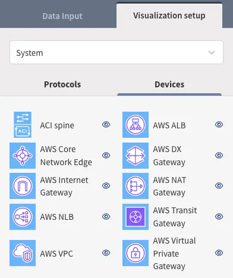

# IP Fabric `v7.8`

!!! danger "Unreleased Version"

    This is an upcoming IP Fabric version, which has not been released yet and
    is not available for download.

--8<-- "snippets/upgrade_version_policy.md"

--8<-- "snippets/clear_browser_cache.md"

## Known Issues

### Google Cloud Platform (GCP)

- For GCP interconnect paths, the Cloud Router (control plane) appears in the
  path lookup. This will be updated in a future release.

## `v7.8.X` (UNRELEASED)

.

### Fixes

.

## `v7.8.0` (UNRELEASED)

.

### New Features

- **Device Attributes Import/Export:** Added the ability to bulk import and
  export device attributes using CSV files for easier management.
- Added support for
  [**GCP multi-project**](../../IP_Fabric_Settings/Discovery_and_Snapshots/Discovery_Settings/Vendors_API/GCP_Google_Cloud_Platform.md)
  environments. Available projects are fetched at the very beginning of the
  discovery.

#### System Upgrade via CLI

A new command-line tool `/opt/ipf-system-upgrade/bin/cli` now enables
performing system upgrades in the same way as through the web interface.

### Improvements

#### API Logging

The `ipf-api` component now writes logs to `/var/log/ipf/ipf-api/` instead of
forwarding them to syslog.

#### Improved PostgreSQL Migration Process

We have addressed edge cases where PostgreSQL might not have been configured
correctly during upgrades. Additional checks and safeguards now ensure
consistent and reliable system configuration. The installation process has also
been improved to better handle dependencies between the product and PostgreSQL.

#### Simplified TechSupport Exports

Logs from cloud-init are now excluded from TechSupport exports.

#### Additional Disk-space Checks During Upgrade

Added a pre-upgrade check for available disk space to prevent the appliance
from running out of space during an upgrade.

#### Jumphost Logs Included in TechSupport Exports

The `ipf-jumphost` service, which has logged to `/var/log/ipf/ipf-jumphost/`
since release 7.0 to keep its logs separate from system logs, now includes
these logs in TechSupport exports to assist with troubleshooting.

#### Upgraded Node.js to v22.19.0

All JavaScript-based services are now running on Node.js version `v22.19.0`.

#### Technology Tables

##### New Tables

- [**IPv6 Managed IP Summary**](../../IP_Fabric_GUI/technology_tables/addressing/ipv6-managed-ip-summary.md)
  table has been added under **Technology → Addressing → Managed-IP**.
- [**Cloud Public IPs**](../../IP_Fabric_GUI/technology_tables/cloud/public_ips.md)
  table under **Technology → Cloud** showing all IPv4 and IPv6 public IPs - even
  those are unused.
- **Cloud Subnets Inventory**  table has been added under
  [**Technology → Cloud → Subnets**](../../IP_Fabric_GUI/technology_tables/cloud/subnets.md),
  and new cloud vendor-specific subnets tables under
  [**Technology → Cloud → Vendors**](../../IP_Fabric_GUI/technology_tables/cloud/vendors.md).
- **Cloud Private Link Endpoints** and **Private Link Services** tables under
  **Technology → Cloud**, and vendor-specific tables:
  - **Service Endpoints**, **Private Link**, and **VNet Integration** under
    [**Technology → Cloud → Vendors → Azure**](../../IP_Fabric_GUI/technology_tables/cloud/vendors.md#azure).
  - **Private Service Connect** under
    [**Technology → Cloud → Vendors → GCP**](../../IP_Fabric_GUI/technology_tables/cloud/vendors.md#gcp-google-cloud-platform),
    covering Endpoints, Published Services, and Published Service Connections.
- **Cloud Endpoint Groups** table under
  [**Technology → Cloud → Endpoints**](../../IP_Fabric_GUI/technology_tables/cloud/endpoints.md),
  and vendor-specific tables under
  [**Technology → Cloud → Vendors**](../../IP_Fabric_GUI/technology_tables/cloud/vendors.md)
  covering **AWS Scaling Groups**, **Azure Virtual Machine Scale Sets**, and
  **GCP Instance and Network Endpoint Groups**.

#### GUI

- An overview of active filters, with buttons to easily remove them, was added
  to all tables
  .
- It is now possible to display interface descriptions on diagram edges in the
  form of line cap labels. Example can be seen on
  [this page](../../IP_Fabric_GUI/diagrams/network_viewer.md#default-protocols-view).
 
#### Path Lookup

##### Cloud

- **New device icons** for the AWS and Azure clouds in network and path-lookup
  diagrams to improve navigation.

- Added support for the **Azure Firewall** - classic rules and policy-based
  firewall, and support for network, application, and DNAT rules. 
  - Limitations:
    - Application rules with FQDN tags are not supported.
    - DNAT rules with FQDN are not supported.
    - Azure Firewall deployed in vWAN is not supported.
- Added support for GCP Partner Interconnect.

##### Meraki

- Path lookup now enabled for Meraki networks for certain topologies. For more
  details see
  [Meraki notes for Path lookup](../../IP_Fabric_GUI/diagrams/vendors/meraki.md).

#### Vendor Support and Improvements

- **Palo Alto**
  - Now supports AAA, NTP, SNMP, Syslog, OSPFv3 tasks and IPv4 and IPv6 route
    summary tables.

- **Fortinet**
  - Now supports IPv4 and IPv6 route summary tables.

- **Meraki**
  - Now supports switchports on LAN side for firewalls, port-channel and
    management interface for switches.
  - Corrected xDP interface numbering for firewalls.

- **Cisco**
  - Now supports IPv6 AAA, ACL, SNMP and Syslog tasks on NX-OS and IPv6 route
    summary tables on ASA, ACI, IOS XR, NX-OS.

- **Aruba IAP - AOS 10+**
  - Virtual Controllers are no longer created as devices in IP Fabric due to
    architectural changes introduced in AOS 10.
  - The cluster group name is now displayed in a new column, `AP Cluster Name`,
    within the table: `Technology/Wireless/Access points`.

### API Changes

- Introduced a new API error code: `API_VENDOR_CONNECTION_TEST_FAILED`. Updated
  the AWS API connection tester to use this new error code instead of the
  previous `API_URL_NOT_REACHABLE`.

#### Endpoint Payload Size Limit

The payload size limit has been introduced with a default of 20 MB, except for
the following endpoints with their respective limits:

- `/appliance-configuration/import` -> 100 MB
- `/extensions/docker-image` -> 2 GB
- `/extensions/docker-zip` -> 10 GB
- `/licenses/upload` -> 5 MB
- `/snapshots/upload` -> 10 GB
- `/graphs/vsdx` -> 25 MB
- `/os/upload-nimpee-cert` -> 5 MB
- `PATCH /settings` -> 100 MB

### Miscellaneous

- BGP AS number format can be changed to
  [ASplain using a Configuration Flag](../../System_Administration/Command_Line_Interface/Configuration_Flags.md#bgp-asplain-notation).
- Discovery and API system logs are now available under separate
  [journald namespaces](../../System_Administration/Command_Line_Interface/Logging.md#service-logs).
- The system status page is now accessible only after login.
- The license upload endpoint is now protected by authentication and accessible
  only to admin users.
- When a user changes their password, all active sessions for that user are
  invalidated.
- Session token is now invalidated upon logout.
- The default RabbitMQ guest account has been removed.
- The built-in Role-Based Access Control (RBAC) policy previously named others
  (ID: read) has been renamed for improved clarity.
  - Despite its ID, this policy also permits write operations for saved filters
    and graphs. The rename helps better reflect its actual permissions and
    avoid confusion between read-only and read/write capabilities. 
