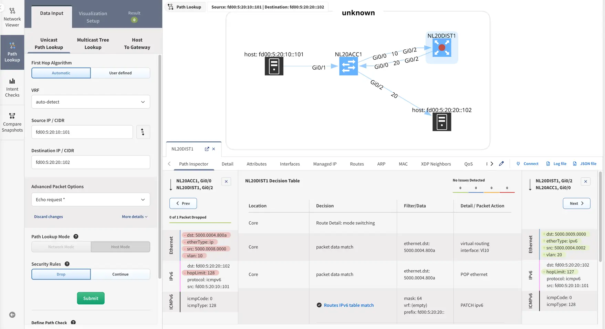
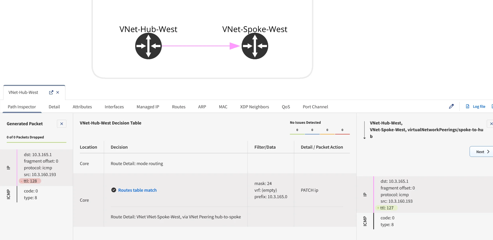

# IP Fabric v7.9

--8<-- "snippets/upgrade_version_policy.md"

--8<-- "snippets/clear_browser_cache.md"

!!! Info "Version 7.8 Notice"

    IP Fabric `7.9` follows directly after `7.5`. Version `7.8` was made available but not broadly promoted or delivered via online updates.

    The `7.8` release notes are included [here](7.8.md) for reference, as its changes were incorporated into later releases.

## Known Issues

### Google Cloud Platform (GCP)

- Using separate Vendor API configurations to discover the Shared VPC host and service projects leads to inconsistent results. This will be fixed in a future release.
  More details regarding the issue can be seen [here](../../support/known_issues/Vendors/gcp.md).

## v7.9.3 (January 14th, 2026; GA)

```
SHA256 (ipfabric-update-7-9-3+0.tar.zst.sig) = e636f2ebc41d51313face02628fabfada914107396f201626e90617cae338407
MD5 (ipfabric-update-7-9-3+0.tar.zst.sig) = 7384714c5f33a898c387bc75ea6e2923
SHA256 (ipfabric-7-9-3+0.qcow2) = 35aac5d53607b829b4ce5236c1af93ba1fd082d4c7649c81c36a0a5456213f5b
MD5 (ipfabric-7-9-3+0.qcow2) = e2f8f80214870baacd68c12aafd55641
SHA256 (ipfabric-7-9-3+0.vmdk) = 27a7e66afac5a98c22d32e98ae740a45ef30c5e9c81f7164fb3b163479173591
MD5 (ipfabric-7-9-3+0.vmdk) = 05aa9efba7e8b6f15e1e5eedc6c438dc
SHA256 (ipfabric-7-9-3+0.vhdx.zst) = 5a55aff66dbe7f811d1333aed9e755893b3ba30553f968c13f888cbad1da03ed
MD5 (ipfabric-7-9-3+0.vhdx.zst) = 200530ac697a3d378518286075aa09ad
SHA256 (unsupported-ESXi6.7U2-ipfabric-7-9-3+0.ova) = 98941c30df19cd7b67e1585c8a5615205695e976d15d2fe292a81d064c41613e
MD5 (unsupported-ESXi6.7U2-ipfabric-7-9-3+0.ova) = 7df26d3603788720f8e72251a7a1e051
SHA256 (unsupported-ESXi7.0-ipfabric-7-9-3+0.ova) = 72cc6be2aef3a32854a982d55bee3ad0f7b0b2bf816fd0067f4969ee4018a36f
MD5 (unsupported-ESXi7.0-ipfabric-7-9-3+0.ova) = 9fbb786e9487f8d6fe5b2a0d157c5c2c
SHA256 (ESXi8.0-ipfabric-7-9-3+0.ova) = 6ff74b4198bdd92289489828a2e0293ea53ab035ea8f1472a4c61e553e7a0f4b
MD5 (ESXi8.0-ipfabric-7-9-3+0.ova) = b23208b5da5947113baeb933b0745089
```

### Improvements

#### Performance

Fixed a performance regression that caused path lookup queries to return results significantly slower in `7.8` compared to `7.3`.

#### Configurable Memory Limits for API & Discovery Services

Memory limits for API and discovery services are now configurable and no longer fixed. This gives better control over resource usage and makes it easier to tune the system for different environments.

The configured memory limits are logged and visible in the UI, providing better transparency during discoveries.

If you encounter out-of-memory issues or need to **adjust memory limits** for your deployment, please contact IP Fabric Customer Support for guidance.

#### Technology Tables

##### New Tables

- **Cloud Serverless Services** table under vendor-specific table
  [**Technology → Cloud → Vendors → GCP → Serverless Services**](../../IP_Fabric_GUI/technology_tables/cloud/vendors.md)
  covering **App Engine**, **Cloud Function**, and **Cloud Run**.
- **Virtual Servers** - **Path Rules** table under Load Balancing [**Technology → Load-balancing**](../../IP_Fabric_GUI/technology_tables/load_balancing.md#virtual-servers-path-rules).
- **DNS** table under [**Technology → Cloud → Vendors → Azure**](../../IP_Fabric_GUI/technology_tables/cloud/vendors.md#azure).

#### Path Lookup

Path Lookup has been extended to support IPv6 for both Unicast and Host to Gateway scenarios. The following technologies are now supported for IPv6 path analysis:
routing, security evaluation, 6in4, GRE, and IPsec.



!!! warning "Limitations"

    NAT and PBR are not yet supported for IPv6 lookups.

Path Lookup has been extended to support Layer 3 routing between cloud-only devices with no interface names.



#### Vendor Support

- **Check Point Gaia** -- Improved NTP data collection by supporting the extended `ntpq` command, providing detailed NTP source information. For more details, see [Extend command to get better NTP results](../../support/known_issues/Vendors/checkpoint.md#extend-command-to-get-better-ntp-results).
- **GCP** -- Added support for VPC Network Peering configured between VPC networks in different Google Cloud projects.
- **Azure** -- Improved security evaluation for Azure Firewall.

#### Enhanced Password Security

Password validation has been strengthened in both the UI and API.
Passwords must be 8–200 characters long and include at least 3 of 5 character categories
(uppercase, lowercase, numerals, special ASCII, Unicode alphabetic).
More details on [Authentication page](../../IP_Fabric_API/authentication.md#password-requirements).

#### Password Change Verification

When changing a password, users are now required to provide their current password for verification.
This additional security measure helps prevent unauthorized password changes if a session is compromised or left unattended.
The user must have admin privileges, and the password must match the current session. If an incorrect password is provided,
the session will be immediately invalidated and the user will be logged out.

### Experimental Features

#### Dedicated API Discovery Worker

An experimental dedicated worker for API-based discovery is available. When enabled, it improves scalability and discovery performance for **API-only devices** by running API discovery independently from other discovery processes.

Discovery behavior and results remain unchanged. The solution includes built-in protections to respect vendor API rate limits and is designed to scale independently.

This feature is **disabled by default**. Customers interested in evaluating it can **contact IP Fabric Customer Support** for more information and assistance with enabling it.
