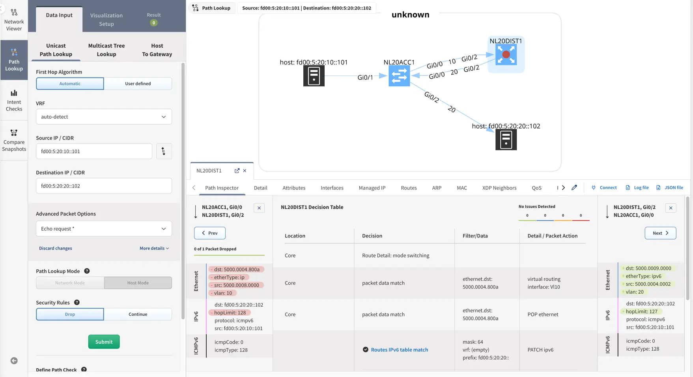
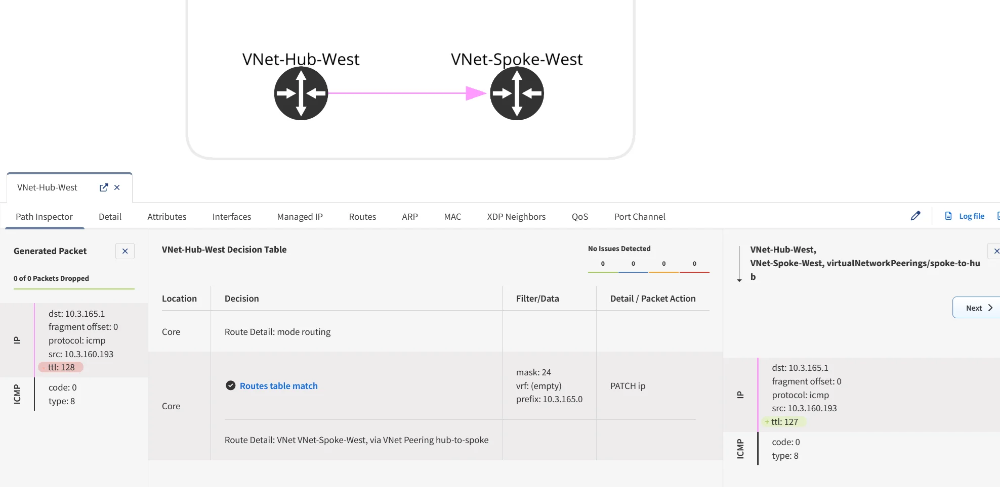
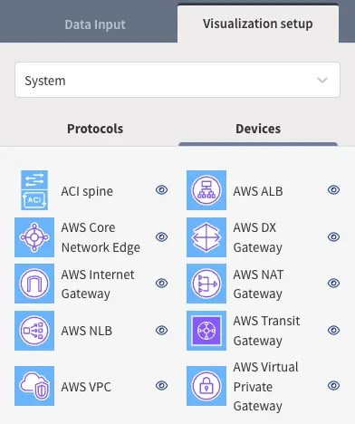
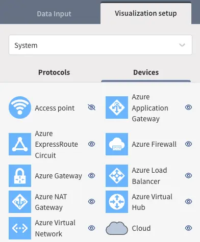
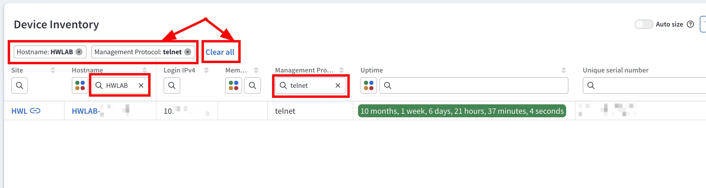

# IP Fabric v7.9

--8<-- "snippets/upgrade_version_policy.md"

--8<-- "snippets/clear_browser_cache.md"

## Known Issues

### Google Cloud Platform (GCP)

- Using separate Vendor API configurations to discover the Shared VPC host and
  service projects leads to inconsistent results. This will be fixed in a
  future release. More details regarding the issue can be seen
  [here](../../support/known_issues/Vendors/gcp.md).
- For GCP interconnect paths, the Cloud Router (control plane) appears in the
  path lookup. This will be updated in a future release.

## Breaking Changes

### Data Loss on User Deletion

If a user is deleted, all saved customizations created by that user are
permanently deleted and cannot be recovered. For more details, please refer to
[Delete user page](../../IP_Fabric_Settings/administration/users.md#delete-user).

## v7.9.4 (February 5th, 2026; GA)

```
SHA256 (ipfabric-update-7-9-4+0.tar.zst.sig) = 9144c144100174baf7a605dfc070c04dab1f732ec7de1a158317c527ef0ded90
MD5 (ipfabric-update-7-9-4+0.tar.zst.sig) = 89ea04a9846d4afef4a24f880aba774f
SHA256 (ipfabric-7-9-4+0.qcow2) = 9f046daa45ba9a5bb076733d302bbab4c79afaf9402007e58375bd70120d8451
MD5 (ipfabric-7-9-4+0.qcow2) = e20203cad7dfa910a588c88c24e0349c
SHA256 (ipfabric-7-9-4+0.vmdk) = 19a41be89028d9325143a915e0d78483c89048cc7bf2cb349b446986d8a05888
MD5 (ipfabric-7-9-4+0.vmdk) = 85441314f6574988e8550f1846763788
SHA256 (ipfabric-7-9-4+0.vhdx.zst) = 8dd2d1a601bcace4b22de9e5dbb32970b72d46cd5f63e3f3d549f648f283d42a
MD5 (ipfabric-7-9-4+0.vhdx.zst) = 667e81724f4abde193d541ded450206c
SHA256 (unsupported-ESXi6.7U2-ipfabric-7-9-4+0.ova) = d169a345755ba3f53768fc4d03785f912f63a82e76d53aef33e702b60e1bb256
MD5 (unsupported-ESXi6.7U2-ipfabric-7-9-4+0.ova) = d55bdbfcd8bff73d381723ebbbd3f02a
SHA256 (unsupported-ESXi7.0-ipfabric-7-9-4+0.ova) = 8c7d2ed9e93341cf0e555800051752a4b2a248d10aedccfb172baaa45d681c28
MD5 (unsupported-ESXi7.0-ipfabric-7-9-4+0.ova) = 84bb3be636282a33cb5c1fc1c2aef45d
SHA256 (ESXi8.0-ipfabric-7-9-4+0.ova) = dcd11ab08ab19d1515f081ec0943527fc78d09a9eef33442b1bf31062755f4ff
MD5 (ESXi8.0-ipfabric-7-9-4+0.ova) = d1b2c67ec60f86cd990bc9aff6eca9f9
```

### Improvements

- Password changes now require the acting user to verify their own password in
  addition to setting the new password for the target account. This improves
  protection against unauthorized changes made from unattended or unlocked
  admin sessions.
- Saved diagram views are once again visible to all local users, rather than
  being limited to the user who created them.

### Bug Fixes

- Fixed upgrade portal getting stuck in `Upgrade process initializing` status
  after a failed download and second upgrade attempt.
- Resolved `ipf-connection-tester` failure with
  `ValidationError: must not be undefined` when running SSH/telnet tests.
- Fixed missing routes parsing on HPE Aruba CX devices.
- Fixed CSV download error `Couldn't download - Network Issue` and restored API
  export of full JSON for **Platforms --> Stacks --> Members**.
- Fixed missing HPE Aruba APs in **Inventory --> Devices** caused by
  `uiVendorList.find is not a function`.
- Fixed error `Could not find data for the gallery ID` for Azure mapping.
- Corrected parsing errors for `commands/huawei/_vrp/mpls/lspVerbose` on Huawei
  VRP devices.
- Corrected parsing errors for `commands/cisco/_nxos/interface` on Cisco NX-OS
  devices.
- Corrected parsing errors for `commands/cisco/controllersOptics` on Cisco
  devices.
- Corrected parsing errors for `commands/fs/_fsos/mlagPeer` to handle MLAG peer
  absence on FSOS devices.
- Corrected LLDP neighbor port mapping and restored missing neighbors on HPE
  Comware devices.

## v7.9.3 (January 14th, 2026; GA)

### Improvements

#### Path Lookup

- Fixed a performance regression that caused path lookup queries to return
results significantly slower compared to previous versions.

- Path Lookup has been extended to support IPv6 for both Unicast and Host to
Gateway scenarios. The following technologies are now supported for IPv6 path
analysis: routing, security evaluation, 6in4, GRE, and IPsec.



!!! warning "Limitations"

    NAT and PBR are not yet supported for IPv6 lookups.

- Path Lookup has been extended to support Layer 3 routing between cloud-only
devices with no interface names.



- It is now possible to display interface descriptions on diagram edges in the
form of line cap labels. Example can be seen on
[this page](../../IP_Fabric_GUI/diagrams/network_viewer.md#default-protocols-view).

##### Cloud

- **New device icons** for the AWS and Azure clouds in network and path-lookup
  diagrams to improve navigation.




- Added support for the **Azure Firewall** - classic rules and policy-based
  firewall, and support for network, application, and DNAT rules.
  - Limitations:
    - Application rules with FQDN tags are not supported.
    - DNAT rules with FQDN are not supported.
    - Azure Firewall deployed in vWAN is not supported.
- Added support for GCP Partner Interconnect.

##### Meraki

- Path lookup now enabled for Meraki networks for certain topologies. For more
  details see
  [Meraki notes for Path lookup](../../IP_Fabric_GUI/diagrams/vendors/meraki.md).

#### Technology Tables

- **Cloud Serverless Services** table under vendor-specific table
  [**Technology → Cloud → Vendors → GCP → Serverless Services**](../../IP_Fabric_GUI/technology_tables/cloud/vendors.md)
  covering **App Engine**, **Cloud Function**, and **Cloud Run**.
- **Virtual Servers** - **Path Rules** table under Load Balancing
  [**Technology → Load-balancing**](../../IP_Fabric_GUI/technology_tables/load_balancing.md#virtual-servers-path-rules).
- **DNS** table under
  [**Technology → Cloud → Vendors → Azure**](../../IP_Fabric_GUI/technology_tables/cloud/vendors.md#azure).
- [**IPv6 Managed IP Summary**](../../IP_Fabric_GUI/technology_tables/addressing/ipv6-managed-ip-summary.md)
  table has been added under **Technology → Addressing → Managed-IP**.
- [**Cloud Public IPs**](../../IP_Fabric_GUI/technology_tables/cloud/public_ips.md)
  table under **Technology → Cloud** showing all IPv4 and IPv6 public IPs -
  even those are unused.
- **Cloud Subnets Inventory** table has been added under
  [**Technology → Cloud → Subnets**](../../IP_Fabric_GUI/technology_tables/cloud/subnets.md),
  and new cloud vendor-specific subnets tables under
  [**Technology → Cloud → Vendors**](../../IP_Fabric_GUI/technology_tables/cloud/vendors.md).
- **Cloud Private Link Endpoints** and **Private Link Services** tables under
  **Technology → Cloud**, and vendor-specific tables:
  - **Service Endpoints**, **Private Link**, and **VNet Integration** under
    [**Technology → Cloud → Vendors → Azure**](../../IP_Fabric_GUI/technology_tables/cloud/vendors.md#azure).
  - **Private Service Connect** under
    [**Technology → Cloud → Vendors → GCP**](../../IP_Fabric_GUI/technology_tables/cloud/vendors.md#gcp-google-cloud-platform),
    covering Endpoints, Published Services, and Published Service Connections.
- **Cloud Endpoint Groups** table under
  [**Technology → Cloud → Endpoints**](../../IP_Fabric_GUI/technology_tables/cloud/endpoints.md),
  and vendor-specific tables under
  [**Technology → Cloud → Vendors**](../../IP_Fabric_GUI/technology_tables/cloud/vendors.md)
  covering **AWS Scaling Groups**, **Azure Virtual Machine Scale Sets**, and
  **GCP Instance and Network Endpoint Groups**.
- An overview of active filters, with buttons to easily remove them, was added
  to all tables
  .

#### Vendor Support

- **Check Point Gaia** -- Improved NTP data collection by supporting the
  extended `ntpq` command, providing detailed NTP source information. For more
  details, see
  [Extend command to get better NTP results](../../support/known_issues/Vendors/checkpoint.md#extend-command-to-get-better-ntp-results).
- **GCP** -- Added support for VPC Network Peering configured between VPC
  networks in different Google Cloud projects.
- **Azure** -- Improved security evaluation for Azure Firewall.
- **Palo Alto**
  - Now supports AAA, NTP, SNMP, Syslog, OSPFv3 tasks and IPv4 and IPv6 route
    summary tables.
- **Fortinet**
  - Now supports IPv4 and IPv6 route summary tables.
- **Meraki**
  - Now supports switchports on LAN side for firewalls, port-channel and
    management interface for switches.
  - Corrected xDP interface numbering for firewalls.
- **Cisco**
  - Now supports IPv6 AAA, ACL, SNMP and Syslog tasks on NX-OS and IPv6 route
    summary tables on ASA, ACI, IOS XR, NX-OS.
- **Aruba IAP - AOS 10+**
  - Virtual Controllers are no longer created as devices in IP Fabric due to
    architectural changes introduced in AOS 10.
  - The cluster group name is now displayed in a new column, `AP Cluster Name`,
    within the table: `Technology/Wireless/Access points`.

#### Password Security

- Password validation has been strengthened in both the UI and API. Passwords
must be 8–200 characters long and include at least 3 of 5 character categories
(uppercase, lowercase, numerals, special ASCII, Unicode alphabetic). More
details on
[Authentication page](../../IP_Fabric_API/authentication.md#password-requirements).

- When changing a password, users are now required to provide their current
password for verification. This additional security measure helps prevent
unauthorized password changes if a session is compromised or left unattended.
The user must have admin privileges, and the password must match the current
session. If an incorrect password is provided, the session will be immediately
invalidated and the user will be logged out.

#### Upgrade & System Stability

- We have addressed edge cases where PostgreSQL might not have been configured
correctly during upgrades. Additional checks and safeguards now ensure
consistent and reliable system configuration. The installation process has also
been improved to better handle dependencies between the product and PostgreSQL.

- Added a pre-upgrade check for available disk space to prevent the appliance
from running out of space during an upgrade.

#### TechSupport Exports

- Logs from cloud-init are now excluded from TechSupport exports.

- The `ipf-jumphost` service, which has logged to `/var/log/ipf/ipf-jumphost/`
since release 7.0 to keep its logs separate from system logs, now includes
these logs in TechSupport exports to assist with troubleshooting.

#### Platform & Infrastructure

- Memory limits for API and discovery services are now configurable and no longer
fixed. This gives better control over resource usage and makes it easier to
tune the system for different environments.

  The configured memory limits are logged and visible in the UI, providing better
transparency during discoveries.

  If you encounter out-of-memory issues or need to **adjust memory limits** for
your deployment, please contact IP Fabric Customer Support for guidance.

- The `ipf-api` component now writes logs to `/var/log/ipf/ipf-api/` instead of
forwarding them to syslog.

- All JavaScript-based services are now running on Node.js version `v22.19.0`.

### New Features

- **Device Attributes Import/Export:** Added the ability to bulk import and
  export device attributes using CSV files for easier management.
- Added support for
  [**GCP multi-project**](../../IP_Fabric_Settings/Discovery_and_Snapshots/Discovery_Settings/Vendors_API/GCP_Google_Cloud_Platform.md)
  environments. Available projects are fetched at the very beginning of the
  discovery.

#### System Upgrade via CLI

A new command-line tool `/opt/ipf-system-upgrade/bin/cli` now enables
performing system upgrades in the same way as through the web interface.

### API Changes

- Introduced a new API error code: `API_VENDOR_CONNECTION_TEST_FAILED`. Updated
  the AWS API connection tester to use this new error code instead of the
  previous `API_URL_NOT_REACHABLE`.

#### Endpoint Payload Size Limit

The payload size limit has been introduced with a default of 20 MB, except for
the following endpoints with their respective limits:

- `/appliance-configuration/import` -> 100 MB
- `/extensions/docker-image` -> 2 GB
- `/extensions/docker-zip` -> 10 GB
- `/licenses/upload` -> 5 MB
- `/snapshots/upload` -> 10 GB
- `/graphs/vsdx` -> 25 MB
- `/os/upload-nimpee-cert` -> 5 MB
- `PATCH /settings` -> 100 MB

### Experimental Features

#### Dedicated API Discovery Worker

An experimental dedicated worker for API-based discovery is available. When
enabled, it improves scalability and discovery performance for **API-only
devices** by running API discovery independently from other discovery
processes.

Discovery behavior and results remain unchanged. The solution includes built-in
protections to respect vendor API rate limits and is designed to scale
independently.

This feature is **disabled by default**. Customers interested in evaluating it
can **contact IP Fabric Customer Support** for more information and assistance
with enabling it.

### Other Changes

- Added documentation for a
  [known limitation with RFC 5549](../../support/known_issues/IP_Fabric/ipv4-over-ipv6-limitations.md)
  (IPv4 routes with IPv6 as next hop).
- BGP AS number format can be changed to
  [ASplain using a Configuration Flag](../../System_Administration/Command_Line_Interface/Configuration_Flags.md#bgp-asplain-notation).
- Discovery and API system logs are now available under separate
  [journald namespaces](../../System_Administration/Command_Line_Interface/Logging.md#service-logs).
- The system status page is now accessible only after login.
- The license upload endpoint is now protected by authentication and accessible
  only to admin users.
- When a user changes their password, all active sessions for that user are
  invalidated.
- Session token is now invalidated upon logout.
- The default RabbitMQ guest account has been removed.
- The built-in Role-Based Access Control (RBAC) policy previously named others
  (ID: read) has been renamed for improved clarity.
  - Despite its ID, this policy also permits write operations for saved filters
    and graphs. The rename helps better reflect its actual permissions and
    avoid confusion between read-only and read/write capabilities.
