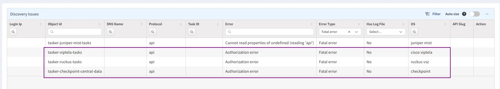

# IP Fabric v6.8

--8<-- "snippets/6.6.3_online_upgrade_issue.md"

--8<-- "snippets/upgrade_version_policy.md"

--8<-- "snippets/clear_browser_cache.md"

### Upgrade Notices

- During the update process, locked snapshots will be unloaded together with
  other snapshots, and their locks will be preserved. Therefore, such snapshots
  won't be deleted by snapshot retention.
- The upgrade to version `6.8` may break custom SSO integrations and will
  require a change to the `/etc/ipf-dex.yaml` file. Since the `6.3.2` release,
  we are omitting the minor API version for SSO configuration, and only the
  major version will need to be changed with the next major IP Fabric version.
  Simply replace the `vX.Y` string in this file with `v6` and then run
  `systemctl restart ipf-dex`.

  ```yaml
  staticClients:
    - id: ipfabric
      redirectURIs:
        - "https://demo1.eu.ipfabric.io/api/v6/auth/external/azure"
  ```

  For more information, please refer to the
  [SSO documentation](../../../../IP_Fabric_Settings/administration/sso.md#sso-configuration-ipf-dexyaml).
  If you would like assistance, please contact your Solution Architect.

## v6.8.6 (May 28th, 2024; GA)

```
SHA256 (ipfabric-update-6-8-6+0.tar.gz.sig) = e9d095fa25bbdd9321d806a8982adbadb3bb3009fb29d8ddf501f9162ed95a60
MD5 (ipfabric-update-6-8-6+0.tar.gz.sig) = ce79f852b9b41faf7c676537bfdad35c
SHA256 (ipfabric-6-8-6+0.ova) = abe9a02b68ccc861739d7e6b9b5eeeb76c2d4181eed849bbb7a8d92c5273c31e
MD5 (ipfabric-6-8-6+0.ova) = d08f95db651a5ac360f6746501839ccf
SHA256 (ipfabric-6-8-6+0.qcow2) = a0a5615ccb3b2d34c6a5a1bf744efb5cd6752464a2daa43f868624896c4d8034
MD5 (ipfabric-6-8-6+0.qcow2) = 3b545ae437f021e9b38d67b9546687ef
SHA256 (ipfabric-6-8-6+0.vmdk) = e85bcb69148b9e3b487311a365fe5eeedc122b60f5ebbc11361f9a3532502a32
MD5 (ipfabric-6-8-6+0.vmdk) = cfd14bc55cd02259a6be3d4178c470d4
```

### Security Fixes

- Fixed the issue with Vendor API clients logging sensitive data when the
  sensitive data contained a regex special character (e.g., `\t`, `\b`, `\d`,
  `\w`, etc.).

## v6.8.4 (May 14th, 2024; GA)

```
SHA256 (ipfabric-update-6-8-4+0.tar.gz.sig) = 2660ef87f9cf512650dd67bb454feb0953bdd03e7db22f4234f1634043cac07e
MD5 (ipfabric-update-6-8-4+0.tar.gz.sig) = bcc3f6b55e5467835c7954362b6e35c5
SHA256 (ipfabric-6-8-4+0.ova) = 20146eceb07d63499d6c3a6b4803db657853ad3272f67976ae28130c48b7dc27
MD5 (ipfabric-6-8-4+0.ova) = 57586d9fefafdb06ac3dc4f333f60517
SHA256 (ipfabric-6-8-4+0.qcow2) = 9b55944acc2c6a30fbd435a125d0fcf8e70ea5047d0f9d11ef88961d9eb0b98a
MD5 (ipfabric-6-8-4+0.qcow2) = c3001363d8eb7e1695d63658442a6340
SHA256 (ipfabric-6-8-4+0.vmdk) = f8385667921641bbb63e312ee26a12fc4f6a8ba51918cfca6184a3edda50068f
MD5 (ipfabric-6-8-4+0.vmdk) = 4da10b0f213a6af0c1c88982115f4dbe
```

### Network Discovery

- Combined API+CLI discovery support for SD-WAN vendors
  [Versa](../../../../IP_Fabric_Settings/Discovery_and_Snapshots/Discovery_Settings/Vendors_API/Versa_Networks_SD-WAN.md)
  and
  [Viptela](../../../../IP_Fabric_Settings/Discovery_and_Snapshots/Discovery_Settings/Vendors_API/Cisco_Viptela_SD-WAN.md#cisco-viptela-sd-wan)
  - If combined discovery is enabled, routing tables are downloaded via CLI to
    avoid large data transfers over the controller, improving discovery time.
  - After completing all API calls, IP Fabric attempts to connect to one of the
    device IPs (default limit is 10 IPs, now configurable with IP Fabric
    Support). Credentials from the global discovery settings are used. If the
    device is not reachable, the routing table won't be downloaded.
- Azure -- The issue with multiple subcriptions has been fixed. Multiple
  subscriptions can now be specified and will be correctly discovered.
- Silver Peak (HPE Aruba EdgeConnect) -- Stale ARP records are stored due to a
  very short expiration time (TTL).
- HPE Citrix Aruba CX -- Support for Policy-Based Routing was added.
- Fortinet FortiSwitch
  - It is no longer necessary to enable it manually
    (`ENABLE_DISCOVERY_DEVICES_FORTISWITCH`).
  - Support for MCLAG and transceivers was added.
- Cisco (NX-OS, IOS-XR, ACI, ASA, FTD, IOS, IOS-XE) -- Support for bandwidth on
  interfaces was added.

### New CIDR Operators for Table Routing Columns

- Operators:
  - is strict supernet (API: `gt`, UI: `>`)
  - is supernet (API: `gte`, UI: `>=`)
  - is strict subnet (API: `lt`, UI: `<`)
  - is subnet (API: `lte`, UI: `<=`)
  - overlaps (API: `sect`, UI: `@`)
  - does not overlap (API: `nsect`, UI: `!@`)
- All new operators take IPv4 CIDR as a value.
- These operators are available for IPv4 routing table columns (e.g., in
  **Technology --> Routing --> Routes**).
- They can be used for filtering table data and in defining intent verification
  rules.

### Other Changes

- Discovery error detection and reporting have been improved.
  - In a snapshot's **Summary of Issues**, any Vendor API discovery failure is
    now being reported (for example, due to missing/wrong credentials):<br/>
    
- `Device Change` dashboard widget -- The scale of the `Number of Changes` axis
  has been changed from linear to logarithmic. This adjustment should improve
  visualization overall and prevent scale confusion in certain cases.
- You can now update device attributes in an existing snapshot from the global
  settings in **Discovery Snapshot --> Settings --> Device Attributes**. This
  action fully replaces all attributes in the snapshot.
- You can filter
  [Disabled Discovery Tasks](../../../../IP_Fabric_Settings/Discovery_and_Snapshots/Discovery_Settings/disabled_discovery_tasks.md)
  by a device's Serial Number. This should help in targeting specific devices.
- In Table Description, there's a link to a separate page with the API
  documentation. Additionally, we've ensured that the information in our API
  documentation accurately reflects the behavior of our endpoints.
- `callhome.ipfabric.io` has changed its IP address from `95.217.156.217` to
  `65.109.166.252`.
  - It is needed for
    [upgrading IP Fabric over the internet](../../../../System_Administration/system_update.md#online-update)
    (along with `releases.ipfabric.io`) and
    [sending diagnostics (parsing errors)](../../../../support/index.md#callhome) to
    us.
  - If you intend to use the mentioned functionalities, please allowlist the
    FQDN `callhome.ipfabric.io` instead of the IP address `65.109.166.252`, as
    IP addresses are subject to change.
