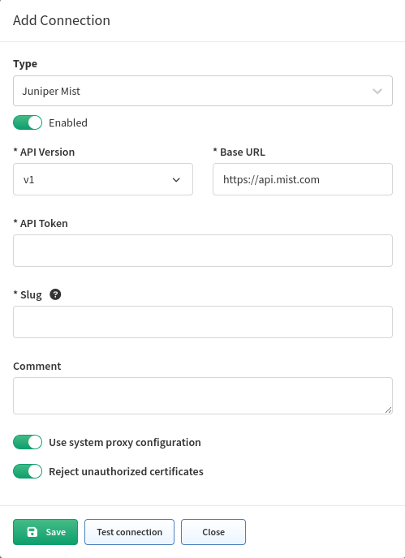

# Juniper Mist

Starting version `4.4.0`, IP Fabric supports Juniper Mist API.

Juniper Mist devices are discovered only through API.

## Generate API Token

1. Log in to the [Juniper Mist website](https://manage.mist.com/signin.html#!signin)

   

   

2. Once logged in, you may proceed to open a new tab in the same browser and go to [API token generation.](https://api.mist.com/api/v1/self/apitokens)

   

3. Once generated, the API token can be used in the IP Fabric GUI.

   

4. In the IP Fabric GUI, go to **Settings --> Discovery & Snapshots --> Discovery Settings --> Vendors API**, click **+ Add**, select `Juniper Mist` from the list and fill in the fields:

   

## Known Issues

**Routing table** -- In the current setup there is no routing table for API endpoints so it is being created only from directly connected routes.

**ARP table** -- Cannot be fetched in the current setup as the API endpoint requires higher privileges.

**Rate limiting** -- The current rate limiting is [5000 API calls per hour](https://www.mist.com/documentation/api-rate-limiting/) and is reset at the hourly boundary. This can affect discovery speed and accuracy (some device might not be discovered). If you need more information, please contact Juniper support at support@mist.com.
