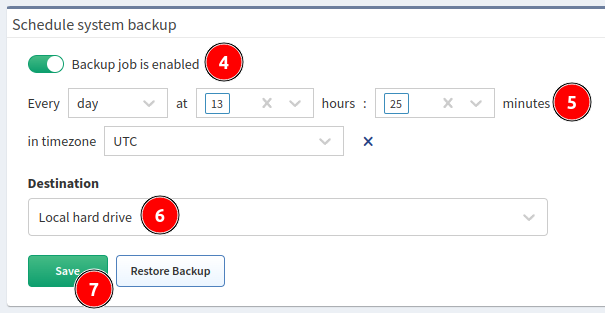

# Schedule System Backup

!!! warning

    For performing a backup, there needs to be > 50 % free space on the `root`
    filesystem.
    
    You can check the free space with the `df -h` command in the IP Fabric VM's
    shell.

Use backup to protect your IP Fabric data.

There are two types of backup:

- local backup
- remote backup (FTP, SFTP)

!!! important

    Backups are encrypted with the `osadmin` user password configured during the
    **First Boot Wizard**. When you lose the `osadmin` user password, backups
    are also lost!

## Automatic Local Backups

Local backup saves database, user and system files locally on a dedicated backup
volume. It's highly recommended placing the backup volume on a different
datastore, ideally on a separate physical storage.

!!! info "Backup Disk"

    The backup disk is not present by default! Please add a new virtual disk to
    enable local backups.

To add a new backup drive, follow the instructions in
[Increase Disk Space - Local Backup Disk](../../../admin/increase_disk_space.md#local-backup-disk).

To schedule automatic local backups, do the following steps:

1. Add a dedicated backup volume (if not done yet).
2. Log in to the main user interface.
3. Go to **Settings --> System --> Backup & Maintenance --> Schedule system
   backup**.
4. Enable backup.
5. Set a backup schedule. See the example for `Every day at 13:25`.
6. Change the **Destination** to `Local hard drive`.
7. Click **Save**.

## Automatic Remote Backups

Remote backup saves database, user and system files remotely using the FTP or
SFTP protocol.

!!! note

    This is the recommended type of backup.

!!! warning

    For FTP and SFTP backups, a directory **has to be specified** . It **has to
    exist** on the remote side. If it does not, you will get an error.

    For **FTP**, the directory path has to be specified as a **relative path**.
    
    For **SFTP**, the directory path has to be specified as an **absolute
    path**.

To set up remote backup, do the following steps:

1. Log in to the user interface.
2. Go to **Settings --> System --> Backup & Maintenance --> Schedule system
   backup**.
3. Enable backup.
4. Set a backup schedule. See the example for `Every day at 5:15 and 17:15` (for
   selecting multiple values, hold `Ctrl` or `Shift` during the selection).
   
5. Change the **Destination** to `FTP` or `SFTP`.
6. Enter the remote FTP/SFTP **Server** FQDN or IP address. Make sure that your
   DNS client is configured and working properly in case of FQDN.
7. Enter **Username** and **Password** for accessing the FTP/SFTP server.
9. Specify the **Directory** where FTP/SFTP backup should be uploaded.
10. Click **Save**.
11. IP Fabric will try to reach the FTP/SFTP server with the configured
    parameters.

--8<-- "snippets/username_password_regex.md"

!!! warning

    The FTP/SFTP user needs the `read`, `write`, `list` and `delete`
    permissions.

!!! note

    Since version `4.1.1`, we do not check the validity of SSL certificates
    during FTP backups.
