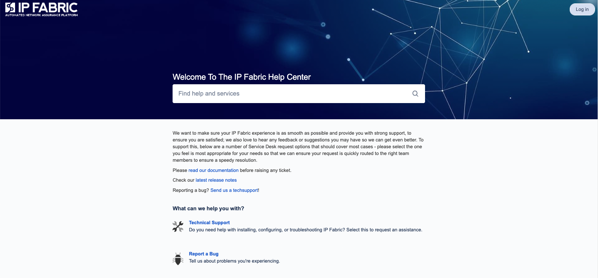

# Technical Support

IP Fabric is provided as a fully managed solution. In case of an issue,
please contact our support teams at
[support.ipfabric.io](https://support.ipfabric.io).

Detailed error reports can be submitted manually by generating
[Techsupport](Techsupport) file and uploading it through support portal
or dedicated upload page in case of large techsupport files.

Send diagnostics
to [callhome.ipfabric.io](http://callhome.ipfabric.io) we will be
pleased to help you.

## IP Fabric Help Center

Is a support portal where you can contact our support teams in case of
any issue with IP Fabric.

We want to make sure your IP Fabric experience is as smooth as possible
and provide you with strong support, to ensure you are satisfied. To
achieve that choose one of icons.

###  Technical Support

Select this feature when you are having technical issues such as problem with
installation, upgrade, backup, configuring, or other technical related
troubleshooting of IP Fabric.

###  Report a Bug

Select this feature to tell us about problems you have found or experiencing.

###  Suggest and Improvement

Do you have a suggestion for us where we can do better or what we
can do better -- tell us.

###  Suggest a New Feature

Do you have any idea for new features which can be added to IP
Fabric? Tell us, we are all ears!

###  Licensing and Billing

Please use this category for any issues or questions around licensing or billing.

###  Questions about Trial Product

This category should be used if you are having question about our
product in case you are testing it and want more information about
it.

###  Other Questions

For inquiries which are not related to any other option on support portal.
