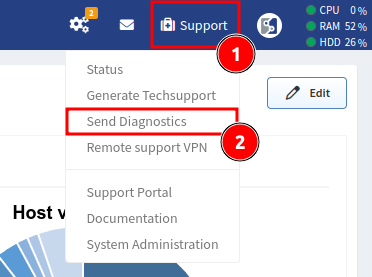

# Technical Support

IP Fabric strive to ensure that the power of our Automated Network Assurance Platform is simple to access for every user. 
We want to make sure you find it simple to use and get the results you are looking for, and that you have the support you need to achieve that.
The IP Fabric licence entitles every paying customer to full customer support so in case of any issue, please contact our support team at
[support.ipfabric.io](https://support.ipfabric.io):

## IP Fabric Help Center

This is the [support portal](https://support.ipfabric.io) from which you can contact our support teams in case of
any issue with IP Fabric.

###  Technical Support

Select this option when you are having problems with
installation, upgrade, backup, configuring, or technical use of the IP Fabric product.

###  Report a Bug

If you feel that the product is not behaving as it should, please select this option to inform us about the issue you are experiencing.

In either case, once you have raised a support ticket, you may be asked to generate a 
[techsupport](techsupport.md) file and upload it via [upload.ipfabric.io](https://upload.ipfabric.io).
This will be used by the support team to recreate your issue and speed diagnosis of any issue.

## Callhome

If your IP Fabric instance has permissions to connect directly to the Internet (specifically to `callhome.ipfabric.io`), you can
send our development team any diagnostic data relating to parsing errors that may have occurred during your snapshot.
To send that diagnostic data to the IP Fabric team, select the Send Diagnostics option on the product's Support menu:

Then opt in the Parsing Errors and hit Send:

## Contact

IP FABRIC s.r.o.  
Kateřinská 466/40  
Praha 2 - Nové Město, 120 00  
Czech Republic  
email: <support@ipfabric.io>  
phone: [+420 720 022 997](tel:00420720022997)  
web: [www.ipfabric.io](http://www.ipfabric.io)
