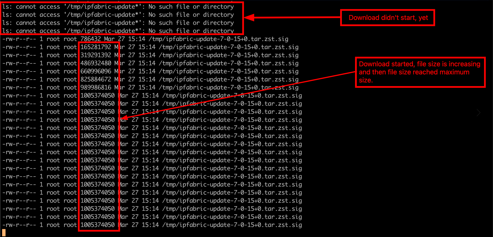

#  Download process freeze

Sometimes, the download process freeze and needs to be recovered to its initial state.

## Troubleshooting Steps

- Ensure that the download is truly frozen:
  - Run following command to check download status: 
    ```bash
    while true; do ls -l /tmp/ipfabric-update*; sleep 2; done:
    ```

    

  - The expected file size is **1,005,374,050** bytes (for version `7.0.15`). If the file size is smaller than this value, the download is **not** complete.
  - Wait a few seconds or minutes, then check again if the file size has increased. If it is growing, the download is still in progress.
  - If the size remains the same, try checking again later. If it is still unchanged, proceed to the next step to recover the **Download Process**.

## To Fix The Problem

```bash
systemctl restart system-upgrade-ipf
```
