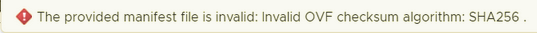

# Error: Invalid OVF checksum algorithm: SHA256

When importing the IP Fabric OVA image on vSphere/ESXi, the following error
might occur:

Please, follow [OVA distribution details](../../../../overview/deployment/ova_details.md) for resolving the issue.
