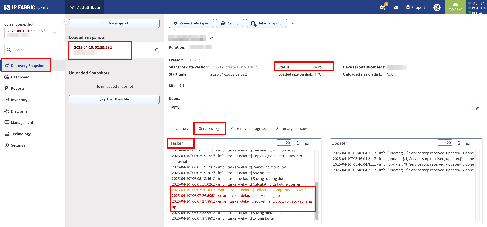
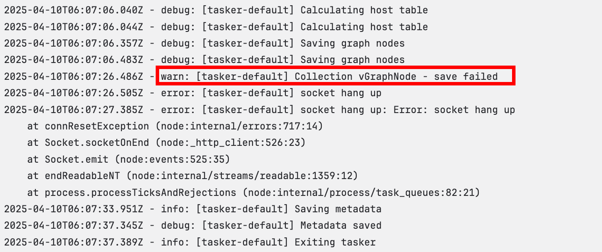

# vGraphNode Issues During Snapshot Loading

From version `6.7` to `7.2.9`, you might encounter problems when loading a newly created or existing snapshot.  
The issue is related to an internal problem with the ArangoDB, which was resolved in version `7.2.9`.  
However, if you have not yet upgraded to `7.2.9`, you may experience difficulties when loading snapshots.

## How to Identify the Issue

There are two ways to check if your problem is related to the described bug:

1. Log in to the GUI, navigate to `/snapshot-management`, and select the `Failed` snapshot.
   - Check `Tasker` under `Services logs` and look for an error message similar to the following:  
     

2. Log in to the CLI and run the following command:

   ```bash
   cat /home/autoboss/snapshots/<affected snapshot ID>/services/tasker/all.txt
   ```

   - Review the end of the file and compare it with this output:
     .

## How to Resolve the Issue

Run System Maintenance via `/settings/system/backup-maintenance`.
If the problem persists, try to `Unload` and then `Load` the affected snapshot on the `/snapshot-management/` page.

## Snapshot Remains in Error Status

If the snapshot remains in an `error` state, please contact [IP FABRIC Support](https://ipfabric.atlassian.net/servicedesk/customer/portal/1)
immediately and raise a new ticket as **Technical Support** with **Priority Support** set to `High` or `Critical`.
