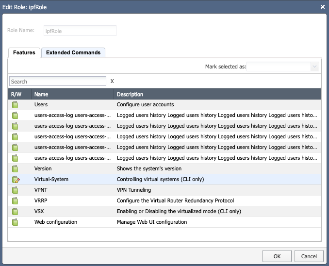

# Check Point

## `fw ctl pstat` Command Requires Admin Rights

**Known Affected platforms**: All

**Result**: Without this command collected no memory utilization will be present

## ARP table contains only master `VSYS 0` entries

**Known Affected Software Versions**: R80.30 and R80.40

**Result**: Command `show arp dynamic all` on VSx always (by mistake) shows ARP only for the `master VSYS 0` regardless of active `VSYS`. It is a confirmed bug on the Check Point firewalls.

## Discovery of Security Policies

- Dynamic objects and negated services are not supported

- **Settings --> Discovery & Snapshots --> Discovery Settings --> Vendors
  API** in the IP Fabric GUI: In case that base URL points to a multi-domain
  server address, domains have to be specified

## Identity Awareness support

Starting with version `6.5`, IP Fabric supports collecting data from the `pdpd` daemon. As the `pdp` command isn't by default available from CLISH, an extended command has to be defined first.

The extended command can be defined from CLISH, but the path depends on the OS version currently installed. For example, if the OS version is `R80.40`, the command would be:

```
> add command ipf_pdp path /opt/CPsuite-R80.40/fw1/bin/pdp description "PDP for IP Fabric"
> save config
```

Alternatively, you can define the extended command from the expert mode by using the environment variable `$FWDIR`. The parameter `-s` saves the configuration:

```
# clish -s -c "add command ipf_pdp path $FWDIR/bin/pdp description \"PDP for IP Fabric\""
```

Don't forget to update the related role and add the `ipf_pdp` extended command to it if needed. See the [official Check Point documentation](https://sc1.checkpoint.com/documents/R81/WebAdminGuides/EN/CP_R81_ScalablePlatforms_Gaia_AdminGuide/Topics-SP-Gaia/User-Defined-Extended-Commands.htm?tocpath=Introduction%20to%20the%20Command%20Line%20Interface%7C_____8).

IP Fabric uses the `ipf_pdp monitor all` command to collect information about active users. Log in to the Check Point management server with the credentials used by IP Fabric discovery and run the command to verify the configuration.

!!! warning

    Ensure that the predefined `fwm` extended command is also enabled for discovery. For more information, see the section below.

## Required Permissions For Successful Discovery Over CLI

To successfully discover a Check Point Gateway, correct role have to be
assigned to a user. IPF requires role features set as read-only, except
of "Virtual-System" where read-write is needed (only if VSX firewalls
are in your network, otherwise read-only is enough).



### How To Setup a Role From Web GUI

1.  Open Check Point Gaia web interface

2.  Navigate to **User Management -> Roles** in the left menu

3.  Click **Add**, fill in the name. In the **Features** tab select all items
    and mark them as **Read-Only**. These permissions from the **Extended Commands** tab are needed (only if Gaia acts as a management server): `fwm` and `ipf_pdp`.

4.  If you have VSX firewall in your network, you have to set
    **Virtual-System** feature to **Read-Write** (we call `set
virtual-system \<ID>` to switch to proper virtual system). This
    allows IPF just to change context and can’t be used for anything
    else.

5.  Assign the role to the user used for IPF discovery

!!! info

    Not all the features are needed for IPF. But as we will add support of new features, it can change. List of currently required features for minimal working setup (IPF 4.0, Gaia R81):

    > Advanced VRRP, ARP, BGP, Cluster, Display Configuration, Domain Name, Host Name, Management Interface, Netflow Export, Network Interfaces, Network Management, NTP, OSPF, Route, Routing Monitor, SNMP, System Configuration, Virtual-System, VRRP, VSX.
