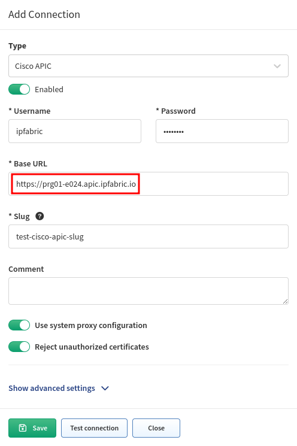
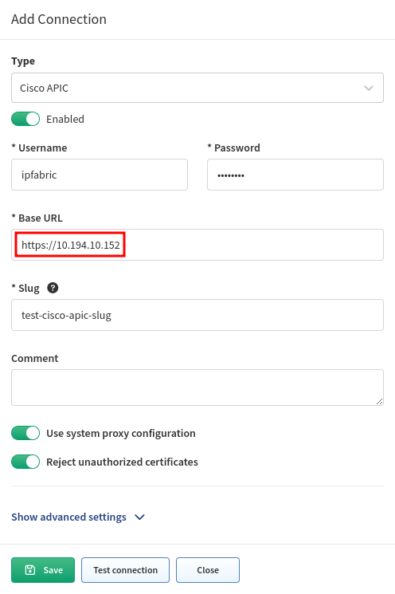

# APIC Tables Are All Empty Except `Controllers`

Even though APIC Vendor API setting is set correctly, you are not able to see anything in any ACI-related tables, except the **Controllers** table.

The reason for this is in the way APIC is discovered.

APIC discovery is running in "hybrid" discovery. Information about controllers is collected through SSH, but the rest of the data is collected thought the API.

If all tables except Controllers are empty, mapping between SSH and API data fails. If all tables are empty, SSH discovery is also not successful.

Until version `6.0.1`, there were issues with API to SSH mapping, if FQDN was used in the Vendor API settings.

IP Fabric was trying to map FQDN `baseurl` to hostname, and because the domain is not usually part of the hostname, mapping was failing.

For example:

```
hostname PRG01-E024-APIC01 != FQDN prg01-e024-apic01.ipfabric.io
```

The workaround is to use IP address of the APIC controller instead of FQDN in the Vendor API settings:

!!! failure

    

!!! success

    

Afterwards, IP address from the Vendor API settings is used for mapping to hostname.
