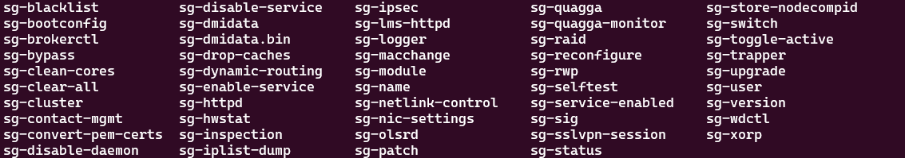

# Forcepoint

## Forcepoint NGFW CLI discovery

**IP Fabric Version:** All

**Known Affected platforms**: Forcepoint NGFW

**Description**: When running discovery via CLI be sure you are using an account that can run the `sg-*` commands. When the account doesn't have the privileges to run the commands, it will give an error `command not found`.

### List of all `sg-` commands

