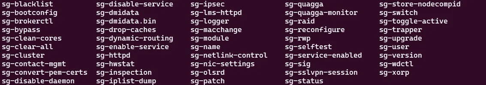

# Forcepoint

## Forcepoint NGFW CLI Discovery

**IP Fabric version:** all

**Known affected platforms**: Forcepoint NGFW

**Description**: When performing discovery via CLI, ensure that you are using an
account that has the necessary privileges to run the `sg-*` commands. If the
account lacks these privileges, attempting to run the commands will result in a
`command not found` error.

### List of All `sg-*` Commands

