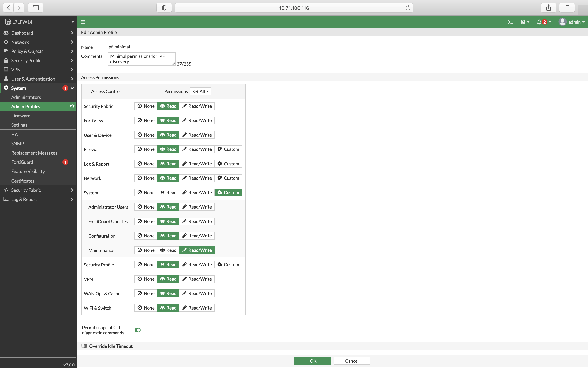

# Overview

## FortiGate

Currently, we support FortiOS version 5.2 and higher. In this section, you will find **our recommendations regarding the setup of administrator profiles and 
accounts**. It's very important, especially if you use **Virtual Domains**, since part of a required configuration can be done only from CLI.

If you plan to use a user with full read/write permissions or even with super_admin profile assigned (which is not recommended, except a LAB testing), you can skip the rest of 
this article.

### User and Profile Creation

#### Create an Admin Profile

First, you need to create an admin profile with read-only permissions.

Follow these steps:

1. Log in to your FortiGate. In case you have VDOMs enabled, ensure you have
   switched to the global scope (relevant drop-down menu is in the top left
   corner)
2. Navigate to **System --> Admin Profiles** and click **+ Create New**
3. Fill in a name and set all permissions to Read (you can do it by clicking
   **Set All** dropdown menu). The only exception is **System --> Maintenance**
   permission, which must be set to **Read/Write** (especially if VDOMs are
   enabled). See the screenshots below from FortiOS versions 6.0 and 7.0:

   

   

!!! note

    For FortiOS version 7.0 and higher, "permit usage of CLI diagnostic commands" has to be enabled.

#### Make The Created Admin Profile Global (VDOMs Only)

If Virtual Domains (VDOMs) are enabled, follow this procedure to make the created admin profile global. It means that administrators having 
this profile will be able to work with all VDOMs. By default, only the default *prof_admin* profile is set as global.

1. Connect to the FortiGate via SSH or Telnet or use the console in the top right corner (version 5.6 and above) or at the dashboard (version 5.4 and below)
2. Run the following commands to change the profile:

   ``` 
   config global
   config system accprofile
   edit read_only
   set scope global
   end
   end
   ```

Change the name of the previously created profile in the 3rd line accordingly.

#### Create An Administrator Account

1. Navigate to **System --> Administrators** and click **+ Create New** and select **Administrator**
2. Fill in its name, select a type of authentication, and finally select the previously created Administrator profile. If you have VDOMs enabled, the Virtual Domains section below should disappear (if not, the selected profile is not global)
3. Apply other restrictions if needed and click OK.

!!! warning

    Ensure that there is at least one interface with SSH or Telnet allowed, and this interface is accessible from IP Fabric VM. To do so, navigate to **Network --> Interfaces** and check the **Access** column.

Now it's time to create a new snapshot or add your FortiGate to an existing one. All VDOMs should be discovered as separate devices named as `<hostname>/<VDOM_name>`.  If not, check the connectivity report in IP Fabric web interface and search for an IP address of your FortiGate.

### Known Bugs

#### FortiGate 300D Interface Flap

**Known Affected platforms**: 6.0.*

**Description**: Running `get system interface transceiver` command on FortiGate 300D running version `6.0.*` can cause some interfaces to flap.
This was confirmed by Fortinet, but no bug ID was received. The Transceivers task has been disabled for any device matching this vendor, model, and version.

**Fix**: Upgrade to a newer version of FortiGate.


## FortiSwitch

### Transceivers

To get the `brokenThld` data, we need to run the `diagnose switch modules state-machine` command. However, currently, we do not have any outputs with meaningful data. Thus, for the FortiSwitch family, we are running this command just to collect outputs and will add the `brokenThld` field as soon as we collect usable data.
