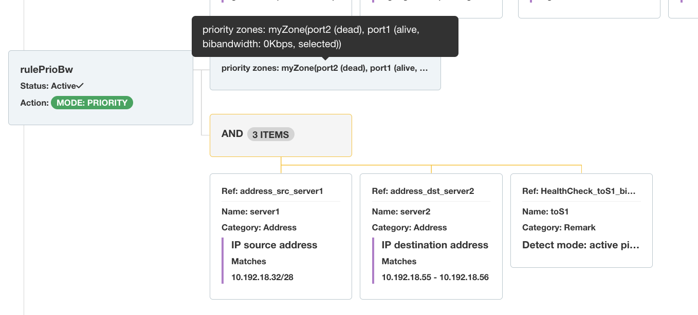

# SD-WAN

Since version `6.9`, IP Fabric supports SD-WAN rules on Fortinet FortiGate
devices. The current implementation maps SD-WAN rules within
[PBR](../../../../IP_Fabric_GUI/technology_tables/routing.md#policy-based-routing).

In end-to-end path lookups, health-check and SLA values are not taken into
account, and we display all paths except for dead members. Information about
SLA/health-check configuration is available in a tree view.

 

SD-WAN neighbors and the application of route-map-out-preferable are not
currently implemented, nor are route-maps in general on FortiGate.

Since SD-WAN on FortiGate is primarily an extension of PBR, there are currently
no new tables available in the
[SD-WAN](../../../../IP_Fabric_GUI/technology_tables/SDWAN.md) section.
