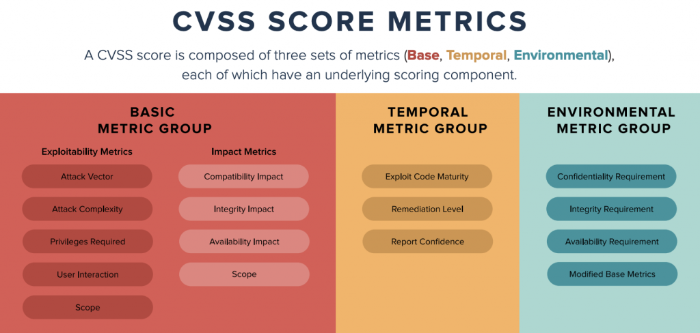

# Security Incident Response

## Initial source of information

We can ingest information about security incident from multiple sources. Main
ingestion points for customers' submitted reports are:

- email: `security@ipfabric.io` or `support@ipfabric.io`
- IP Fabric customers' support portal (Atlassian Service Desk – [NSD](https://ipfabric.atlassian.net/servicedesk/customer/portals))
- to the office phone `+420 720 022 997`
- CVE database for software vulnerabilities
- internal monitoring (doesn’t cover the customers’ deployments)
- `debian-security` mailing list
- Other security relevant sources

## Classification

We use industry standard [CVSS](https://en.wikipedia.org/wiki/Common_Vulnerability_Scoring_System) scoring for classification of the reported / discovered vulnerabilities.

Timeline and escalation path is as follows

| CVSS Score | Qualitative Rating | SLA Rating | Reaction Time            | Escalation    |
| ---------- | ------------------ | ---------- | ------------------------ | ------------- |
| 0.0        | None               |
| 0.1 – 3.9  | Low                |
| 4.0 – 6.9  | Medium             | Normal     | Next two working days    | VPE, SRE      |
| 7.0 – 8.9  | High               | High       | Next working day         | CTO, VPE, SRE |
| 9.0 – 10.0 | Critical           | Critical   | 4h during business hours | CTO, VPE, SRE |

You may wonder, why we don't list "Remediation time". It is hard to predict upfront time complexity of particular issue, or availability of the solution (for example, we can be blocked by upstream). Thus we provide a reaction time. Reaction time is not a simple "thank you for your report" type of answer, but rather solution proposal with time-frame and real resolution time estimation.

## Tracking

Every security incident has to have a tracking ticket, which has to contain:

- CVSS score
- CVE number / link (when applicable)
- Affected customers (if specific)
- It has to have `security` tag assigned

Also notify `#security` Slack channel. A dedicated channel can be created if
the mitigation is going to be complex or is imposing immediate operational
issue.

We select one person to coordinate internal communication and serve as an
interface to the work outside of Engineering. Typical candidates: DevOps TL,
Head of Development, VPE, CTO.
