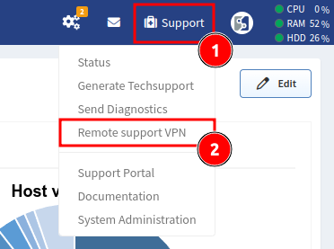
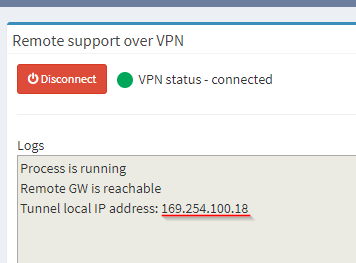

# Support VPN

Starting with IP Fabric `1.0.3`, you can establish remote SSL VPN to IP Fabric's
DC. Support VPN uses OpenVPN.

!!! warning "Network requirements"

    Support VPN requires access to `remote.ipfabric.io` remote port `443/tcp`.
    The IP Fabric appliance must be also configured with a functional DNS
    server.

    Connection through proxy servers should work, but it is not guaranteed.

## How to Establish Support VPN

!!! info "Security info"

    VPN is always established and teared down by you. VPN connection cannot be
    triggered externally.

1.  Click **Support** in the top-right corner of the IP Fabric GUI.

2.  Select **Remote support VPN**:

    

3.  On the newly opened page, click **Connect**:

    

4.  `VPN status` should change to `connected` and you should also see the
    assigned IP address.

## How to Tear Down Support VPN

1.  Repeat steps 1 and 2 from the
    [How To Establish Support VPN](#how-to-establish-support-vpn) section above.

2.  On the newly opened page, click **Disconnect**:

    

3.  `VPN status` should change to `disconnected`.
