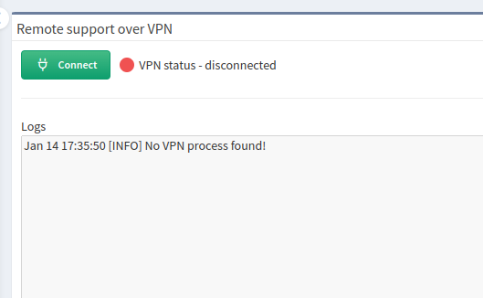
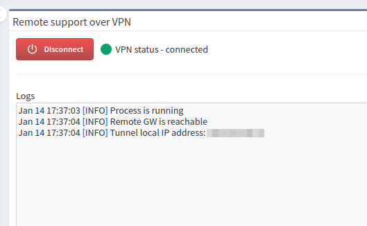

# Support VPN

Starting with IP Fabric `1.0.3`, you can establish a remote SSL VPN from your IP
Fabric appliance to IP Fabric's DC. Support VPN uses OpenVPN.

Support VPN requires access to `remote.ipfabric.io` on remote port `443/tcp`.
The IP Fabric appliance must also be configured with a functional DNS server.

--8<-- "snippets/allowlist_fqdn.md"

Connection through proxy servers should work, but it is not guaranteed.

## How To Establish Support VPN

!!! info "Security Info"

    VPN is always established and teared down by you. The VPN connection cannot
    be triggered externally.

### From GUI

1. In the top-right corner of the IP Fabric GUI, click **Support**.

2. Select **Remote support VPN**:

   

3. On the newly opened page, click **Connect**:

   

4. The `VPN status` should change to `connected`, and you should see the
   assigned IP address.

### From CLI

1. Connect to the IP Fabric appliance via SSH with the `osadmin` user:

   ```shell
   ssh osadmin@<ip_or_fqdn>
   ```

2. Switch to `root`:

   ```shell
   sudo su -
   ```

3. Now run the VPN command:

   ```shell
   sudo -u autoboss nimpee-support-vpn start
   ```

   

## How To Tear Down Support VPN

### From GUI

1. Repeat steps 1 and 2 from the
   [How To Establish Support VPN](#how-to-establish-support-vpn) section above.

2. On the newly opened page, click **Disconnect**:

   

3. The `VPN status` should change to `disconnected`.

### From CLI

1. Repeat steps 1 and 2 from the
   [How To Establish Support VPN](#how-to-establish-support-vpn) section above
   if you logged out. Skip this step if you didn't.

2. Now run the VPN command:

   ```shell
   sudo -u autoboss nimpee-support-vpn stop
   ```

   
