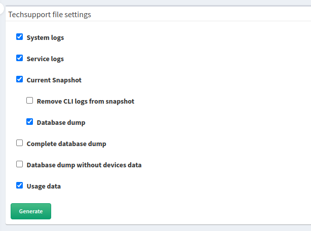
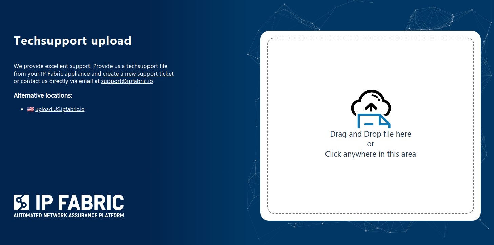

# Techsupport

!!! note "Techsupport data handling"

    A techsupport file uploaded to the `upload.ipfabric.io` server is stored
    there only temporarily. The file is eventually moved to a permanent location
    on Microsoft SharePoint. The `upload.ipfabric.io` server is only accessible
    to the IP Fabric Ops team, who facilitates the transfer to the permanent
    location. The file in the permanent location has configured strict RBAC
    rules allowing access to people at IP Fabric who need it for their work
    (such as support team, Network Automation Engineers etc.).

!!! info "Video tutorial"

    A techsupport file from the IP Fabric appliance is one of many ways how you
    can share the discovered data with our support team and engineers. This
    quick tutorial demonstrates how to generate the file and share it with us.
    The techsupport file is encrypted. Only IP Fabric support staff is able to
    decrypt the data.

    <iframe width="560" height="315" src="https://www.youtube-nocookie.com/embed/SJZAzYAuXrE" title="YouTube video player" frameborder="0" allow="accelerometer; autoplay; clipboard-write; encrypted-media; gyroscope; picture-in-picture" allowfullscreen></iframe>

## Generating Techsupport File

1. In the IP Fabric GUI, go to **Support --> Generate Techsupport**:

   

2. Select data to be included in the techsupport file (when in doubt, keep the
   defaults):

   

## Uploading Techsupport File

### WEB / HTTPS

Please visit [https://upload.ipfabric.io](https://upload.ipfabric.io) in your
browser to upload the generated techsupport for the IP Fabric team. Depending
on your location, you will be redirected to `upload.EU.ipfabric.io` or
`upload.US.ipfabric.io` (can be switched on the page). The username and password
are provided by IP Fabric Support.



### `curl`

If your IP Fabric appliance has direct internet access, you can upload the
techsupport file directly from it using the following `curl` command:

```shell
curl --user username:password \
-T "/home/autoboss/files/techsupport-xxx.tar" \
-X POST https://upload.EU.ipfabric.io/upload \
-f
```

Generated techsupport files are located in the `/home/autoboss/files` directory
on the IP Fabric appliance.

In the command, you may change `https://upload.EU.ipfabric.io/upload` to
`https://upload.US.ipfabric.io/upload`. The username and password are provided
IP Fabric Support.

## What is included in techsupport file

1. **System logs** -- Includes `syslog`, `dmesg`, RabbitMQ, MongoDB, ArangoDB
   and IP Fabric API service logs. Customer data are **not** included.

2. **Service logs** -- Includes IP Fabric discovery service logs without CLI.
   Included customer data are limited, only IP addresses which were used during
   discovery and serial numbers of devices are included.

3. **Current Snapshot** -- Includes the currently-selected snapshot.

   - **Remove CLI logs from snapshot** -- Removes devices' CLI logs from
     the currently-selected snapshot.
   - **Database dump** -- Includes the database dump of the currently-selected
     snapshot.

4. **Complete database dump** -- Includes the database dump of all snapshots
   which are currently loaded in the memory.

5. **Database dump without devices data** -- Removes all collected data from
   devices. Dump contains only error and service tables.

!!! info

    Snapshot and database dumps don't include any customer credentials
    (passwords, keys etc.)
